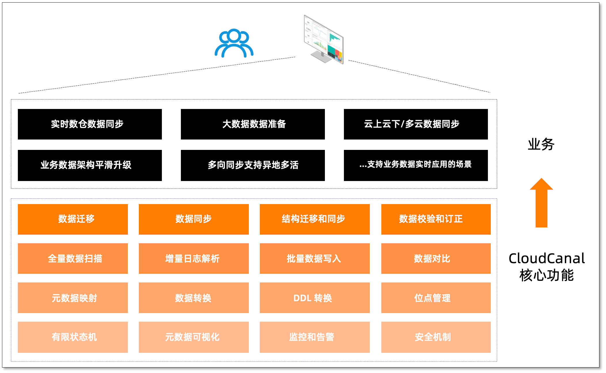

import DataSourceLink from "@site/src/components/DataSourceLink";

CloudCanal 是一款 **数据同步、迁移** 工具，帮助企业构建高质量数据管道,具备实时高效、精确互联、稳定可拓展、一站式、混合部署、复杂数据转换等优点。

## 数据迁移

将指定数据源数据全量搬迁到目标数据源，支持多种数据源，具备断点续传、顺序分页扫描、并行扫描、元数据映射裁剪、自定义代码数据处理、批量写入、并行写入、数据条件过滤等特点，对源端数据源影响小且性能好，同时满足数据轻度处理需求。

可选搭配结构迁移、数据校验和订正，满足结构准备或数据质量的需求。

## 数据同步

通过消费源端数据源增量操作日志，准实时在对端数据源重放，以达到数据同步目的，具备断点续传、DDL 同步、元数据映射裁剪、自定义代码数据处理、操作过滤、数据条件过滤、高性能对端写入等特点。

可选搭配结构迁移、数据初始化(全量迁移)、单次或定时数据校验与订正，满足数据准备和业务长周期数据同步对于数据质量的要求。

## 结构迁移和同步

帮助用户快速将源端结构执行到对端的功能，具备类型转换、数据库方言转换、命名映射等特点，可独立使用，也可作为数据迁移或数据同步准备步骤。

## 数据校验和订正

将源端和对端数据分别取出，逐字段对比，可选择差异数据订正，功能可单独使用，也可配合数据迁移或数据同步使用，满足用户数据质量验证与修复的需求。

## 数据源互通拓扑

下表为 CloudCanal 支持的数据链路一览，纵向为源端，横向为目标端。支持的数据库版本请参考 [数据源种类和版本支持](../dataMigrationAndSync/datasource_version.md)。

<DataSourceLink />
