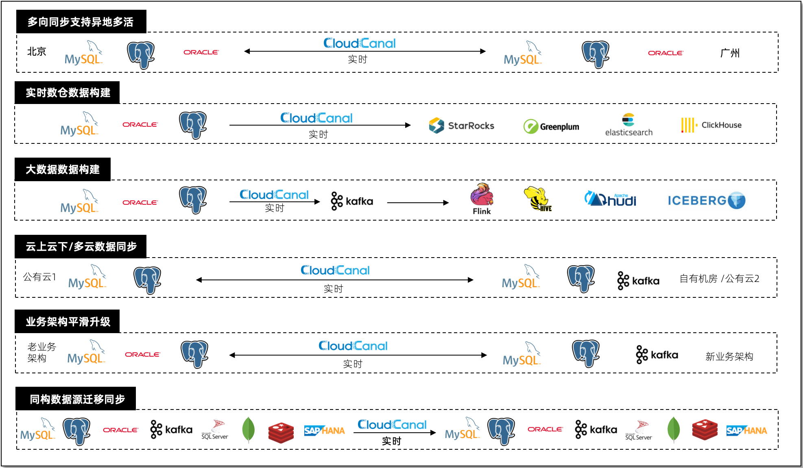

本文主要介绍 CloudCanal 产品的应用场景，帮助业务落地数据应用需求。

## 数据库多向同步

帮助业务双向/多向同步数据库、消息中间件数据之间数据，并消除同步循环，达成 **业务异地多活、数据容灾备份** 业务目标。

参考样例: [MySQL 双向数据同步](../bestPractice/mysql_loop_data_sync.md)

## 实时数仓数据同步

通过实时同步，让数据既满足业务流程的刚性需求，同时具备更多的应用，包括但不限于**数据复杂检索（多维度筛选、聚合、连接等）**、**模糊搜索**、**子业务流程触发**、**数据共享**、**数据挖掘**等。

参考样例: [MySQL 到 ClickHouse 同步](../bestPractice/mysql_clickhouse_sync.md)

## 大数据数据准备

通过消息中间件**解耦在线业务和大数据分析**，在线数据实时出现在消息中间件中，下游流、批处理数据，构建数据平台。

参考样例: [MySQL 到 Kafka 同步](../bestPractice/mysql_kafka_sync.md)

## 云上云下/多云数据同步

公有云与公有云、公有云与私有机房、跨地域远距离数据迁移和同步，增量同步**节省业务带宽**，CloudCanal Tunnel 数据源让 **两端数据库都不暴露公网**，并且默认附带鉴权、加密传输，让数据同步更安全。

参考样例: [跨互联网数据同步](../bestPractice/http_base_internet_data_sync.md)

## 业务数据架构平滑升级

自定义代码上传让业务有机会进行复杂的数据迁移同步，通过实现 clougence-sdk 接口，接受迁移或同步数据，再进行变换处理甚至调用远程服务，最后将结果返回 CloudCanal 。

此能力让用户对老业务数据结构进行彻底变化，并且完成 **新老业务不停机过渡** 成为可能。

参考样例: [数据同步脱敏](../bestPractice/encrypt_data_when_sync.md)

## 同构数据源迁移同步
支持 MySQL、PostgreSQL、Oracle、Kafka、SQL Server、MongoDB、Redis、SAP HANA、TiDB 等多种同构数据源之间的数据迁移同步，为数据库版本升级、多云/云上云下数据同步、跨区域数据迁移同步以及容灾数据同步带来了极大的便利。

参考样例：[PostgreSQL 到 PostgreSQL 同步](/blog/data_sync_sample/pg_pg_sync)

## 更多场景和样例

CloudCanal 能够极大丰富业务的数据应用场景，充分发挥数据本来的价值，更多场景应用不断丰富中。

参考样例: [数据校验与订正](../bestPractice/verification_and_correction.md)