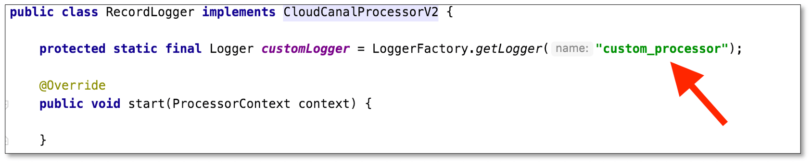
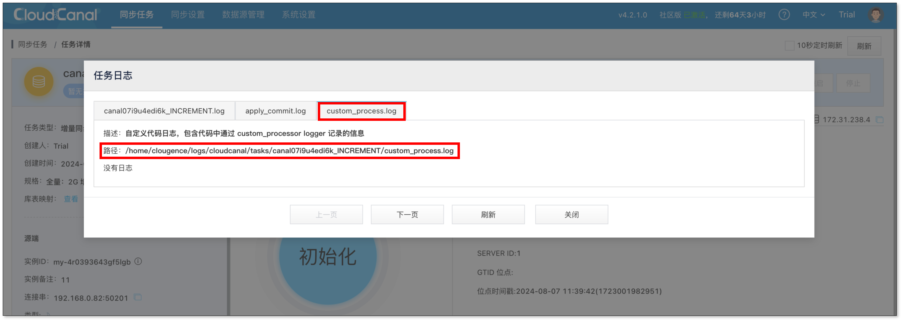

在自定义代码功能中，CloudCanal 提供了一个 logger 给到业务打印相关信息，以便排查问题。

## 操作步骤
1. 自定义代码中加入如下 logger，即可使用并打印日志。
   ```
   protected static final Logger customLogger = LoggerFactory.getLogger("custom_processor");
   ```
   
  
2. 启动任务。
3. 任务运行后，可按以下方式查看日志：  
   在任务详情页点击 **查看日志** > **custom_process.log** 可在线查看日志内容，也可根据在线日志页面提供的路径到终端查看完整的日志文件。
  
  