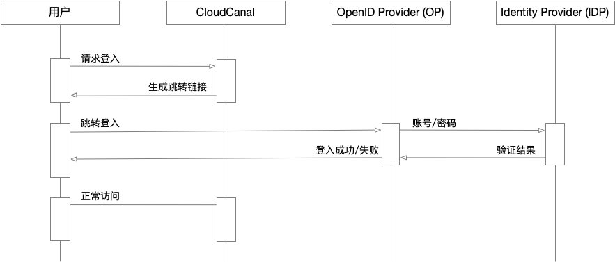

本文档主要介绍如何将 CloudCanal 产品接入企业自身 **OpenID Connect (OIDC)** 以实现统一身份认证。

## 什么是 OIDC？

[OpenID Connect (OIDC)](https://openid.net/developers/how-connect-works/) 是标识身份验证协议，它是开放授权 (OAuth) 2.0 的扩展，用于标准化用户登录访问数字服务时进行身份验证和授权的过程。
OIDC 提供身份验证，这意味着验证用户的身份。OAuth 2.0 授权允许这些用户访问哪些系统。
OAuth 2.0 通常用于使两个不相关的应用程序能够共享信息，而不会影响用户数据。例如，许多人使用其电子邮件或社交媒体帐户登录到第三方网站，而不是创建新的用户名和密码。

OIDC 还用于提供单一登录。组织可以使用安全标识和访问管理 (IAM) 系统（如 [Keycloak](https://www.keycloak.org/)）作为标识的主要身份验证器，然后使用 OIDC 方式接入该系统。
这样，用户只需使用一个用户名和密码登录一次即可访问多个应用。

## 约束限制

CloudCanal 版在使用统一身份认证功能时具有如下约束限制：
- **统一身份认证** 的配置需要由主账号进行。
- 多个主账号之间 **统一身份认证配置** 彼此独立。
- 当启用后产品将 **只允许** OIDC 中允许的用户作为子账号登录。
- 当启用后 **配置** > **子账号管理** 页面中的 **添加账号** 功能将不可用。
- 当启用后 CloudCanal 的账号有效性验证将会由 **OIDC** 验证。
- 用户首次登录时会根据选项参数 oidcLoginRoleMap 预先定义的角色进行分配。
- 使用 OIDC 认证后用户账号有效性及密码强度过期策略等将会全部交由 **OIDC** 管理。

## 工作原理

- 在登录页面的 **子账号登录** 选项卡中点击 **OIDC 登录**，跳转到 OP 登录页面
- 登录完成后 OP 会将浏览器跳转回 CloudCanal 并携带 Authorization code 代码。
- CloudCanal 根据 Authorization code 代码向 OP 获取用户信息以完成登录动作。

## 如何配置

CloudCanal 版开启 OIDC 认证步骤如下：
1. 使用主账号登录 CloudCanal 产品。
2. 进入页面 **配置** > **个人偏好** > **通用参数** 选项卡。
3. 参考如下表格修改配置项。最后点击右上角 **保存** 按钮后 **确认** 保存。   
  **(必选) 需要修改的配置**

  | 配置项                           | 修改后                 | 说明                      | 
  | :--                            | :--                  | :--                      |
  | subAccountAuthType    | OIDC           | 统一身份认证使用 OIDC 服务 |
  | oidcLoginWellKnownUrl | http://xxxxx   | Well-KnownUrl。根据 OpenID Connect (OIDC) 协议标准，每一个 OP 都会提供 [Well-KnownUrl](https://openid.net/specs/openid-connect-discovery-1_0.html#WellKnownRegistry)，除机要信息外所有配置信息均通过 Well-KnownUrl 获取。 |
  | oidcLoginClientId     | xxxxx          | 机要信息 ClientId |
  | oidcLoginClientSecret | xxxxx          | 机要信息 ClientSecret |

  **(可选) 高级参数选项说明**

  | 配置项              | 修改后        | 说明                                                                                                                                                                 | 
  |:-----------------|:-----------|:-------------------------------------------------------------------------------------------------------------------------------------------------------------------|
  | oidcLoginScope   | 3000       | 用来获取通常无需更改配置，根据规范要求 openid 为必选项。请参考 [详细信息](https://openid.net/specs/openid-connect-core-1_0.html#ScopeClaims)。                                                     |
  | oidcLoginRoleMap | Developers | 首次登录时绑定的角色，默认是 Developers（开发角色） <ul><li>**Manager** 表示系统内置 **管理员** 角色。</li><li>**DBA** 表示系统内置 **DBA** 角色。</li><li>**Developers** 表示系统内置 **开发者** 角色。</li></ul> |

:::info
  - 首次登录时，用户需确认或补全 **手机号、邮箱**。
  - 首次进入控制台时会根据其 oidcLoginRoleMap 参数配置分配 CloudCanal 用户角色。
:::

## 恢复设置

在开启了 **OIDC** 认证服务后，若想恢复 **内置账号** 方式登录需要按照如下操作进行。

1. 使用主账号登录 CloudCanal 产品。
2. 进入页面 **配置** > **个人偏好** > **通用参数** 选项卡。
3. 参考如下表格修改配置项。最后点击右上角 **保存** 按钮后 **确认** 保存。   
  **(必选) 需要修改的配置**
  
  | 配置项                           | 修改后                 | 说明                      | 
  | :--                            | :--                  | :--                      |
  | subAccountAuthType  | PASSWORD                | 使用系统内置账号方式登录系统   |

## 服务提供商参考

### Keycloak

**[Keycloak](https://www.keycloak.org/)** 是开源的身份和访问管理中间件。
1. 登录您的 Keycloak 管理控制台。
2. 选择您的 Realm，如果没有需要新建一个。请参考 [参考手册](https://www.keycloak.org/docs/latest/server_admin/index.html#proc-creating-a-realm_server_administration_guide)。
3. 在您的 Realm 中选择 Clients，并新增一个 Client。请参考 [参考手册](https://www.keycloak.org/docs/latest/server_admin/index.html#assembly-managing-clients_server_administration_guide)。新增的 Client 名称填入 **oidcLoginClientId**。
4. 请确保您的 Client 具备以下配置：
  - `Valid redirect URIs` 选项请填写 CloudDM Team 的首页地址（如：`http://192.168.0.100:8222/*` ）
  - `Web origins` 选项同上
  - `Client authentication` 选项设置为 `On` 表示启用机要配置
  - `Client Authenticator` 选项选择 `Client Id and Secret`
5. 完成上述配置后，在您的 Credentials 中可以获取到 `Client Secret`，填入 **oidcLoginClientSecret**。
6. WellKnownUrl 为 `http://keycloak-server/realms/<your realm>/.well-known/openid-configuration`

:::warning
在 CloudCanal 的实现机制中由于不会维护 OIDC 的 id_token 活跃性，因此为了系统正常退出需要将以下两个属性参数保持一致。
- Realm settings > Session > SSO Session Idle
- Realm settings > Tokens > Access Token Lifespan
:::
