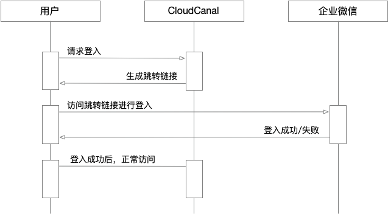
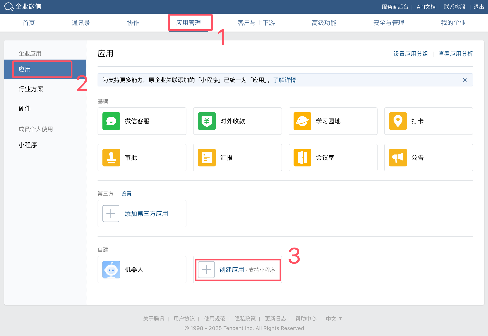
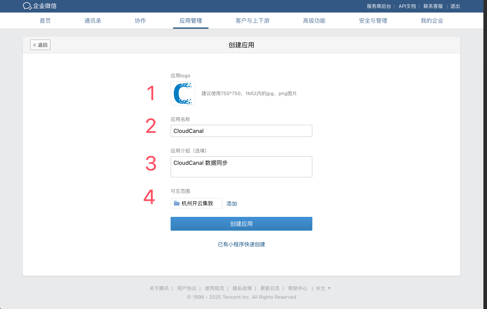
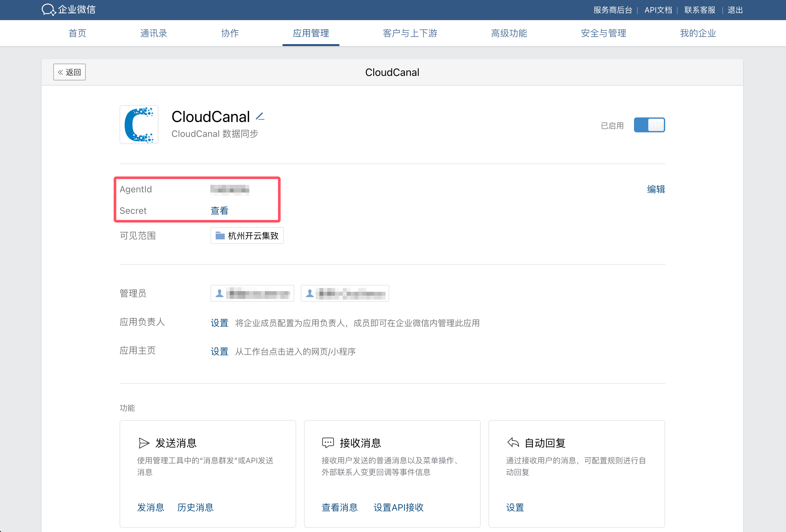
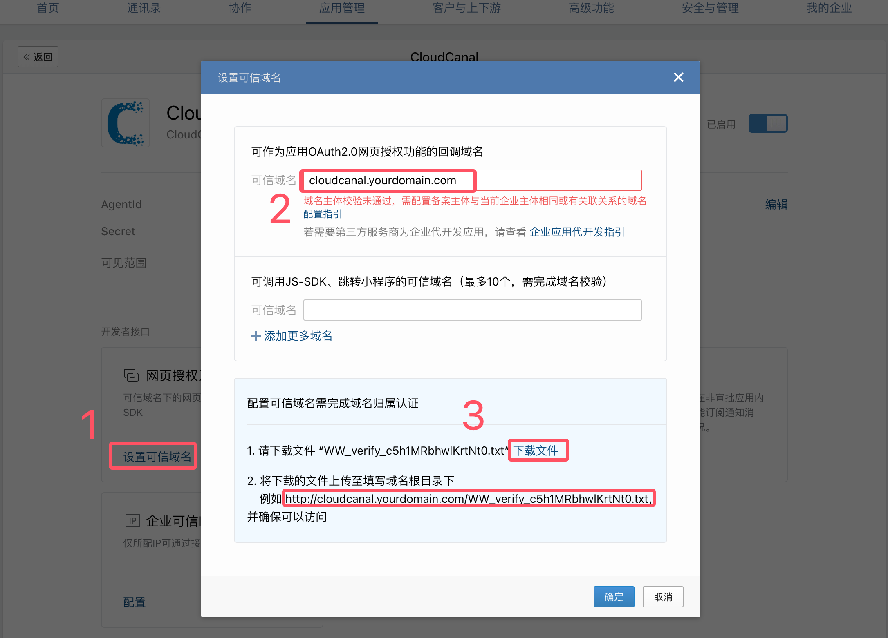
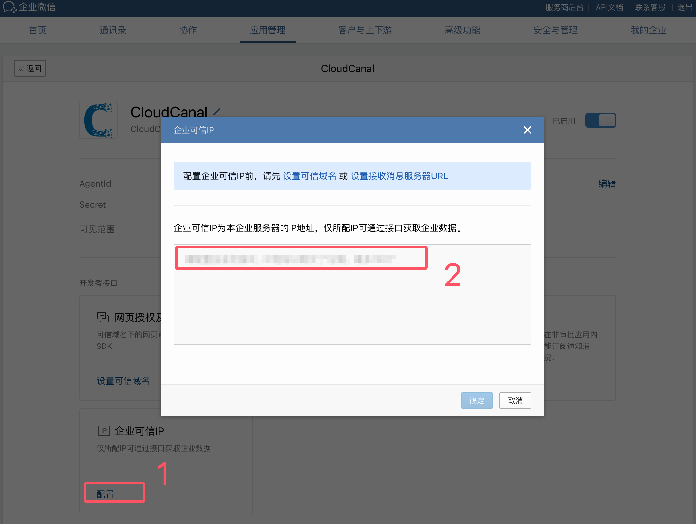
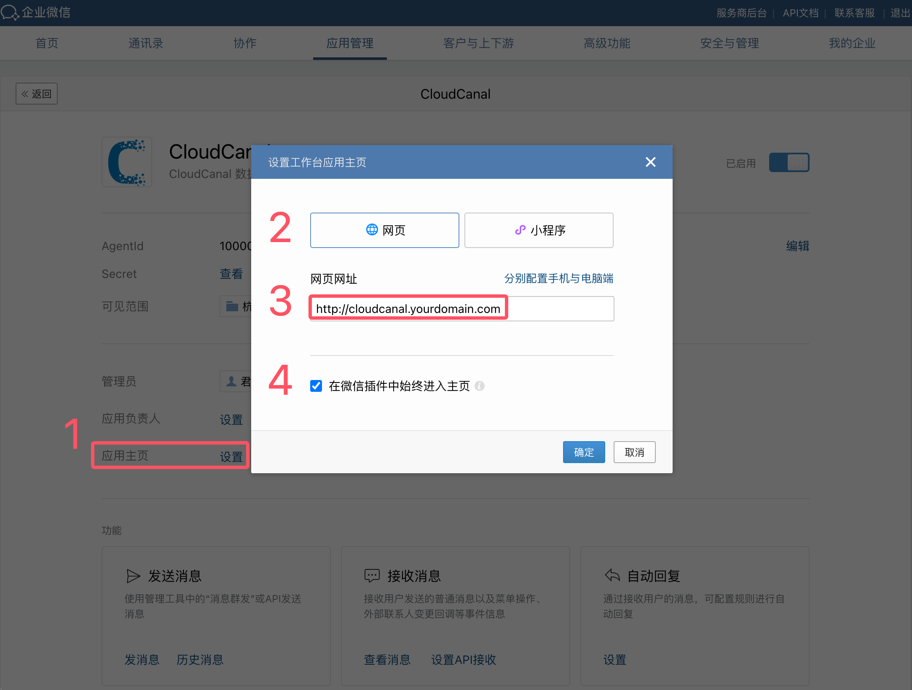
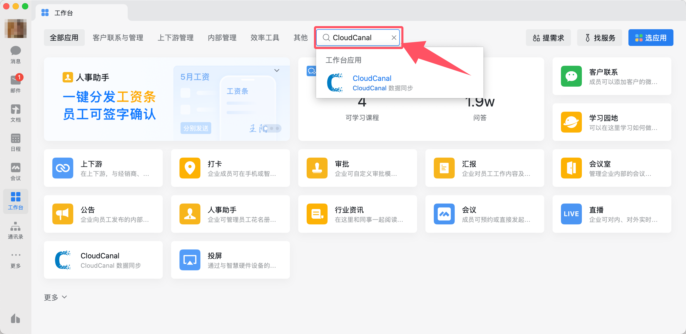
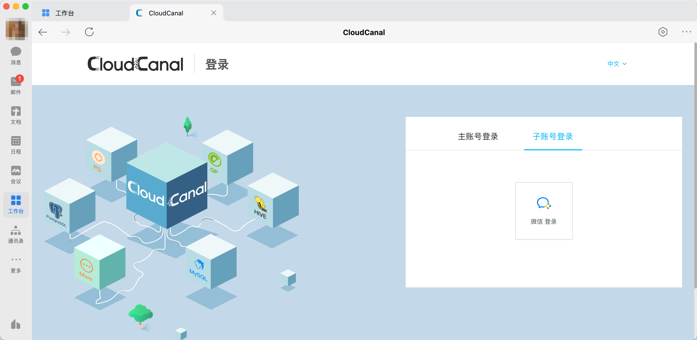

本文档主要介绍如何将 CloudCanal 产品接入 [企业微信](https://work.weixin.qq.com/) 以实现统一身份认证。

## 约束限制

CloudCanal 版在使用统一身份认证功能时具有如下约束限制：
- CloudCanal 必须分配域名并且域名默认 80 端口可访问）
- 用户账号的登陆必须通过微信企业版客户端登陆。
- **统一身份认证** 的配置需要由主账号进行。
- 多个主账号之间 **统一身份认证配置** 彼此独立。
- 当启用后产品将 **只允许** 企业微信组织中的用户作为子账号登录。
- 当启用后 **系统设置** > **子账号管理** 页面中的 **添加账号** 功能将不可用。
- 当启用后 CloudCanal 的账号有效性验证将会由 **企业微信** 验证。
- 用户首次登录时会根据选项参数 wechatLoginRoleMap 预先定义的角色进行分配。
- 使用企业微信认证后用户账号有效性及密码强度过期策略等将会全部交由 **企业微信** 管理。
- **在使用企业微信登录时 CloudCanal 所有子账号只能通过企业微信客户端的工作台登录**。

## 工作原理

- CloudCanal 采用 OAuth 2.0 流程进行接入。
- 在登录页面的 **子账号登录** 选项卡中点击 **企业微信登录**，跳转到企业微信登录页面。
- 登录完成后企业微信会将浏览器跳转回 CloudCanal 并携带 Authorization code 代码。
- CloudCanal 根据 Authorization code 代码向企业微信获取用户信息以完成登录动作。

## 如何配置

CloudCanal 开启企业微信认证步骤如下：
1. [创建并配置企业微信应用](#config_app)。
2. 使用主账号登录 CloudCanal 产品。
3. 进入页面 **系统设置** > **系统偏好** > **通用参数** 选项卡。
4. 参考如下表格修改配置项。最后点击右上角 **保存** 按钮后 **确认** 保存。   
   **(必选) 需要修改的配置**
  
  | 配置项                           | 修改后                 | 说明                      | 
  | :--                            | :--                  | :--                      |
  | subAccountAuthType    | Wechat     | 统一身份认证使用企业微信服务 |
  | wechatLoginCorpId     | xxxxx      | 企业 ID |
  | wechatLoginAgentId    | xxxxx      | 应用 AgentId |
  | wechatLoginSecret     | xxxxx      | 应用 Secret |

  **(可选) 高级参数选项说明**

  | 配置项                | 修改后        | 说明                                                                                                                                                                 | 
  |:-------------------|:-----------|:-------------------------------------------------------------------------------------------------------------------------------------------------------------------|
  | wechatLoginRoleMap | Developers | 首次登录时绑定的角色，默认是 Developers（开发角色） <ul><li>**Manager** 表示系统内置 **管理员** 角色。</li><li>**DBA** 表示系统内置 **DBA** 角色。</li><li>**Developers** 表示系统内置 **开发者** 角色。</li></ul> |

:::info
   - 首次登录时，用户需确认或补全 **手机号、邮箱**。
   - 首次进入控制台时会根据其 wechatLoginRoleMap 参数配置分配 CloudCanal 用户角色。
:::

## 恢复设置

在开启了 **企业微信** 认证服务后，若想恢复 **内置账号** 方式登录需要按照如下操作进行。

1. 使用主账号登录 CloudCanal 产品。
2. 进入页面 **系统设置** > **系统偏好** > **通用参数** 选项卡。
3. 参考如下表格修改配置项。最后点击右上角 **保存** 按钮后 **确认** 保存。   
  **(必选) 需要修改的配置**

  | 配置项                           | 修改后                 | 说明                      | 
  | :--                            | :--                  | :--                      |
  | subAccountAuthType              | PASSWORD              | 使用系统内置账号方式登录系统  |

## 企业微信应用参考 {#config_app}

**准备工作**
1. 登录 [企业微信后台](https://work.weixin.qq.com/)。
2. 需要准备一个域名并且可以通过域名访问 CloudCanal。

**创建应用**
1. 点击 **应用管理** > 在页面最下方点击 **创建应用**。
   
2. 填写应用的基础信息，涉及图标资源可以在 [资源下载](../../../reference/resource_download) 中获取。应用可用范围选择组织机构的 **根部门(包含所有员工)**，然后点击 **保存**。
   

**配置应用**
1. 在 **应用详情** 中可以获取，获取 **AgentId** 和 **Secret**。
   
2. 在 **我的企业** 页面底部可以获取 **企业 ID (CorpId)**。
   
3. 在 **应用详情** 中找到 **网页授权及JS-SDK** 卡片点击 **设置可信域名**，根据引导完成可信域名的配置。
   
4. 在 **应用详情** 中找到 **企业可信 IP** 卡片点击 **设置**，填写您部署 CloudCanal 环境中公网出口 IP。
   
5. 在 **应用详情** 中设置 **应用主页**。
   

**访问应用**
1. 打开 **[企业微信客户端](https://work.weixin.qq.com/#indexDownload)** 在工作台中搜索您创建的 CloudCanal 应用。
   
2. 点击 **应用** 会进入 CloudCanal 登录页面，在 **子账号登录** 中选择 **企业微信登录** 即可。
   

## FAQ  

**Q: 用户账号登录时提示 “获取用户信息错误:获取 Token 错误，Remote host terminated the handshake” 错误信息。**   
A: 请检查企业微信的 **企业可信 IP**，可能您网络环境的出口 IP 发生了变更。