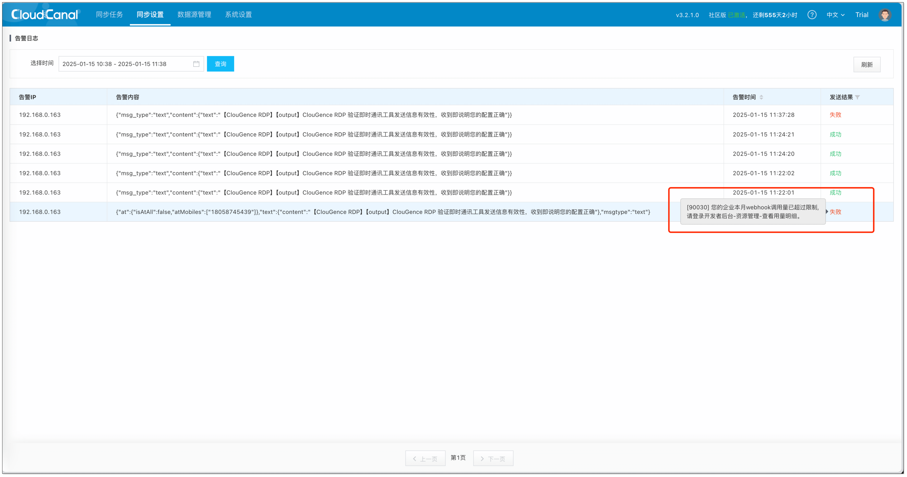

本文档介绍 CloudCanal docker 部署如何配置不同告警方式。

## 前置条件
CloudCanal 任务告警、机器告警均需要先完成系统的告警配置才可以正常工作。告警当前支持的发送方式、对接实现方式和前置准备如下表所示：
<table>
<thead>
<tr>
<th>发送方式</th>
<th>对接实现方式</th>
<th>告警设置准备</th>
</tr>
</thead>
<tbody>
<tr>
<td>短信</td>
<td>阿里云短信服务</td>
<td>参考 <a href="./add_sms_alert">配置短信告警或验证码</a></td>
</tr>
<tr>
<td>语音</td>
<td>阿里云语音服务</td>
<td>参考 <a href="./add_voice_alert">配置语音告警</a></td>
</tr>
<tr>
<td>邮箱</td>
<td>邮箱服务器</td>
<td>-</td>
</tr>
<tr>
<td rowspan="6">即时通讯软件(IM)</td>
<td>钉钉</td>
<td> 参考 <a href="../../productOP/dailyOP/create_dingding_group">创建钉钉告警机器人</a></td>
</tr>
<tr>
<td>微信</td>
<td>参考 <a href="https://cloud.tencent.com/document/product/248/50413">使用企业微信群接收告警通知</a></td>
</tr>
<tr>
<td>飞书</td>
<td>参考 <a href="./create_feishu_group">创建飞书告警机器人</a></td>
</tr>
<tr>
<td>Slack</td>
<td>参考 <a href="../../productOP/dailyOP/create_slack_group">创建 Slack 告警机器人</a></td>
</tr>
<tr>
<td>Discord</td>
<td>参考 <a href="../../productOP/dailyOP/create_discord_group">创建 Discord 告警机器人</a></td>
</tr>
<tr>
<td>webhook</td>
<td>参考 <a href="../../productOP/dailyOP/create_custom_alarm">创建 Webhook 告警</a></td>
</tr>
</tbody></table>

## 操作步骤

### 短信告警方式
参考 [配置短信告警或验证码](./add_sms_alert) 文档。

### 语音告警方式
参考 [配置语音告警](./add_voice_alert) 文档。

### 邮箱告警方式
1. 点击 **配置** > **个人偏好**，为发送告警的邮箱服务器设置相关参数，参数说明如下：
   
    | 参数名称 | 说明 |
    | :-- | :-- |
    | ***emailHost*** | 邮件发送方的 SMTP 服务器 IP 或域名 |
    | ***emailPort*** | 邮件发送方的 SMTP 服务器端口号 |
    | ***emailUserName*** | 邮件发送方的邮箱账号 |
    | ***emailPwd*** | 邮件发送方的授权码或密码 |
    | ***emailSmtpAuth*** | SMTP 服务器开启权限校验 |
    | ***emailEnableTls*** | SMTP 服务器开启 TLS 验证 |
    | ***emailRequiredTls*** | SMTP 服务器使用 TLS 验证 |
    | ***emailEnableSsl*** | SMTP 服务器开启 SSL 验证 |
    | ***emailProtocol*** | 邮件传输协议类型 |
  
2. 在页面底部点击 **验证邮箱服务器**，收到验证信息即配置正确。

    :::info
    接收告警信息的邮箱为注册时所填邮箱。如需查看或更换，请点击页面右上角头像 > **账户中心**。
    :::

### IM 告警方式
1. 点击 **配置** > **个人偏好**。
2. 根据需要配置相关参数，参数说明如下：
   
    | 参数名称 | 说明                                                     |
    | :-- |:-------------------------------------------------------|
    | ***alertImType*** | 设置告警类型，目前支持钉钉、企业微信、飞书、Slack 等即时通讯工具，也可以设置自定义告警机器人      |
    | ***defaultImAlertUrl*** | 配置发送普通告警的 webhook                                      |
    | ***criticalImAlertUrl*** | 配置发送重要告警的 webhook                                      |
    | ***taskAlertInhibitMin*** | 配置告警抑制间隔，即针对同一个任务的异常或者延迟，或相同告警内容，间隔多久告警一次。单位为分钟，默认为 1 分钟 |
    | ***webHookProxyHost*** | 配置 webhook 的 http 代理                                   |

2. 在页面底部点击 **验证 IM 告警**，收到验证信息即配置正确。

    :::info
    该告警配置作用于当前用户，请在注册新账号后及时进行配置。
    :::

## 查看告警历史记录
1. 点击 **同步设置** > **告警日志**，打开告警详情页面。
2. 调整时间范围并点击 **查询**。
3. 若有发送结果为失败的记录，可将鼠标悬停在“失败”上查看错误明细。

