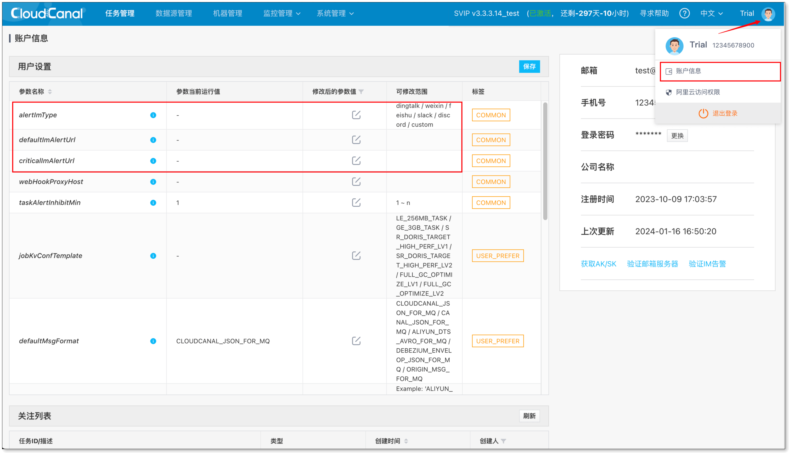
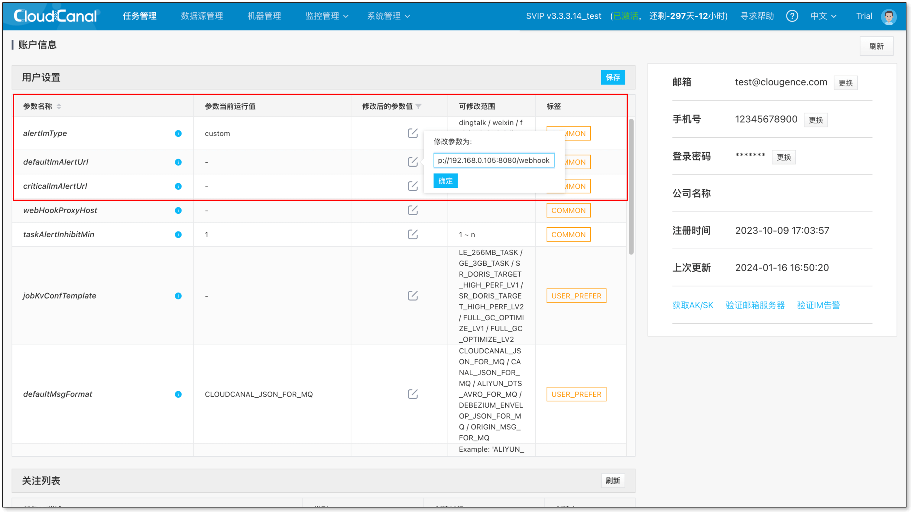
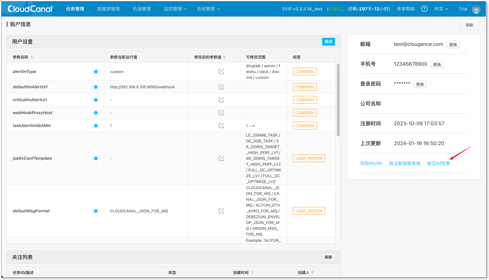
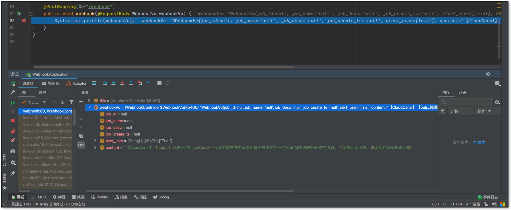

CloudCanal 支持配置自定义 Webhook 告警，本文以 Java 为例介绍自定义 Webhook 的请求参数。

### 请求方式

**POST**

### 请求参数

| 参数名称 | 参数类型 | 参数说明 | 是否必须 |
|---------|---------|-----|----|
| job_id | long | 任务id | 否 |
| job_name | String | 任务名称 | 否 |
| job_desc | String | 任务描述 | 否 |
| job_create_ts | String | 任务创建时间 | 否 |
| alert_user | String[] | 接受者用户名 | 否 |
| content | String | 告警详细信息 | 是 |

### 操作案例

#### 准备 Webhook 服务
本例以 Spring MVC 为例，简单打印接收到的参数信息，用户则可自由拓展该业务场景。
```java
package com.clougence.webhook.controller;

import org.springframework.web.bind.annotation.PostMapping;
import org.springframework.web.bind.annotation.RequestBody;
import org.springframework.web.bind.annotation.RestController;

import java.util.Arrays;

@RestController
public class WebhookController {

    @PostMapping("/webhook")
    public void webhook(@RequestBody WebhookVo webhookVo) {
        // TODO 本例简单打印参数信息，用户可在此处自由拓展业务需求...
        System.out.println(webhookVo);
    }

    static class WebhookVo {
        private Long job_id;
        private String job_name;
        private String job_desc;
        private String job_create_ts;
        private String[] alert_user;
        private String content;

        public Long getJob_id() {
            return job_id;
        }

        public void setJob_id(Long job_id) {
            this.job_id = job_id;
        }

        public String getJob_name() {
            return job_name;
        }

        public void setJob_name(String job_name) {
            this.job_name = job_name;
        }

        public String getJob_desc() {
            return job_desc;
        }

        public void setJob_desc(String job_desc) {
            this.job_desc = job_desc;
        }

        public String getJob_create_ts() {
            return job_create_ts;
        }

        public void setJob_create_ts(String job_create_ts) {
            this.job_create_ts = job_create_ts;
        }

        public String[] getAlert_user() {
            return alert_user;
        }

        public void setAlert_user(String[] alert_user) {
            this.alert_user = alert_user;
        }

        public String getContent() {
            return content;
        }

        public void setContent(String content) {
            this.content = content;
        }

        @Override
        public String toString() {
            return "WebhookVo{" +
                    "job_id=" + job_id +
                    ", job_name='" + job_name + '\'' +
                    ", job_desc='" + job_desc + '\'' +
                    ", job_create_ts='" + job_create_ts + '\'' +
                    ", alert_user=" + Arrays.toString(alert_user) +
                    ", content='" + content + '\'' +
                    '}';
        }
    }
}
```

#### 控制台配置 IM 告警
  
- 进入控制台 > 点击个人头像 > 进入账户信息

      
- 配置 **alertImType** 为 **custom**，**defaultImAlertUrl** 为 **Webhook 请求路径** > 保存配置

      
- 验证 IM 告警

  
- crul 发送 POST 请求
    ```
    curl -H 'content-type: application/json' -X POST -d '{"job_id":null,"job_name":null,"job_desc":null,"job_create_ts":null,"alert_user":["Trial"],"content":"【CloudCanal】【output】这是一封CloudCanal平台通过您提供的系统配置信息发送的一封验证IM发送服务有效性消息。当您收到该消息，说明您的系统配置正确"}' http://192.168.0.105:8080/webhook
    ```

- Webhook 结果
