CloudCanal 通过设置钉钉群自定义机器人 webhook,发送告警信息到钉钉群中。本文档简要介绍如何获得有效 webhook 以供使用。

### 安装钉钉

1. [下载钉钉](https://www.dingtalk.com/download)，并安装，如已安装则略过。
2. 注册或登录,如已登录则略过。

### 创建钉钉内部群

1. 创建群入口。
  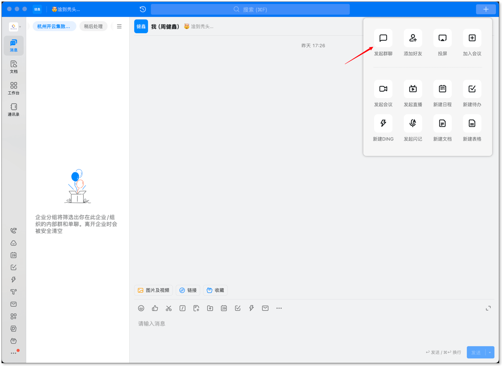

2. 创建内部群。
  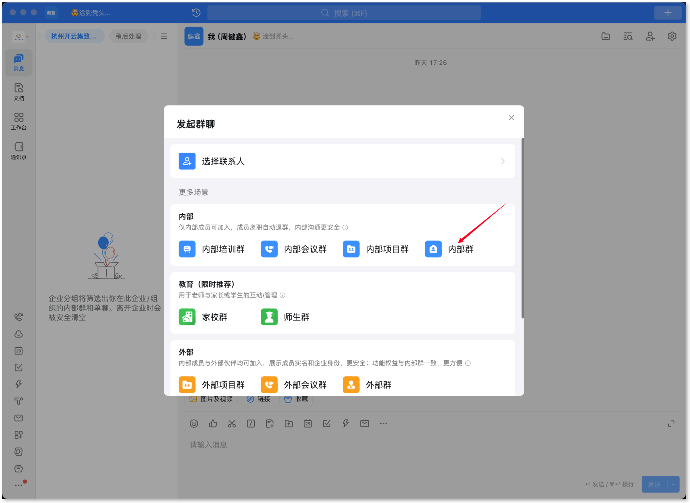

3. 创建群最少需要 3 个人。群名称请选择容易理解的名词。
  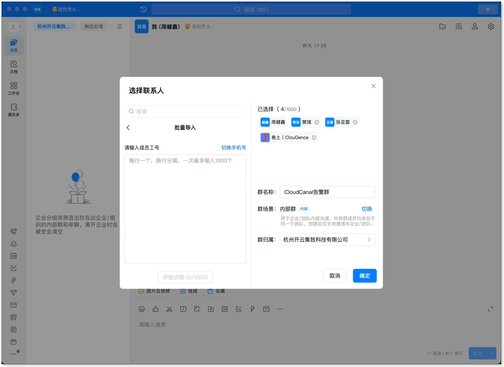

### 创建机器人

1. 登录 [钉钉开发者后台](https://open-dev.dingtalk.com)，选择相应的组织，进入后台页面。

2. [获取开发者权限](https://open.dingtalk.com/document/isvapp/obtain-developer-permissions)，如已有权限则略过。

3. 进入应用开发 > 钉钉应用 > **创建应用**。
  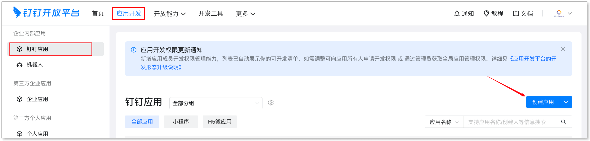
  
4. 填写应用基础信息，并点击 **保存**。
  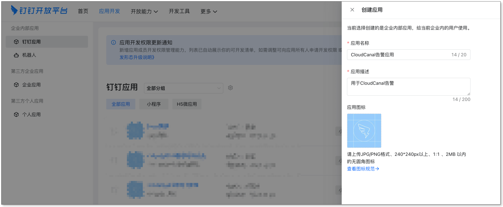
  
5. 添加应用能力 > 添加 **机器人**。
  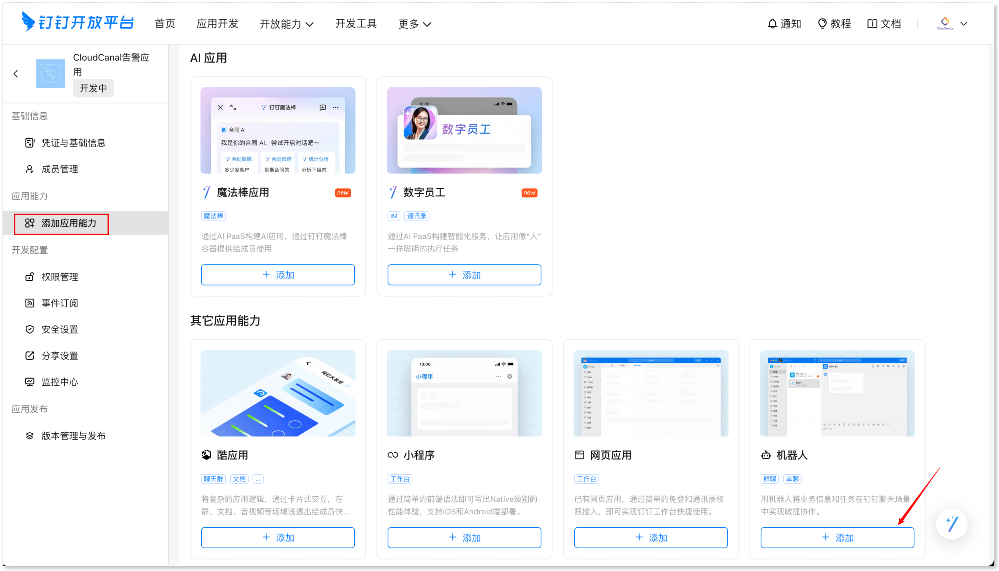
  
6. 开启 **机器人配置** > 填写机器人基础信息 > 消息接收模式选择 **Stream 模式**，点击**发布**。
  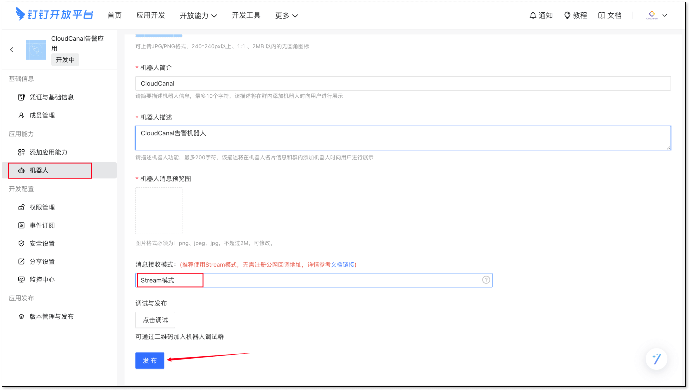
  
7. 版本管理与发布 > 创建新版本。
  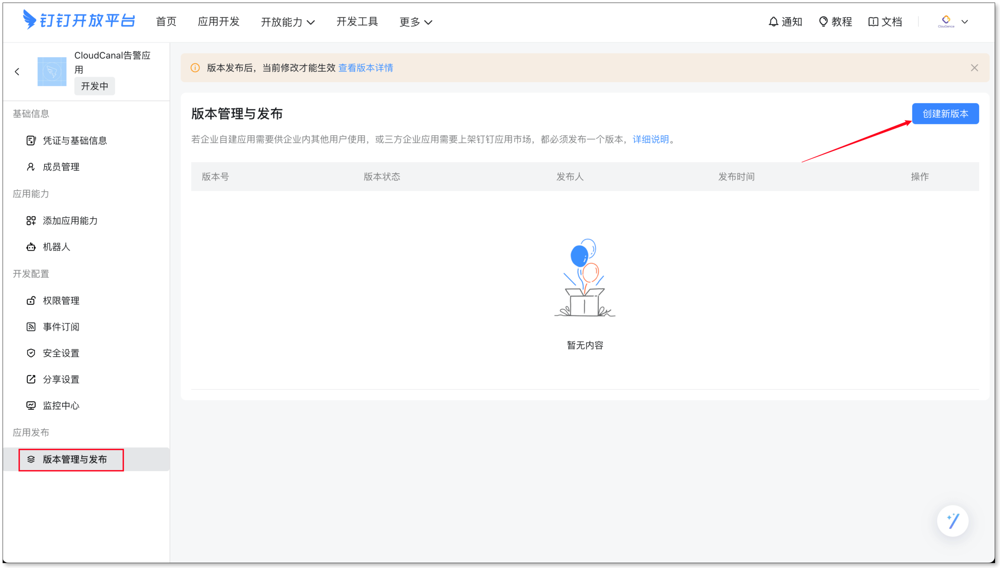
  
8. 填写版本基础信息 > 应用可见范围选择**全部员工** > 保存。
  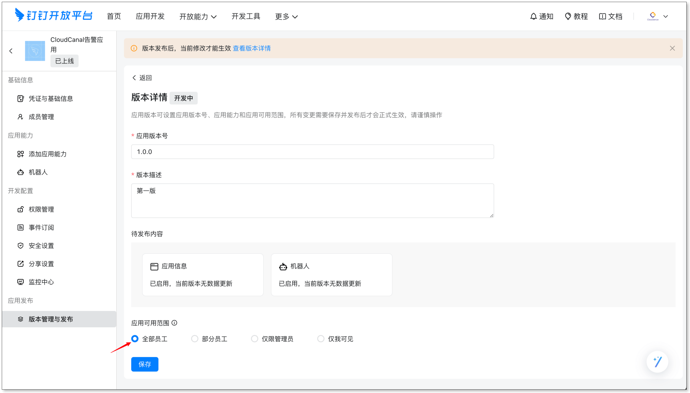
  
### 添加机器人

1. 进入群聊，打开群设置。
  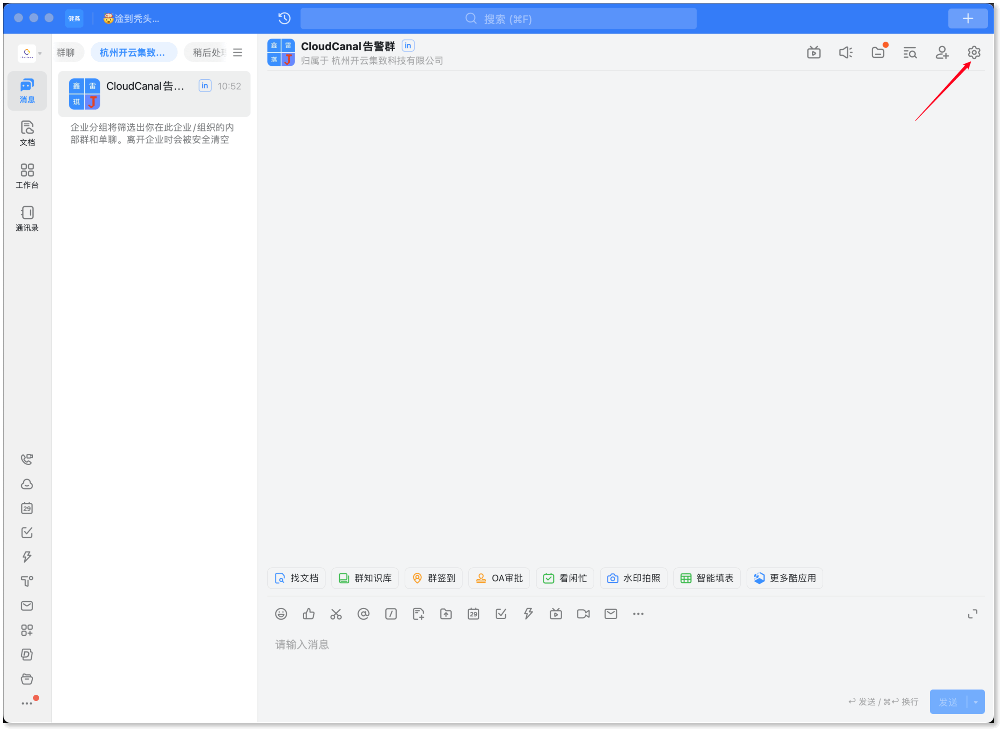
  
2. 点击群管理下的 **机器人** > **添加机器人**。如果需要设置关键字，填写 ClouGence RDP。
  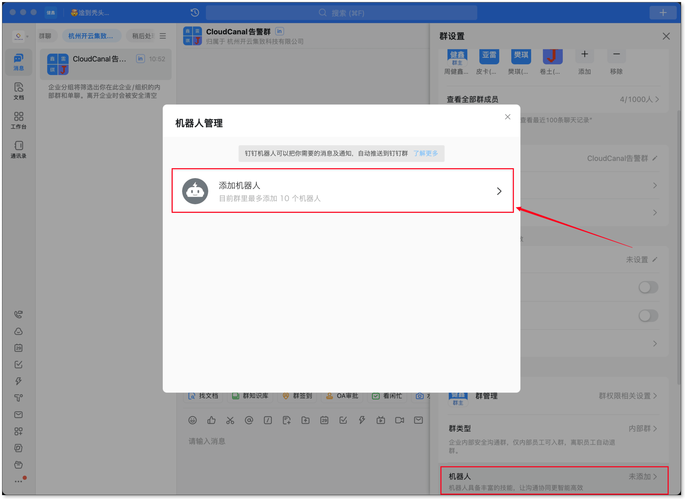
  
3. 进入机器人管理 > 企业机器人，找到刚刚创建的机器人，点击 **添加**。
  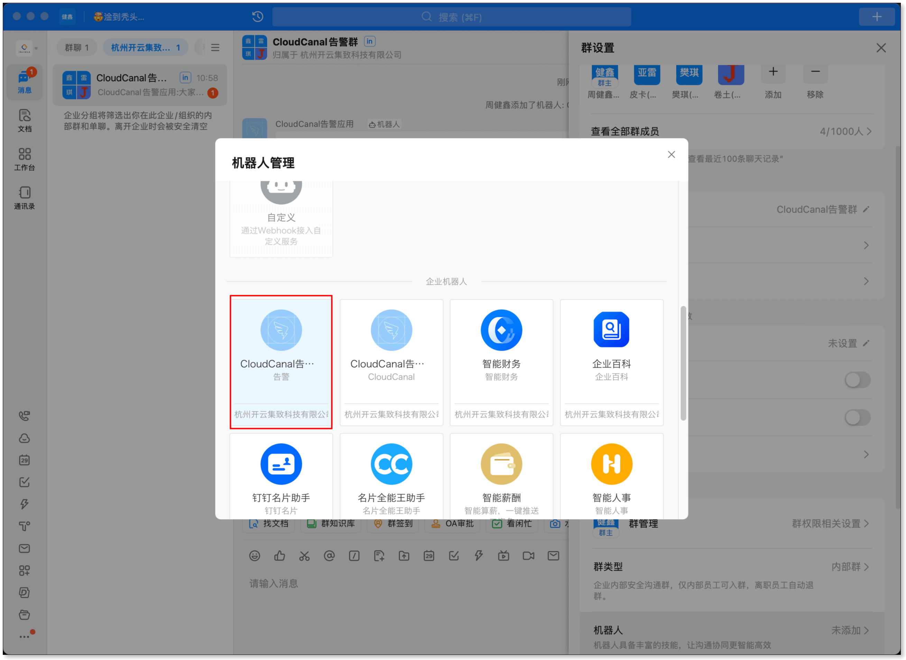
  
  
### 获取机器人 Webhook

回到机器人管理 > 本群的机器人，复制 Webhook 地址。可在安全设置中设置关键词，设置后仅包含该关键词的消息才能成功发送。
  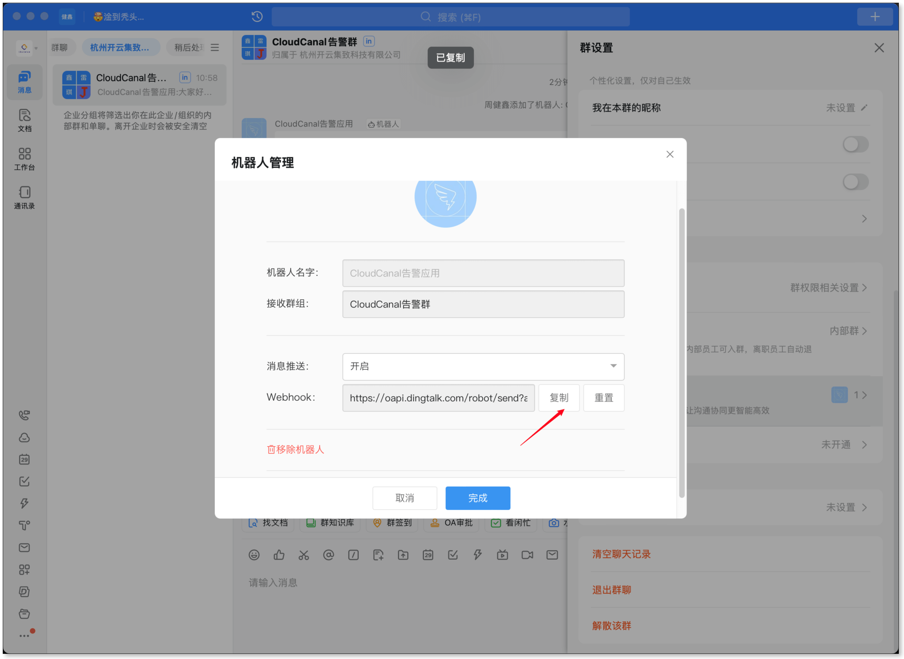
  

### 创建成功

创建成功后，依照 [配置告警](./alarm_conf.md#im-告警方式) 中的步骤，在配置中填写 webhook 等信息，并验证 IM 告警。
  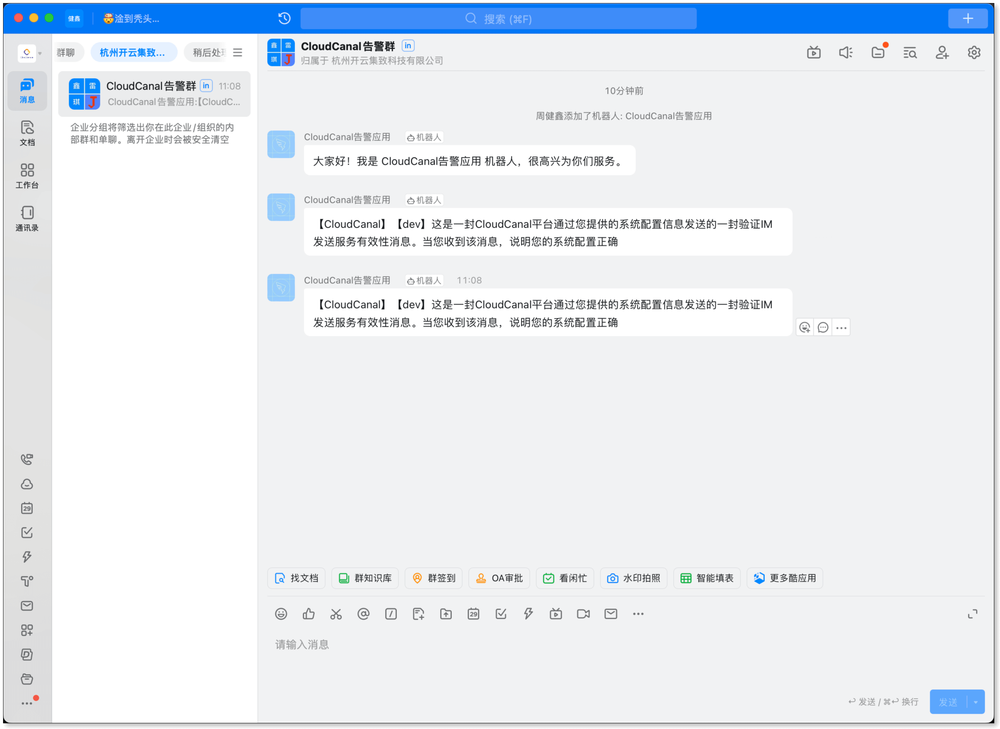
