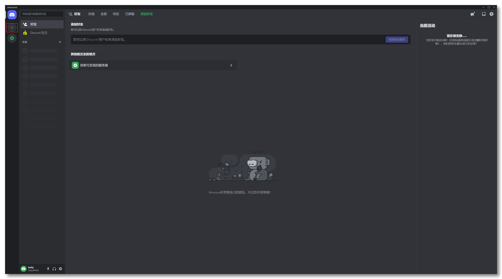
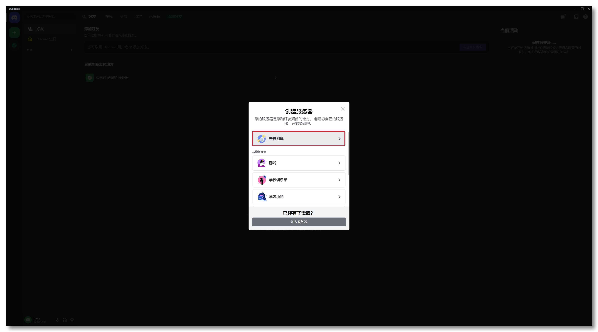
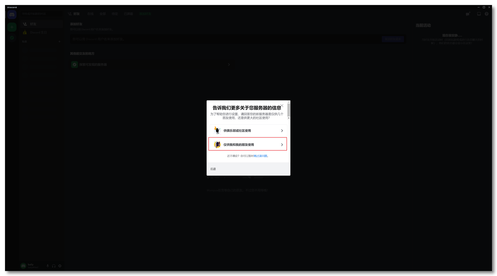
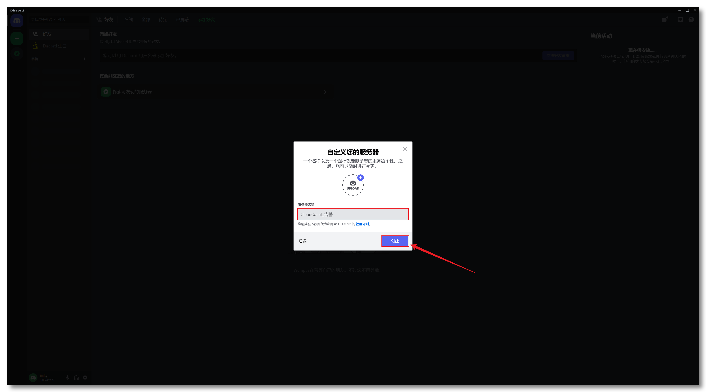
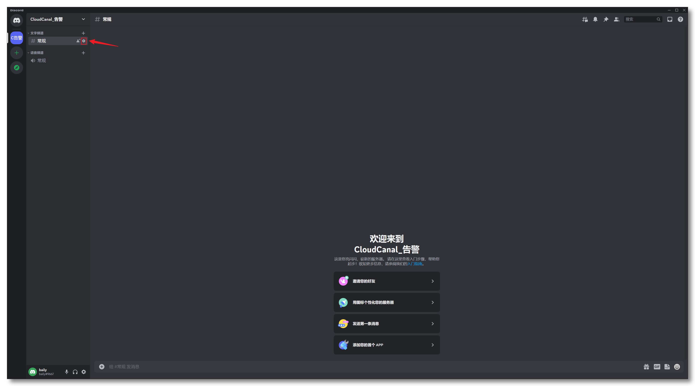
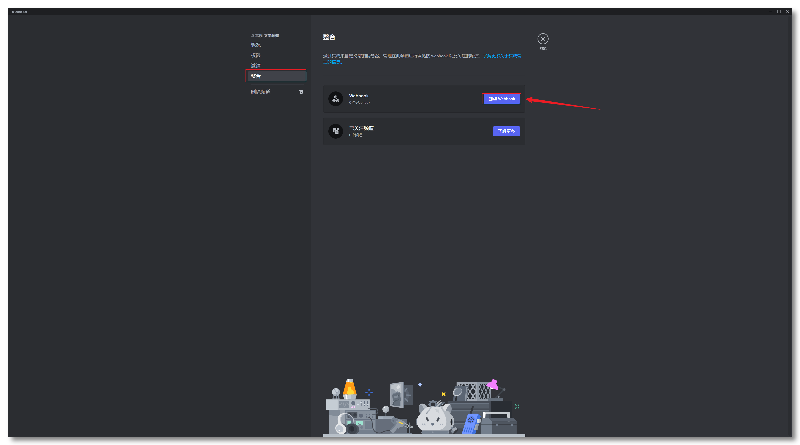
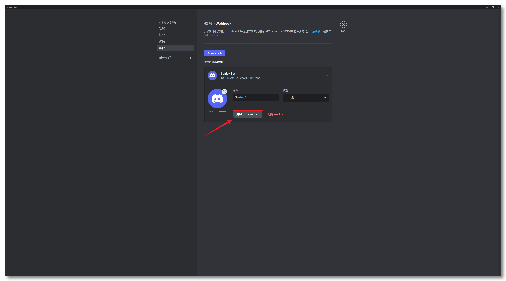
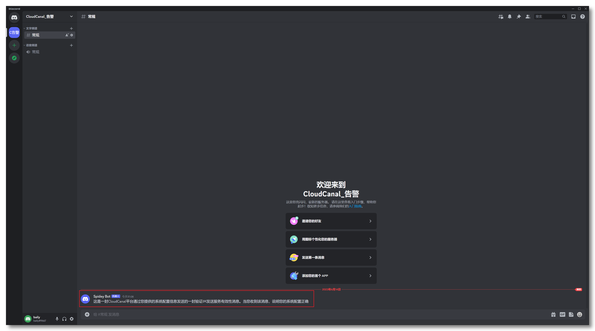

CloudCanal 通过对 Discord 服务器配置 webhook，发送告警信息到指定的 Discord 频道中。本文档简要介绍如何获得有效 webhook 以供使用。

### 安装 Discord

1. [下载Discord](https://discord.com)，并安装，如已安装则略过。
2. 注册或登录，如已登录则略过。

### 创建 Discord 服务器

创建服务器。

 

### 配置 WebHook

### 获取 webhook

### 创建成功

创建成功后，依照 [配置告警](./alarm_conf.md#im-告警方式) 中的步骤，在配置中填写 webhook 等信息，并验证 IM 告警。

