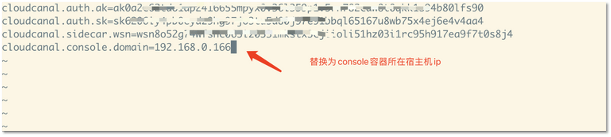

本文档主要介绍如何在 Docker 环境中添加 CloudCanal 节点，达到同步任务高可用目的。高可用特点如下：
- **任务容灾自动切换**
- **任务手动调度**
- **自动分配任务至低负载机器**

如果您从未安装过 CloudCanal Docker 版，请参考 [CloudCanal 全新安装(Docker Linux/MacOS)](./install_linux_macos)。

## 操作步骤

### 环境准备
登录新节点，参考 [安装文档](./install_linux_macos) 的 **软件准备** 章节准备相关软件。

### 添加机器
1. 登录 CloudCanal 控制台。
2. 点击 **同步设置** > **同步机器**，进入集群列表页。
3. 点击列表右侧操作栏中的 **机器列表**，进入机器列表页。
4. 点击页面右上角 **新增机器**。
5. 点击 **生成机器唯一标识**。
6. 选择待确认的机器，点击 **查看配置文件**。
7. 点击 **获取短信验证码**，输入 **777777**。
8. 获取机器唯一识别配置信息。
9. 在新机器上解压安装包。
    ```shell
    7z x cloudcanal.7z -o./cloudcanal_home
    ```

10. 进入解压目录下的 **install_on_docker**，执行以下命令，添加一个新的 Sidecar 容器。
    ```shell
    cd /cloudcanal_home/install_on_docker
    sh install_one_node.sh
    ```
    :::info
    一台机器上不允许启动两个 Sidecar 容器，请在新的机器上启动 Sidecar 容器。
    :::

11. 寻找并编辑指定配置文件。
    ```sh
      ## 查看容器id
      docker ps | grep cloudcanal-sidecar
    
      ## 进入容器
      docker exec -it ${CONTAINER_ID} /bin/bash
    
      ## 修改配置文件
      vi /home/clougence/cloudcanal/global_conf/conf.properties
    ```

12. 将控制台 **机器唯一识别配置信息** 复制到配置文件（conf.properties），替换已存在内容。
13. 将 `cloudcanal.console.domain` 的值设为 cloudcanal-console 容器所在宿主机 ip。
  

14. 从 Sidecar 容器检查 Console 容器所在宿主机 7007 端口连通性。
    ```
    docker exec -it ${CONTAINER_ID} /bin/bash
    
    ## 安装 telnet
    yum install -y telnet
    
    telnet ${console容器所在宿主机ip} 7007
    ```

15. 进入新添加的 Sidecar 容器，执行如下命令启动 Sidecar。
    ```
    chown -R clougence.clougence cloudcanal
    
    ## 切换为 clougence 用户
    su - clougence
    
    ## 启动 Sidecar
    sh /home/clougence/cloudcanal/sidecar/bin/startSidecar.sh
    
    ## 查看日志，确认是否有异常。如果都为 INFO 或者 WARN 日志就是正常的
    tail -f /home/clougence/logs/cloudcanal/sidecar/sidecar.log
    ```

16. 在机器列表页确认新添加的机器正常上线。


## FAQ

**Q: 使用 clougence 用户执行 sidecar.sh 脚本报错 Permission denied 怎么办？**   
**A:** 确认 /home/clougence/cloudcanal 目录权限是否为 clougence:clougence，如果不是，执行以下操作：
    ```ssh
    chown -R clougence:clougence /home/clougence/cloudcanal
    ```

**Q: properties in global config /home/clougence/cloudcanal/global_conf/conf.properties are empty**   
**A:** 请仔细检查 /home/clougence/cloudcanal/global_conf/conf.properties 文件的内容，是否复制粘贴完整。

