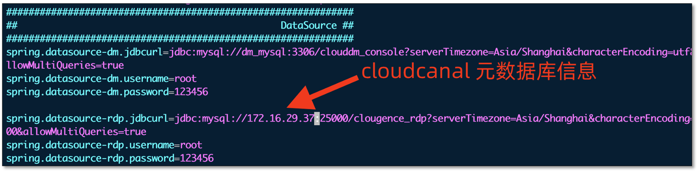
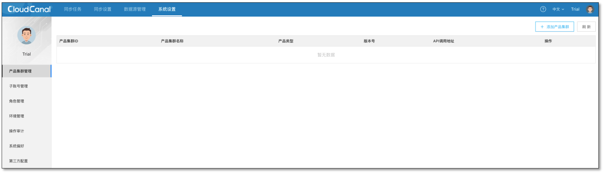
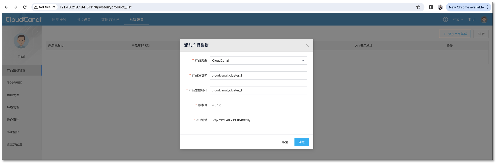
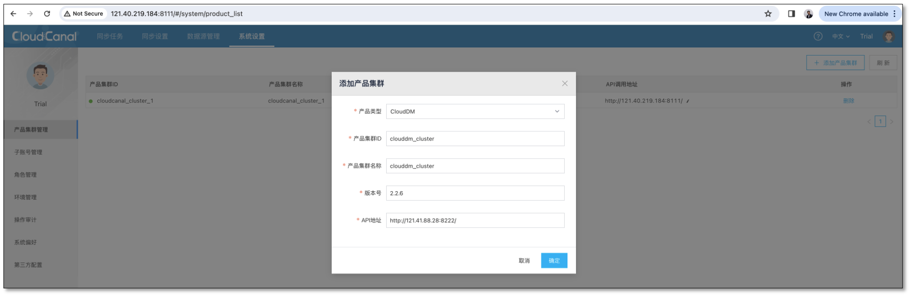
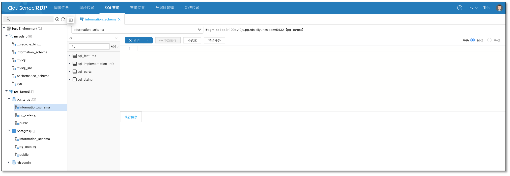
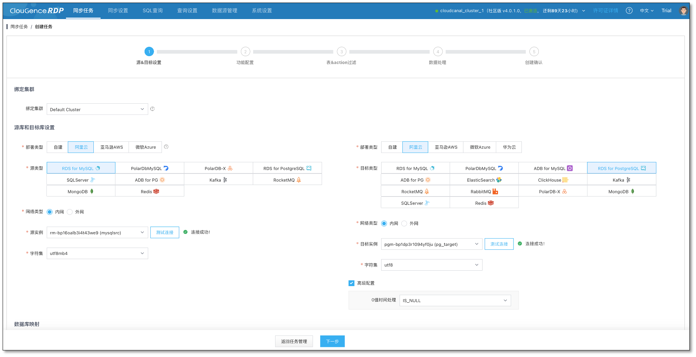

CloudDM 是 CloudCanal 同一个厂商推出的在线数据管理产品， Team 版主要面向企业级场景。

本文主要介绍如何在已部署使用 CloudCanal 后( >= 4.0 版本)，无缝添加 CloudDM Team 版使用。

### 账号准备

- 登录 CloudCanal 元数据库

  ```shell
  # e.g.,docker
  mysql -h127.0.0.1 -uroot -P25000 -p123456
  ```
  
- 进入 clougence_rdp 库

  ```shell
  use clougence_rdp;
  ```
  
- 查询当前主账号

  ```shell
  mysql> select uid,username,maintainer from rdp_user where parent_id is null and email <> 'inner@clougence.com';
  +------------------+----------+------------+
  | uid              | username | maintainer |
  +------------------+----------+------------+
  | 6258151610403310 | Trial    |          0 |
  +------------------+----------+------------+
  1 row in set (0.00 sec)
  ```

  > Ps:如出现多个主账号，请寻求官方帮助

- 更改主账号属性

  ```shell
  # e.g.,
  update rdp_user set maintainer=1 where uid='6258151610403310';
  ```

### 部署 CloudDM Team

- 准备一个新机器
- 根据 [CloudDM Team 版全新安装(docker)](https://www.clougence.com/dm-doc/maintain/docker/install_linux_macos) 文档进行安装。

### 网络处理(Docker)

- 如果 CloudCanal 为 Docker 部署，且和 CloudDM 部署于同一个 Docker 服务中，则执行以下命令打通网络

  ```shell
  docker network connect cloudcanal-network clouddm-console
  ```

### 修改 CloudDM Team 元数据库配置

- 进入 clouddm-console 容器（docker 部署）

  ```shell
  docker exec -it <clouddm-console's container id> /bin/bash
  ```

- 修改元数据库 clougence_rdp 指向

  ```shell
  su - clougence
  
  vi /home/clougence/clouddm/console/conf/console.properties
  ```
  
  

- 重启 clouddm-console ,并查看 console.log 确认元数据库链接正常

  ```shell
  cd /home/clougence/clouddm/console/bin
  
  ./shutdown.sh
  
  ./startup.sh
  ``` 

### 添加产品集群

- 主账号登录 CloudCanal 控制台
- **配置** > **产品集群管理**

  

- 添加 CloudCanal 产品集群

  

- 添加 CloudDM Team 产品集群

  

### 完成安装 

- 控制台 Logo 自动变成 ClouGence RDP
- 从 CloudDM 控制台进入，可访问两个产品所有能力
- 从 CloudCanal 控制台进入，可访问两个产品所有能力
- 对数据源进行 **数据查询**

  

- 对数据源进行 **数据迁移同步**
  
  

### FAQ
**Q: CloudDM 不断登录怎么办？**

**A:** 检查 cloudcanal-console 的 business-output.properties 文件中 jwt.secret 配置是否和  clouddm-console 的 console.properties 的 jwt.secret 一致。如不一致，请调成一致，并重启相应的进程。

