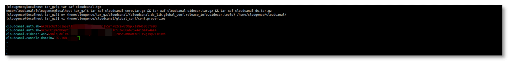

本文档主要介绍 TGZ 部署方式中添加 CloudCanal 任务运行节点。

## 前置条件

已通过 TGZ 方式部署 CloudCanal 控制台。   
如还未安装, 请先按 [全新安装(TGZ Linux)](firstinstall_with_tgz) 文档进行安装。

## 操作步骤

### 自动部署

1. 打通控制台（Console）所在服务和添加机器节点的 ssh 访问权限。
2. 点击 **同步设置** > **同步机器**，进入集群列表页。
3. 点击列表右侧操作栏中的 **机器列表**，进入机器列表页。
4. 点击页面右上角 **新增机器**，并选择 **自动部署**。
5. 填写对应新增机器的服务器信息，并点击 **测试连接**。
   
    | 项目 | 说明 |
    | :-- | :-- |
    | ip | 新增机器的 ip 地址 |
    | 端口 | 新增机器的端口，可自定义 |
    | 远程安装路径 | 服务部署安装的路径 |
    | 安装包路径 | 安装包存放的路径，可自定义 |
    | ssh 类型 | 可选择使用 **密码** 或 **密钥** 登录 |
    | 账号 | 新增机器的账号 |

6. 点击 **自动部署**。
7. 确认机器 IP 地址已更新，且采集到系统指标，则添加成功。


### 手动部署

1. 打通控制台（Console）所在服务和添加机器节点的 ssh 访问权限。
2. 点击 **同步设置** > **同步机器**，进入集群列表页。
3. 点击列表右侧操作栏中的 **机器列表**，进入机器列表页。
4. 点击页面右上角 **新增机器**，并选择 **手动部署**。
5. 点击 **生成机器唯一标识**。
6. 在 [官网](https://www/clougence.com) 获取安装包下载地址。
7. 下载到指定目录。
    ```bash
    cd /home/clougence/tar_gz

    wget "{从官网获取的下载地址}" -O cloudcanal.tgz
    ```

8. 解压安装包。
    ```bash
    tar xavf cloudcanal.tgz

    tar xaf cloudcanal-core.tar.gz && tar xaf cloudcanal-sidecar.tar.gz && tar xaf cloudcanal-ds.tar.gz

    mv /home/clougence/tar_gz/cloudcanal /home/clougence/
    ```

9. 返回 CloudCanal 机器列表页，选择待确认的机器，点击 **查看配置文件**。
10. 点击 **获取验证码**，输入 **777777**。
11. 获取机器唯一识别配置信息，并点击 **复制**。
12. 将配置信息覆写到节点配置文件。
    ```shell
    vi /home/clougence/cloudcanal/global_conf/conf.properties
    ```
    <br />
  
13. 启动任务运行机器（Sidecar）。
    ```bash
    cd /home/clougence/cloudcanal/sidecar/bin

    sh ./startSidecar.sh
    ```
14. 确认机器 IP 地址已更新，且采集到系统指标，则添加成功。
