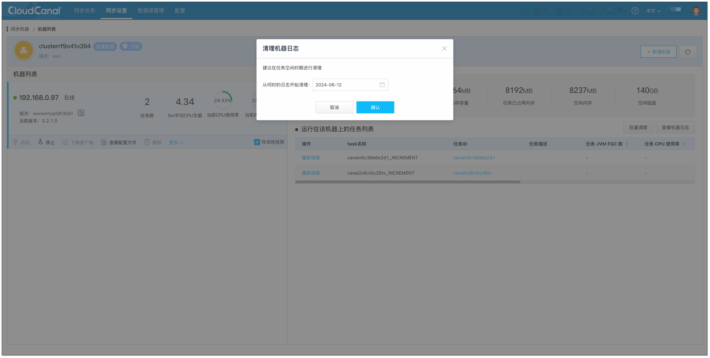
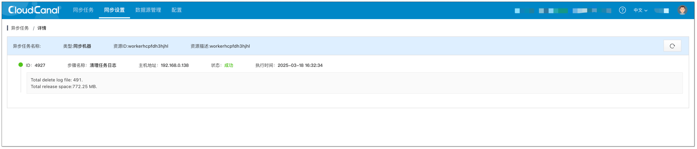

## 简介

CloudCanal 提供了客户端日志清理功能，该功能会清理以下路径中的日志文件：

- **`${user.home}`/logs/cloudcanal/tasks/`${任务名}`**（未归档的任务日志）
- **`${user.home}`/logs/cloudcanal/tasks/`${归档日期}`/`${任务名}`**（已归档的任务日志）

## 操作步骤

1. 登陆 CloudCanal 云平台。
2. 点击 **同步设置 > 同步机器 > 机器列表**，打开 **机器列表详情** 界面。
3. 选择需要清理日志的机器，点击 **更多**，选择 **清理机器日志**。
4. 选择从何时的日志开始清理（默认为机器创建的时刻），点击 **确认** 开始异步任务执行。

   

5. 查看异步任务结果，详情界面中包含日志清理的统计结果。

   
   :::info
   参数释义：
    - **Total delete log file**: 已清理的日志文件数量
    - **Total release space**:   日志清理所释放的文件空间
    - **File failed to delete**:  删除失败的文件（需要手动删除）
   :::