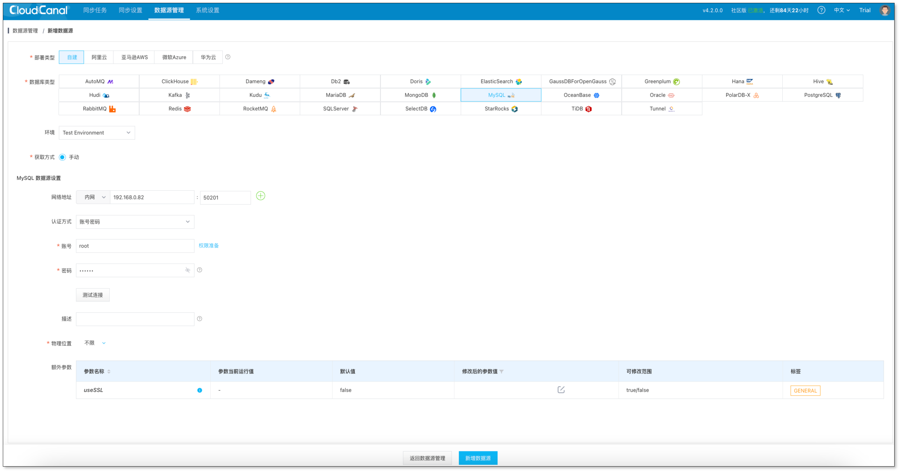
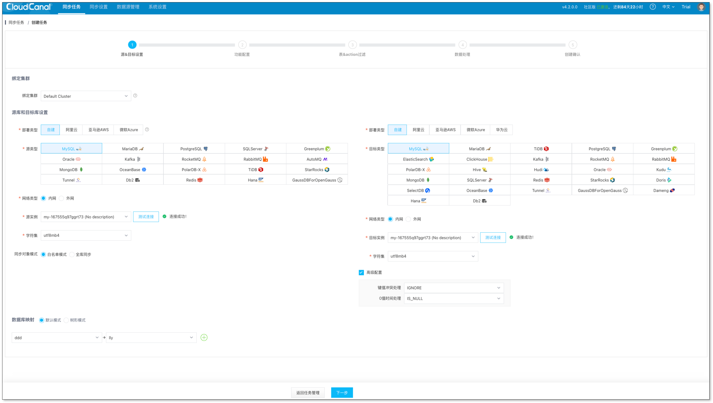
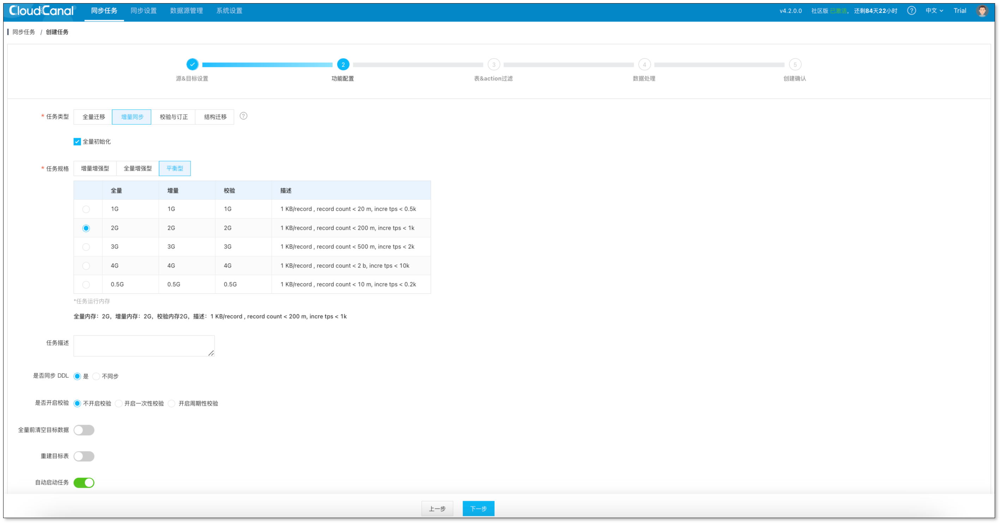
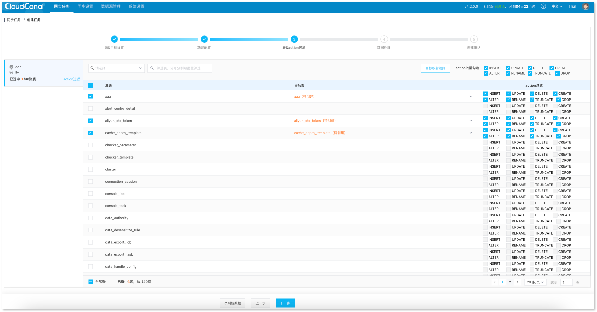
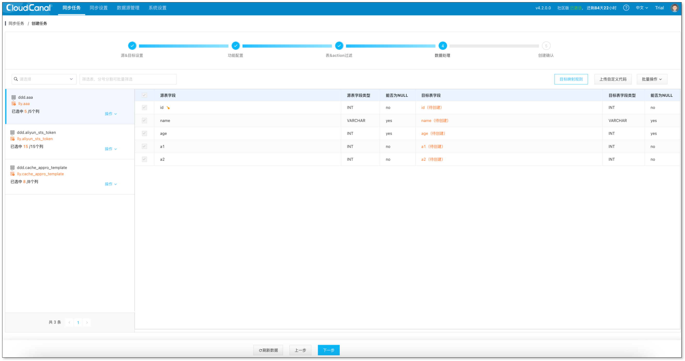
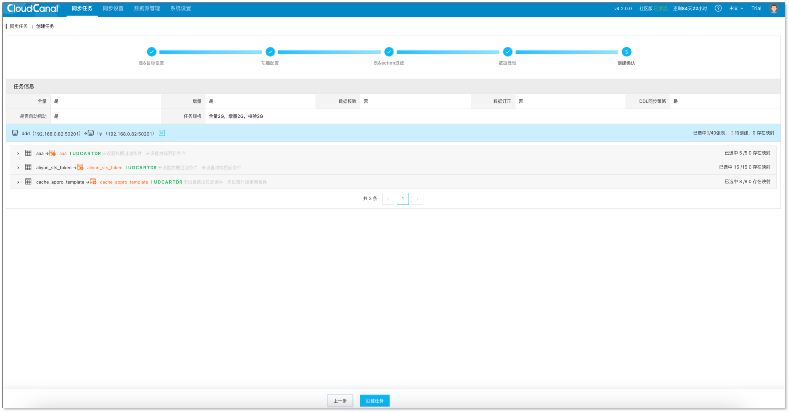
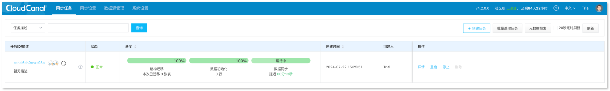

CloudCanal 私有部署版 **将完整产品安装于用户私有环境中**。

本文以 Linux 机器全新部署 Docker 版 CloudCanal 为例，快速实现数据迁移和同步。

## 安装并激活 

1. [安装完整产品(Linux/MacOS)](../productOP/docker/install_linux_macos.md)。
2. [免费激活系统](../license/license_use.md)。
   :::info
   若全新部署，且环境联通互联网，则自动免费激活社区版 15 天。

   也可登录官网获取免费社区版许可证。
   :::

## 添加数据源
1. 登录 CloudCanal 控制台，选择 **数据源管理** > **新增数据源**。
  

## 创建任务
1. CloudCanal 控制台，选择 **同步任务** > **创建任务**。

2. 选择已添加的数据源作为 **源实例** 和 **目标实例** 并点击 **测试连接**，点击 **下一步**。
  

3. 选择任务类型为 **增量同步**，并勾选 **全量初始化**，点击 **下一步**。
  

4. 选择需要订阅的源端表，并点击 **下一步**。
  

5. 选择全部列，并点击 **下一步**。
  

6. 点击 **创建任务**。
  

7. 任务正常运行，自动进行数据初始化、数据迁移和同步，进度条逐步发生变化。
  

8. 进行验证。
若在源端表增加、删除、修改数据，可在对端表中查到一致的数据变动。

