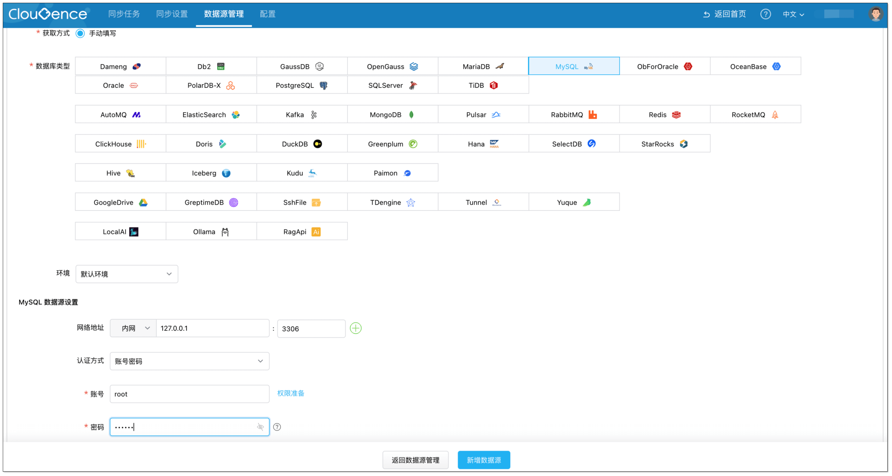
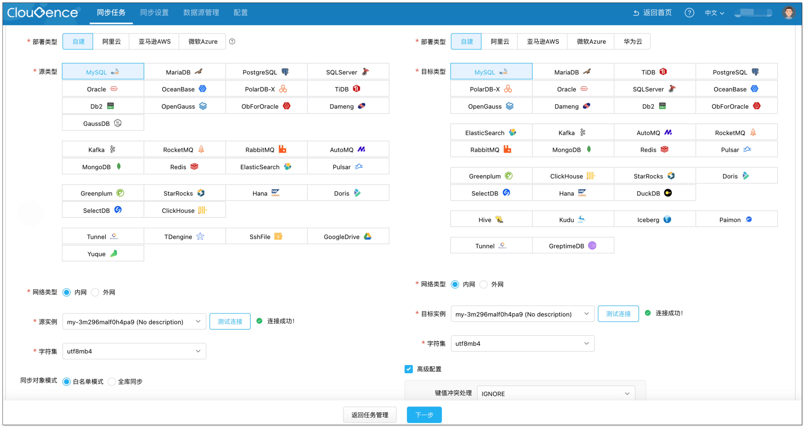
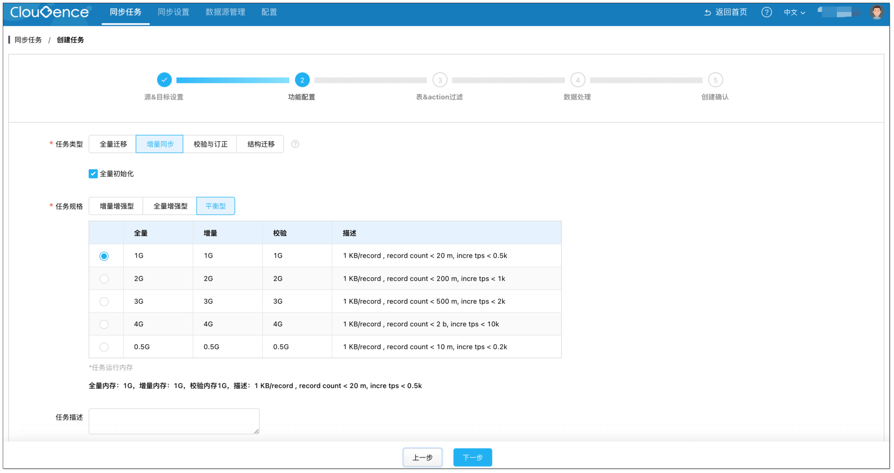
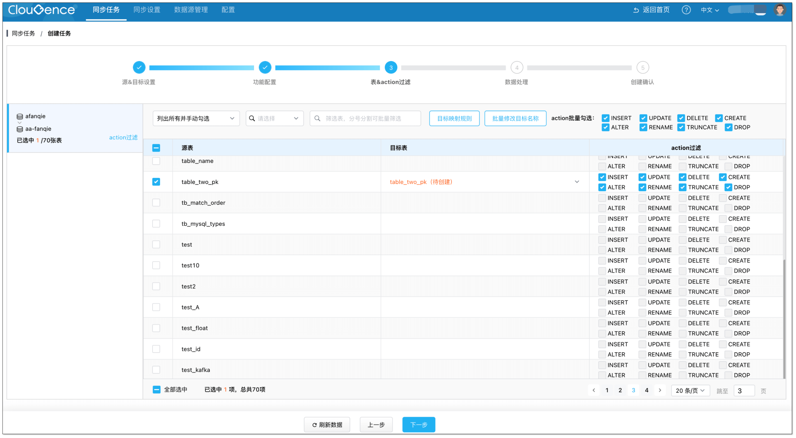
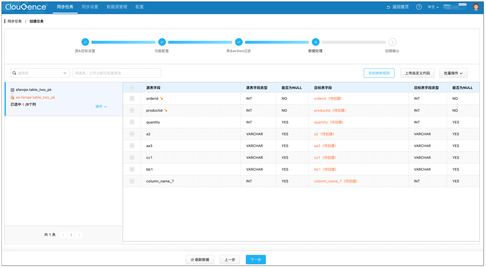
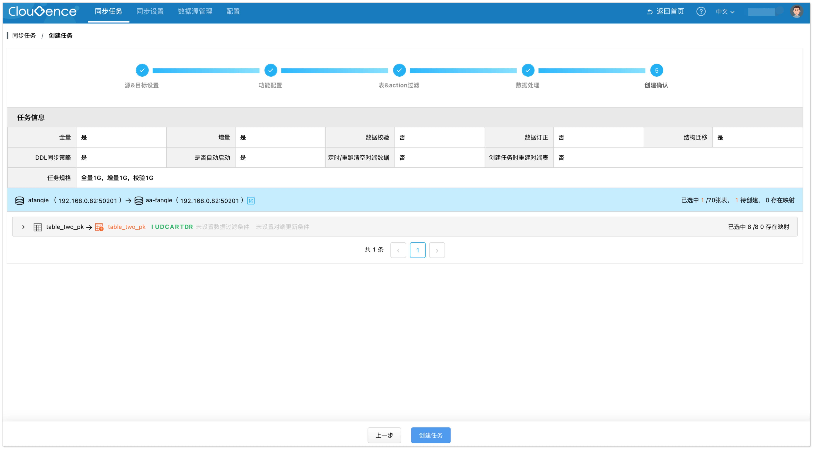
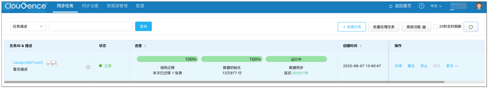

CloudCanal SaaS 支持 BYOC(Bring Your Own Cloud) 模式，**运维平台共享，数据迁移同步客户端部署于用户环境中**。

本文简要介绍如何快速拉起一个客户端，并创建迁移同步任务。

## 安装客户端

[安装 SaaS 客户端](../productOpByoc/docker/install_worker_docker.md) 并运行。

## 添加数据源
1. 登录 [CloudCanal SaaS 平台](https://cloudcanal.clougence.com)。
2. 选择 **数据源管理** > **新增数据源**。
  

## 创建任务
1. 选择 **同步任务** > **创建任务**。

2. 选择已添加的数据源作为 **源实例** 和 **目标实例** 并点击 **测试连接**，点击 **下一步**。
  

3. 选择任务类型为 **增量同步**，并勾选 **全量初始化**，点击 **下一步**。
  

4. 选择需要订阅的源端表，并点击 **下一步**。
  

5. 选择全部列，并点击 **下一步**。
  

6. 点击 **创建任务**。
  

7. 任务正常运行，自动进行数据初始化、数据迁移和同步，进度条逐步发生变化。
  

8. 进行验证。     
若在源端表增加、删除、修改数据，可在对端表中查到一致的数据变动。