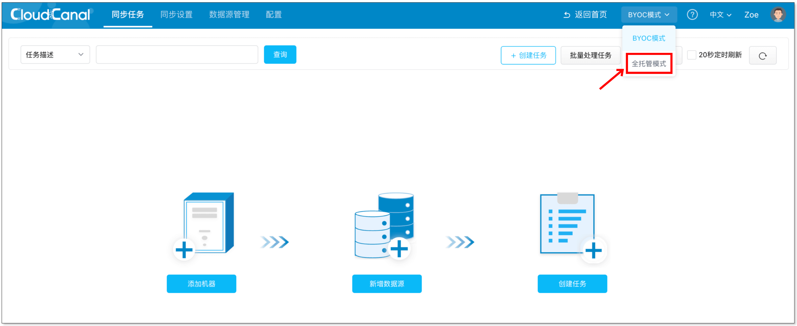
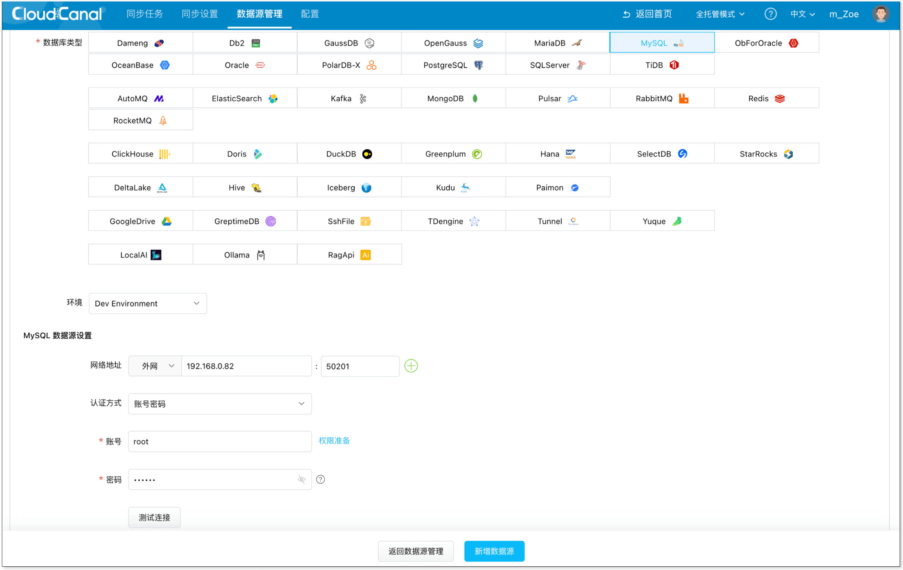
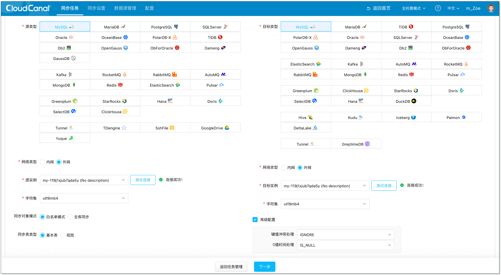
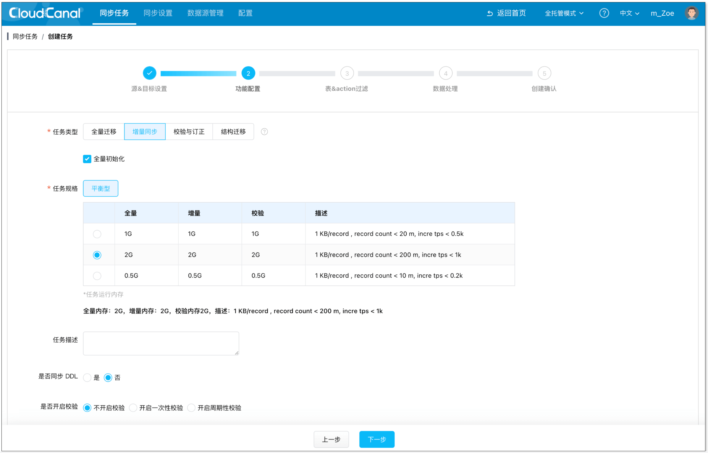
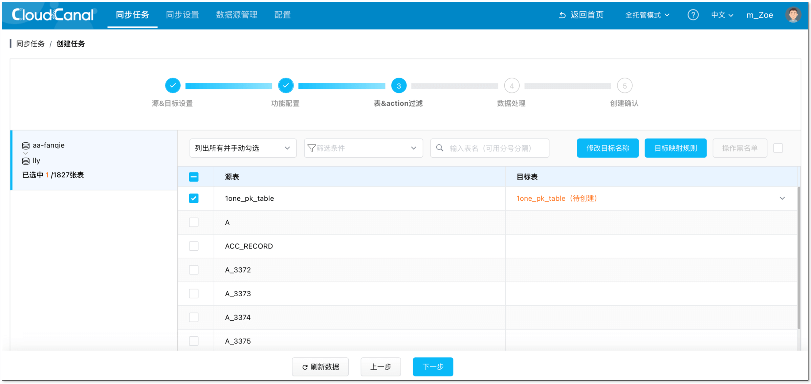
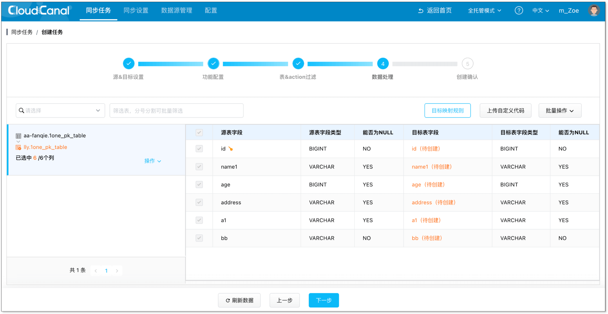
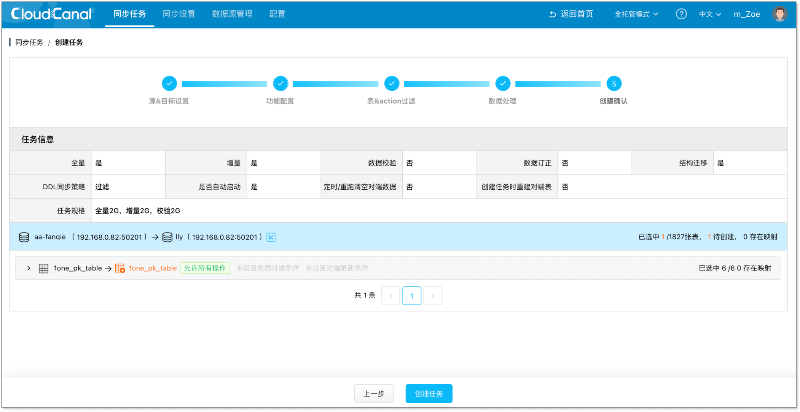
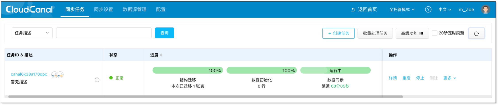

CloudCanal SaaS 支持 **全托管** 模式，**运维平台和数据迁移同步客户端均使用产品自运维机器**，用户只需进行页面操作即可。

本文简要介绍如何快速创建迁移同步任务。

## 切换为全托管模式

1. 登录 [CloudCanal SaaS 平台](https://cloudcanal.clougence.com)。
2. 在页面右上角切换为 **全托管** 模式。
   

## 添加数据源

1. 从以下 3 种方式中任选一种，让 CloudCanal 连接到你的数据库。
     - 以 [SSH 隧道方式添加数据源](../operation/datasource_manage/set_ssh_tunnel.md)。
     - 开通数据源公网访问，并通过 **同步设置** > **同步机器** > **机器 IP 列表** 获取迁移同步机器 IP 列表，添加 IP 白名单。
     - 通过公共云 Private Link 进行连接。

2. 返回 CloudCanal SaaS 平台，选择 **数据源管理** > **新增数据源**，填写相应信息，添加你的数据源。
  

## 创建任务
1. 选择 **同步任务** > **创建任务**。

2. 选择已添加的数据源作为 **源实例** 和 **目标实例** 并点击 **测试连接**，点击 **下一步**。
  

3. 选择任务类型为 **增量同步**，并勾选 **全量初始化**，点击 **下一步**。
  

4. 选择需要订阅的源端表，并点击 **下一步**。
  

5. 选择全部列，并点击 **下一步**。
  

6. 确认任务信息，点击 **创建任务**。
  

7. 任务正常运行，自动进行数据初始化、数据迁移和同步，进度条逐步发生变化。
  

8. 进行验证。      
若在源端表增加、删除、修改数据，可在对端表中查到一致的数据变动。