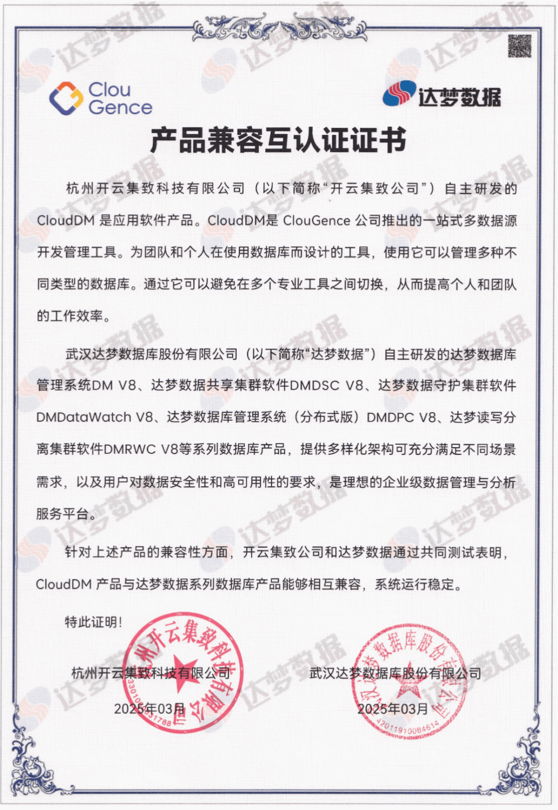

近日，杭州开云集致公司推出的一站式多数据源开发管理工具 CloudDM 与武汉达梦数据库股份有限公司自主研发的 **达梦数据系列数据库产品** 正式完成 **产品兼容性互认证**。

双方技术团队进行了严格的测试，测试结果表明，CloudDM 能够无缝连接并高效管理达梦数据库，支持可视化创建/修改表、可视化创建/查看视图/触发器/函数等多种高级功能，**两款产品在功能方面实现了深度兼容，系统运行稳定高效**。

这一认证的完成具有多重意义。技术层面，验证了 CloudDM 对国产数据库的支持能力，特别是针对达梦数据库的特性适配更加完善。生态层面，推动了国产数据库工具链的成熟。同时，为企业用户提供了更可靠的 **国产化数据库管理解决方案**，降低存储和运维成本。

CloudDM 是 ClouGence 公司推出的 一站式多数据源开发管理工具，专注企业数据安全，注重安全性、稳定性、用户体验。**产品通过简单且高效的交互来保证开发使用上的便利性，在团队协作过程中利用工作流推进数据库变更在不同环境中的变化，是一款便利用、安心管、不担心的数据安全管理平台**。目前，CloudDM 支持 MySQL、DB2 等 19 种数据源，内置 54 种常用 SQL 规则校验，为数据库变更安全保驾护航。同时，CloudDM 还支持 SSO 统一身份认证、基于角色的访问控制、与主流 OA 平台无缝衔接的工单审批流程等，满足企业跨团队协作的需求。

达梦数据库作为国产数据库的代表产品，**以其通用性、高性能、高可用、跨平台和高可扩展等特点，在党政机关、金融、电信、能源等多个关键行业得到广泛应用**。达梦数据库采用创新的体系架构，兼顾了海量数据处理和安全性。DM8 作为最新一代产品，融合了分布式、弹性计算与云计算的优势，对灵活性、易用性、可靠性、高安全性等方面进行了大规模改进。其多样化架构充分满足不同场景需求，支持超大规模并发事务处理和事务-分析混合型业务处理，动态分配计算资源，实现更精细化的资源利用和更低成本的投入。

随着数字化转型的深入，特别是在信创产业快速发展的背景下，国产基础软件的协同创新显得尤为重要。达梦数据库作为信创生态的核心成员，与 CloudDM 的深度兼容将有力推动自主可控技术体系的建设。**未来，CloudDM 与达梦数据库将加深合作，探索多维度的产品使用场景，持续加大技术投入，不断优化细节，推动国产数据库在性能、功能和用户体验等方面达到新的高度**。