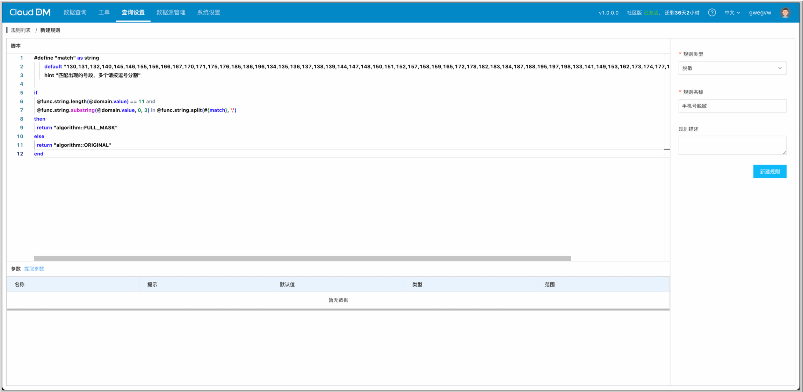
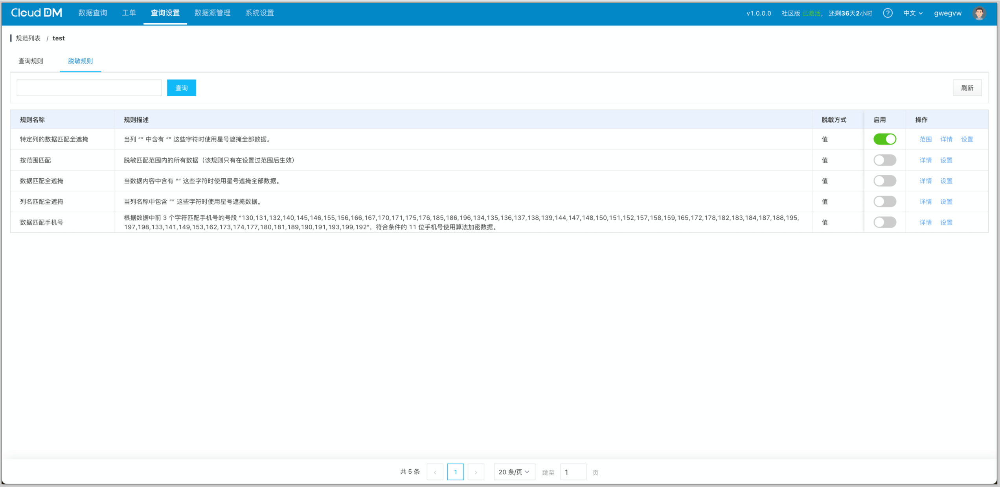
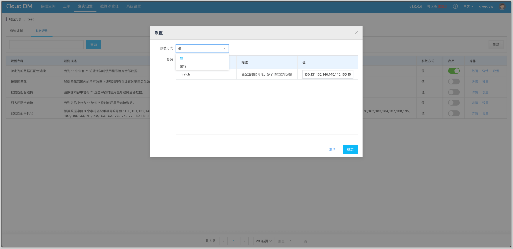
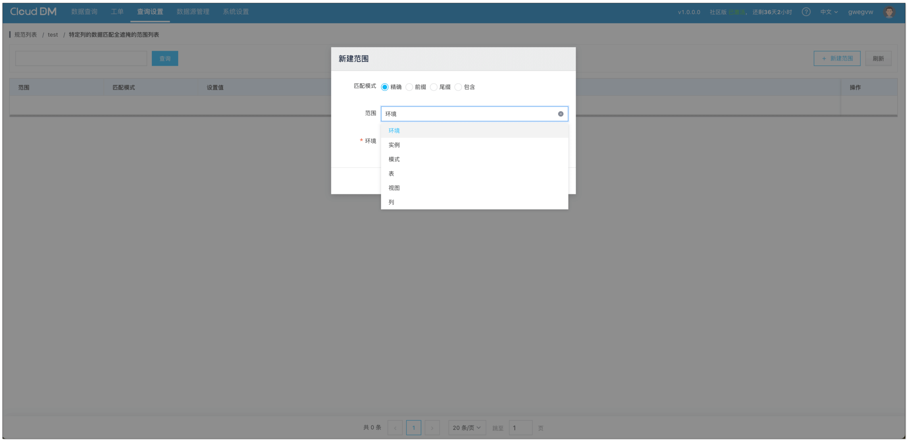
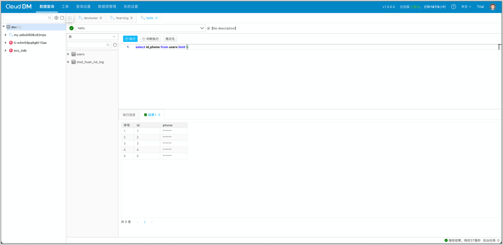

大数据时代，数据已成为许多企业的重要资产与发展基石。然而，由于没有恰当的保护措施，企业内部员工泄漏数据的情况频频发生。有数据显示，在数据泄露事件中有 80% 为企业内部人员所为，快递、酒店、银行、房产中介、教育培训等各行各业无一幸免。这对数据库的使用管理提出了更高的要求。团队开发使用数据库时**如何加强数据安全和隐私保护呢？数据脱敏提供了一种数据安全防护的新范式。**

## 什么是数据脱敏
**数据脱敏**（Data Masking）是一种安全技术，用于保护敏感数据免遭未经授权的访问和泄露。它通过**隐藏、加密、替换或修改**存储在数据库、文件或其他存储系统中的敏感信息，降低数据的敏感度。数据脱敏有助于在开发、测试、培训或数据分析等环境中使用真实数据的副本，而不暴露实际的个人信息或商业秘密。

业内常用的数据脱敏主要有两种实现方式：

+ 指定列脱敏
+ 数据识别脱敏

**指定列脱敏** 是指用户设置需要脱敏的列，对整列的数据进行脱敏。这种方式只需要配置需要数据脱敏的表和字段，配置较为简单，但需要对每张表逐一配置，当表数量较大时容易遗漏个别表。

**数据识别脱敏** 是指用户配置脱敏规则，对查询出的数据进行分析，针对符合规则的数据进行脱敏。根据脱敏规则识别数据，灵活性更高，省去了遗漏敏感数据的烦恼，但开发脱敏规则有一定难度，且算法稳定性和脱敏性能难以保证。

## CloudDM 数据脱敏
CloudDM 是一款全自研数据库数据管控平台，专注企业组织数据安全。针对大数据时代，数据隐私保护难的痛点问题，CloudDM 开发出了一套灵活、友好的数据脱敏解决方案——Rule Script 引擎。

CloudDM 自研的 Rule Script 引擎会自动识别出数据所在的库表、字段名称、数据内容等信息，通过 Rule Script 的 domain 对象进行校验，便可根据自身需求脱敏数据。

目前，Rule Script 内置了 5 种常用脱敏规则，用户无需花费大量时间开发规则脚本，即使是非专业开发人员也可以轻松实现  **指定列脱敏** 和 **数据识别脱敏**。脱敏时还可以根据具体需要决定是脱敏 **整行数据** 还是脱敏 **单个值**。此外，针对特殊的业务需求，用户还可以自己编写脱敏规则，配置脱敏方式，即可对需要脱敏的内容脱敏。

### CloudDM 脱敏引擎的优势
+ **自动化**：基于脱敏规则，对表中数据进行解析、判断与脱敏。全程自动化，无需人为操作干预，脱敏过程无感知。
+ **可拓展性**：用户可以根据自身业务需求识别敏感数据，并灵活配置脱敏规则。产品中内置了常见的脱敏规则，可满足大部分业务的脱敏需求。此外，用户可自定义脱敏规则。
+ **灵活性**：用户可根据数据的敏感程度及业务具体需求，选择整行数据脱敏或值脱敏。
+ **可用性**：数据库内原始敏感数据参与数据识别，仅在结果返回时才进行脱敏处理。

### 如何使用数据脱敏
1. **梳理敏感数据**：对于不同的业务内容、业务群体，敏感数据的定义会有所差别，因此，数据脱敏前，首先需要根据实际业务场景和安全维度，识别并梳理敏感数据。例如，在物流系统中，作为用户，敏感字段包括手机号、订单信息、收货地址等；在支付系统中，作为用户，敏感字段可能还涉支付订单、银行卡信息等。
2. **确定脱敏方式**：不同的数据可以采用不同的脱敏方式。对于特定的敏感字段，如手机号、地址等字段，可采取指定列脱敏的方式。而针对一些敏感内容，如档案系统中的工作单位等信息，可采用数据识别脱敏的方式。此外，对于安全级别高的数据可以进行整行脱敏，即对整条数据进行脱敏，确保信息绝对安全。对于手机号等单个敏感数据可以采用值脱敏，通过隐藏关键部分来保护个人隐私。
3. **编写脱敏规则**：明确上述信息后，可选择相应的内置脱敏规则，或根据需求自行编写脱敏规则，并配置生效。

自定义规则

启用规则

脱敏方式

生效范围

规则生效

## 总结
使用 **CloudDM** 数据库数据管理工具，轻松实现数据脱敏，为数据安全提供保障。如果感兴趣的话，欢迎免费试用。

