在数字化的今天，数据脱敏已成为保护数据隐私的重要手段。
在《大数据时代，数据脱敏助力企业信息安全》一文中，我们介绍了数据脱敏的重要性，以及 CloudDM 数据脱敏的实现方式。本文将手把手教你如何使用 CloudDM 以多种方式实现数据脱敏。

<!-- truncate -->

## 数据脱敏方案概览
在数据脱敏之前，用户首先需要明确，对于不同类型的敏感数据，采取不同的脱敏方案。CloudDM 支持对值和整行数据脱敏，满足用户不同的脱敏需求。

+ 列脱敏：针对手机号等单个敏感数据，可整列脱敏。

| 脱敏前的数据 | | 脱敏后的数据 |
| --- | --- | --- |
| id | phone | id | phone |
| 1 | 19927384392 | 1 | ****** |
| 2 | 19829831782 | 2 | ****** |
| 3 | 18920192839 | 3 | ****** |

+ 数据识别脱敏：当数据符合某种条件时，脱敏该数据。

| 脱敏前的数据 | | 脱敏后的数据 |
| --- | --- | --- |
| name | comment | name | comment |
| 小明 | up主真厉害 | 小明 | up主真厉害 |
| 小绿 | 好酷炫的操作 | 小绿 | 好酷炫的操作 |
| 小白 | 就这，不如XX | 小白 | ****** |

+ 整行脱敏：针对安全级别较高的数据，可进行整行脱敏。

| 脱敏前的数据 | | | 脱敏后的数据 |
| --- | --- | --- | --- |
| info | time | level | info | time | level |
| 吃了KFC | 10-1 | normal | 吃了KFC | 10-1 | normal |
| 吃了麦当劳 | 10-2 | normal | 吃了麦当劳 | 10-2 | normal |
| 做了很重要的事 | 10-3 | high | ****** | ****** | ****** |

## 前提条件
用户的角色需要拥有 **安全规则/规范管理、查询配置管理** 权限，若无该权限，可参考 [授权管理](https://www.clougence.com/dm-doc/operation/auth) 进行授权。

+ **安全规则/规范管理**：管理规则规范。
+ **查询配置管理**：环境绑定安全规范。

## 操作步骤
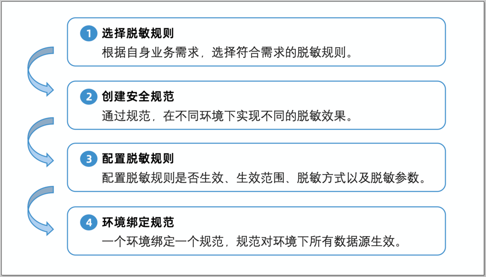

### 选择脱敏规则
1. 登录 CloudDM 平台。在上方导航栏点击 **查询设置** > **安全规则**，选择 **脱敏规则** 页签。
2. 寻找需要使用的规则，详细内容可点击 **详情** 查看。

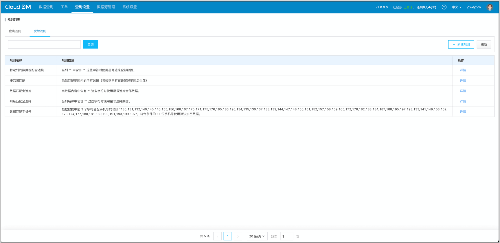

### 创建安全规范
1. 在上方导航栏点击 **查询设置** > **安全规范**。
2. 页面右上角点击 **新建规范。**

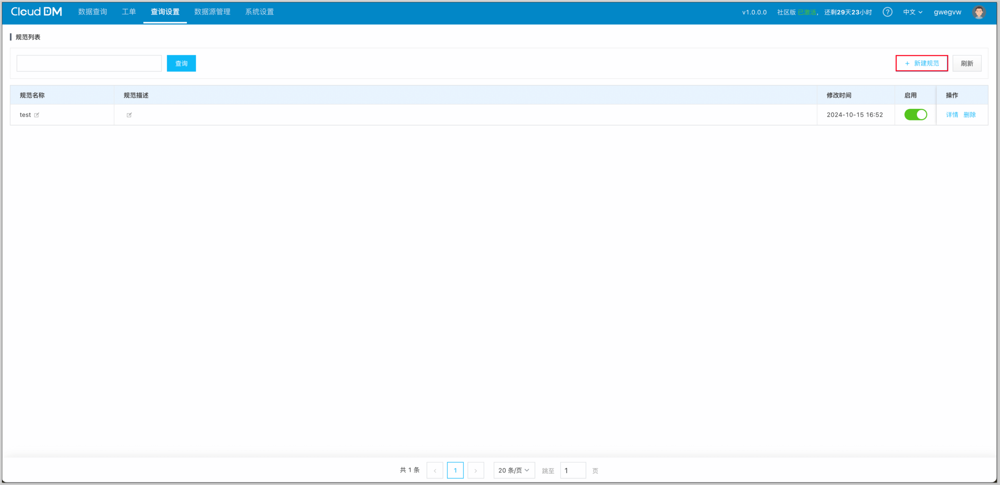

3. 输入规范名称后，点击 **确认。**

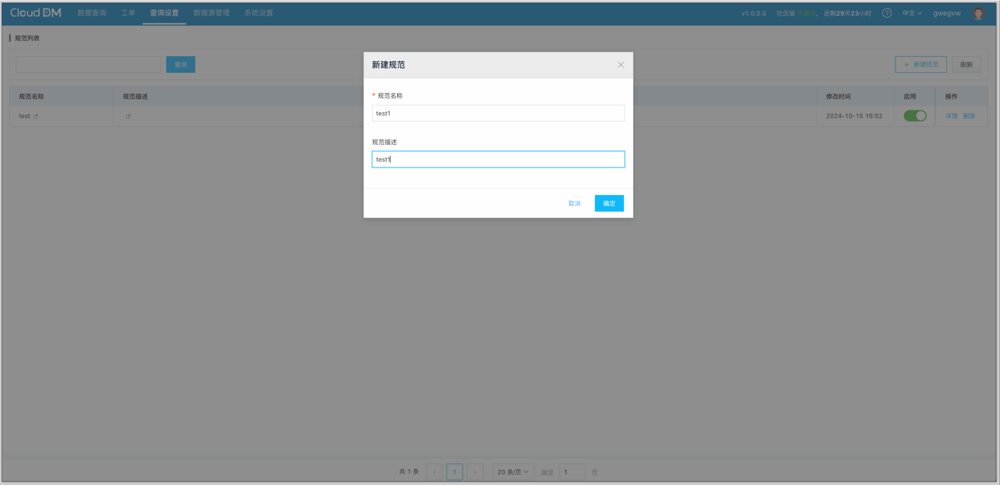

### 配置脱敏规则
1. 选择一个安全规范，在操作栏点击 **详情。**

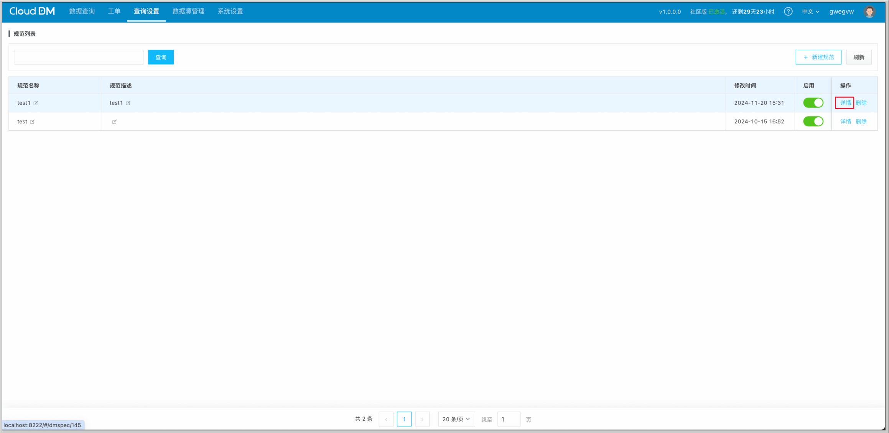

2. 启用对应的脱敏规则。

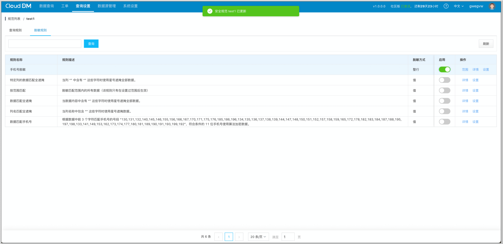

3. 配置规则。每个规则都可以设置其脱敏方式、参数以及生效范围。

      i. 点击操作栏中的 **设置**，配置脱敏方式：

    - 值：对于符合条件的数据，只脱敏该字段中的数据。
    - 整行：对于符合条件的数据，脱敏整行数据。

      ii. 在 **值** 一栏配置参数：设置脱敏规则参数，如下图则为设置需要脱敏的手机号号段。

      iii. 点击操作栏中的 **范围**。在范围配置页面右上角，点击 **新建范围**。生效范围支持多种匹配机制，并且能够精确到列级别。用户可以根据自己的业务需求，灵活配置规则的适用范围。

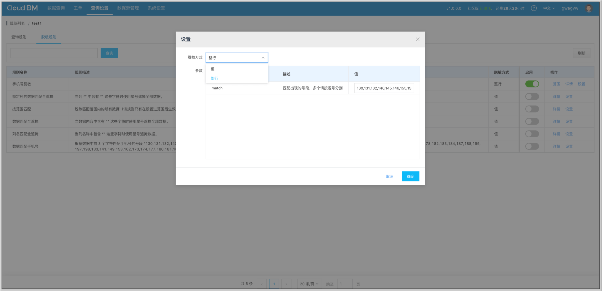

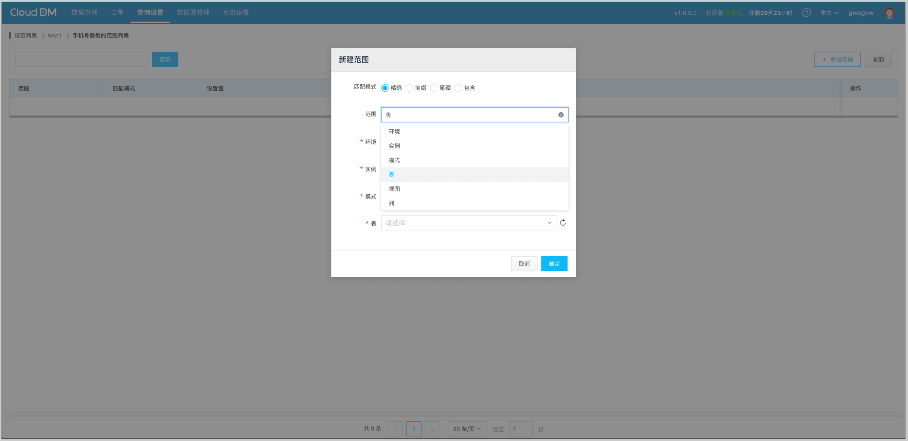

### 环境绑定规范
1. 在上方导航栏点击 **查询设置** > **查询配置** 
2. 选择 **环境** 页签。

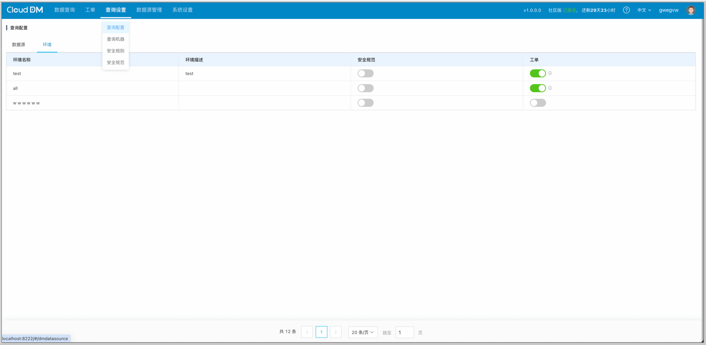

3. 在 **安全规范** 一栏中点击按钮，并选择需要绑定的安全规范。

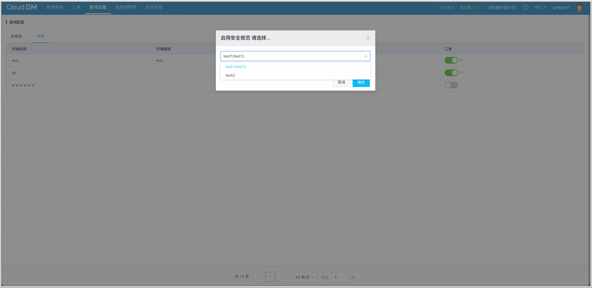

### 效果展示
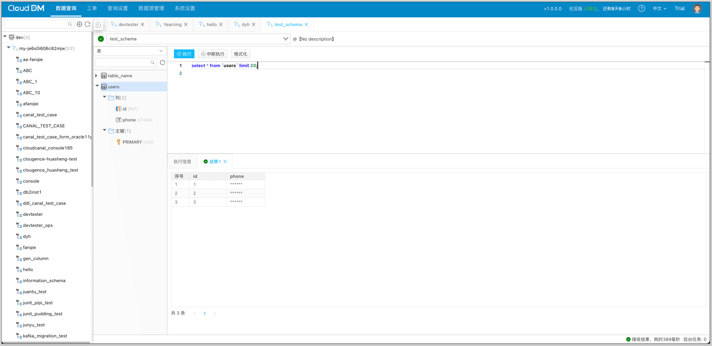

## 总结
使用 **CloudDM** 数据库数据管理工具，轻松实现数据脱敏，为数据安全提供保障。如果感兴趣的话，欢迎免费试用。
