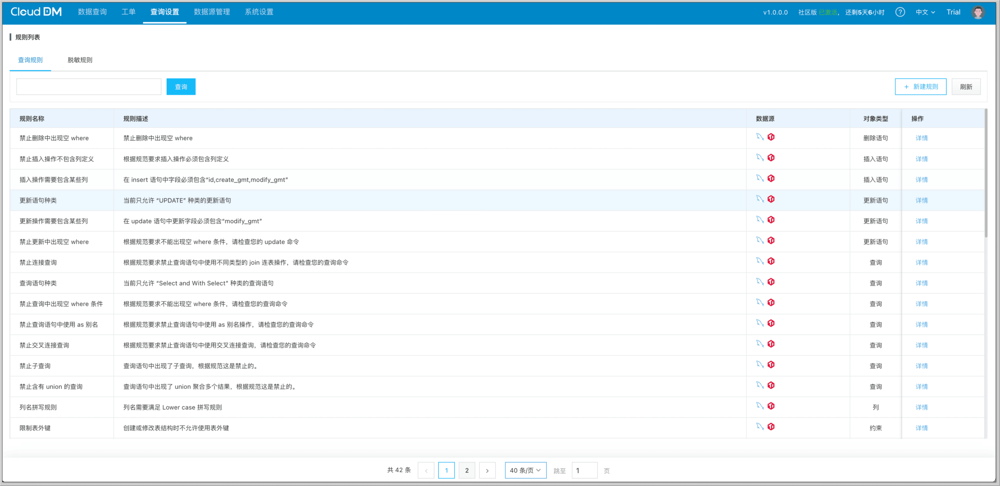
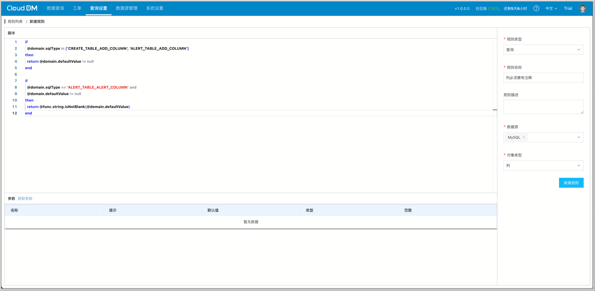
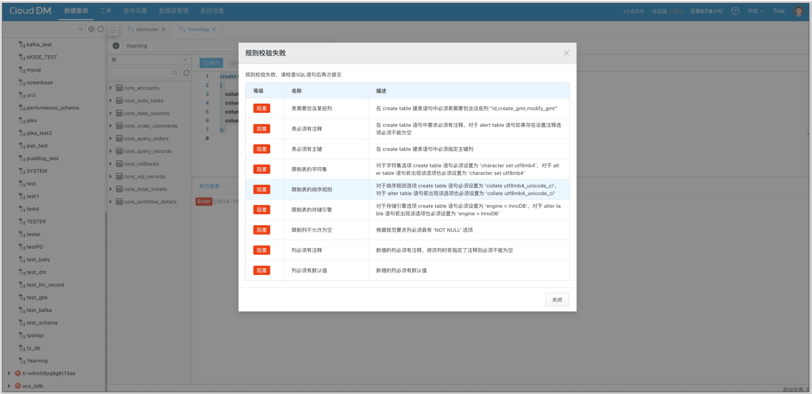

在团队协作开发过程中，开发人员想法、习惯各异，使用数据库时常常导致表结构不统一。
如果长期使用不规范的表结构，可能会导致数据分析困难、执行速度下降、数据可视化困难等多种后果。
‌这些问题普遍带有 **滞后性**、**隐蔽性** 的特点，解决这些问题时又容易产生更多连带风险。因此，规范化的表结构设计对于业务发展至关重要。

<!-- truncate -->

## 表结构不规范的影响
### 数据分析困难
表结构不规范，将会大大增加数据分析师处理数据时的难度。例如，相同含义字段名称不统一，又缺乏相应的元信息备注，导致后续分析数据时，还需要消耗大量时间梳理数据关系。

【场景 1】根据以下购物系统的订单表做数据分析：

```sql
CREATE TABLE  (
  ...
  cost DECIMAL(15, 2) ,
  ...
);
```

当我们尝试进行数据分析时，会发现 cost 字段没有设置禁止为空，也没有任何注释。开发人员在编写代码时，对于支付金额为 0 的订单可能会设置为 null 或 0。当我们发现一个订单的 cost 为 null 或者 0 时，可能是顾客使用优惠卷/红包后，支付金额为 0，或是赠品订单。而由于没有注释，在数据分析时难以对该字段的数据进行准确分析。

### 执行速度下降
不合理的表结构设计可能导致数据库查询执行速度下降。例如，某些查询语句的执行计划看似相同，但由于表结构的不合理设计，实际执行效果相差很大，导致查询速度变慢，而这个问题往往在数据量变大之后才会凸显出来。

【场景 2】 以下 SaaS 系统的 user 表记录了用户信息，所有用户都关联到一个主账号上。

```sql
CREATE TABLE sales_data (
  id INT AUTO_INCREMENT PRIMARY KEY,
  ...
  parent_id varchar(64) 
  ...
);
```

在团队管理中，当查询当前团队的成员时，需要使用 parent_id 作为过滤条件去查询。因为 parent_id 没有设置索引，在查询时需要进行全表扫描，导致执行速度大幅下降。

### 数据可视化困难
原本不为空的字段列，由于缺少表结构约束，导致意外录入脏数据，进而在数据可视化结果呈现上产生误导，甚至还会影响用户对数据的准确理解。‌最直接的问题就是 “空字符串” 和 “空值” 之间的差别难以有效界定。

【场景 3】根据以下记账软件的开支表分析收支情况。

```sql
CREATE TABLE expenditure (
  ...
  price  decimal not null,
  type ENUM('IN','OUT') NULL
  ...
);
```

当我们想对本年的收支情况进行分析时，因为该表 type 字段粒度太大，只能分析支出和收入两种类型，若想更加细致地分析在某些方面的支出，则无能为力了。

从上述例子中可以看出，数据库结构不规范，会对开发和数据分析形成重重阻碍。如果在创建表时就注意规范表结构，就可以有效避免上述情况的发生。

## 解决方案
本文提供以下方案，供读者参考比较。

1. **关键字匹配**：直接使用关键字对 DDL 语句进行判断。
+ 优点：实现简单。
+ 缺点：很容易通过各种方式绕开。

2. **SQL 审核**：普通用户执行 DDL 语句时需要提交给审核人员审核，通过后再由审核人员执行。
+ 优点：审核人员可以浏览到所有 SQL，进行统一把控。
+ 缺点：不同审核人员风格不同，并且审核人员一般是团队中的领导者，需要付出额外的精力。人工审核，也有概率漏过一些不符合标准的 DDL。

3. **SQL 审核平台**：通过 SQL 审核平台的校验规则，加上审核人员的最终把控，对将要执行的 SQL 进行高效监管，并且有历史记录查询、回滚 SQL 等多种功能满足团队需求。
+ 优点：通过脚本校验 SQL，用户只需开启脚本便可检查 SQL 是否满足规范。审核人员只需要检查 SQL 是否符合业务需求即可。此外还有其他功能满足用户各种需求。
+ 缺点：SQL 解析复杂，实现难度大。大部分平台只有常用规则，但无法自定义规则，无法满足用户个性化的需求。

## 推荐方案
根据上述的方案比较，不难看出 **SQL 审核平台** 是比较便捷安全的方案，校验准确，省时省力，并且可以满足多样的需求。国产自研的数据库数据管控工具 **CloudDM Team** 便是一个合适的选择。

CloudDM Team 采用了全新的自研 Rule Script 引擎。通过 Rule Script 强大的编程能力，CloudDM Team 的所有内置规则全部实现了脚本化。此外，用户能够根据自己的需求自定义规则。



内置规则



自定义规则



规则生效


## 总结
使用 **CloudDM** 这样的数据库数据管理工具，轻松实现良好的数据库结构规范，为团队开发协作提质增效。


