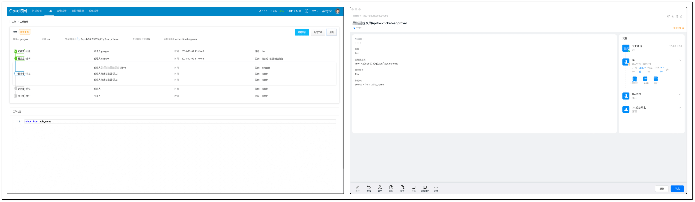
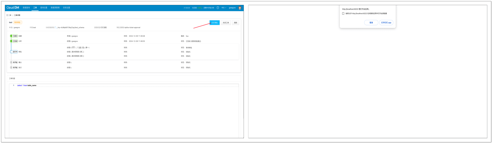
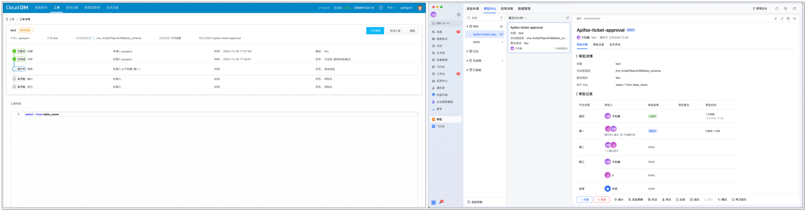
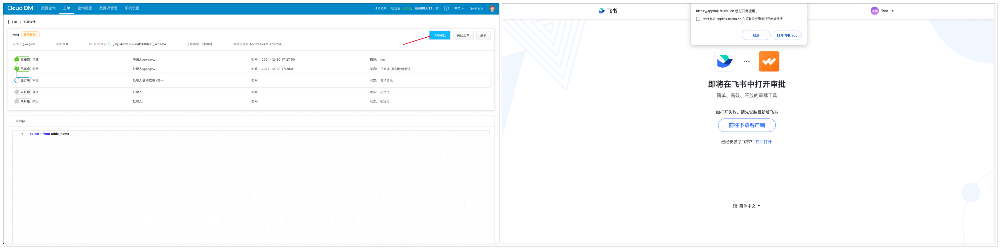
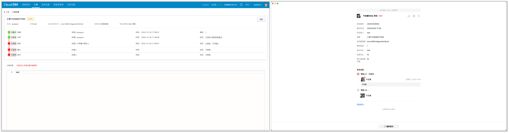

数据库数据管控平台在维护企业数据安全、数据库规范方面不可或缺，这一点毋庸置疑。但在实际使用数据库数据管理系统时，常常面临一个问题：工单审批流程集中在数据管理系统，然而并非所有员工都使用这个系统，导致审批困难、效率低下。当然，可以强制相关员工加入该系统，但这会增加时间及管理成本，并非最佳的解决方法。

实际上，大多数企业都有自己的协同办公系统，如钉钉、飞书等主流平台。这些平台集成了各类日常办公操作，如考勤、审批等，大大提升了办公效率。将企业 OA 系统接入数据库数据管理系统，既无需员工额外下载一个软件，又方便办公事务的集中管理，是简化工单审批流程的必行之道。

## CloudDM 接入 OA 系统
CloudDM 是一款全自研数据库数据管控平台，专注企业组织数据安全。为提升用户体验，CloudDM 最近支持接入钉钉、飞书和企业微信三款 OA 系统，实现了 OA 系统与 CloudDM 的无缝衔接，让工单审批流程更加简便高效。

通常，将 OA 系统接入数据库数据管理软件，会出现各种各样的问题，如：

+ 网络出错，导致回调消息丢失，状态不同步。
+ 调用接口失败，但是无法定位问题根源。
+ 付费 API 过量使用，导致不必要的花费。

CloudDM 作为一款专为企业级用户设计的数据库数据管控软件，充分考虑了上述问题，并从用户的角度出发，设置了各种解决方案：

| **问题** | **解决方案** |
| --- | --- |
| API 网络异常 | 在 API 调用过程中如遇网络错误，系统将自动记录相关信息，并安排在下一次执行重试。对于需要及时响应的操作，系统会向用户提供清晰的错误提示。 |
| 信息不同步 | 网络波动可能导致消息不同步。CloudDM 将定期检查所有待审批工单的状态，通过调用接口获取最新的审批信息。这一检查频率可以在配置中调整。用户也可以在工单详情页面手动刷新，直接从 API 获取最新的状态更新。 |
| 模版被删除 | 若尝试创建审批时发现模版已被删除，系统将自动把工单状态设置为失败，并在工单详情界面显示相应的错误信息。 |
| 其他异常 | 对于其他类型的错误，如无法找到匹配的用户信息或系统异常等无法推进流程的错误，系统会明确提示错误原因，并将工单状态设置为失败，以避免不必要的 API 调用次数。 |

## CloudDM 第三方审批流程特点
CloudDM 的第三方审批流程有两大特点：**一致性**、**便捷性**。

**一致性**: 无论是通过 CloudDM 内置的审批流程还是整合其他 OA 系统，用户的操作体验都是统一的，几乎感觉不到不同审批系统间的差异，极大地提升了操作的流畅性和效率。

**便捷性**: 用户只需进行简单的配置，即可在任一平台上发起审批流程。CloudDM 与外部 OA 系统都将实时同步最新的审批状态。用户无需在不同系统间切换，在一个平台上即可掌握审批进度。

## 如何接入外部 OA 系统
### 钉钉
请参考 [接入钉钉审批](https://www.clougence.com/dm-doc/maintain/extension/extension_dingtalk_approval)，完成相关配置。配置成功后，可实现 CloudDM 与钉钉的无缝衔接。

+ 流程同步：CloudDM 与钉钉的审批页面实时同步审批流最新状态。

+ 快速跳转：在 CloudDM 点击 **钉钉审批**即可直接跳转到钉钉对应的审批单，方便用户进行催单等操作。

### 飞书
请参考 [接入飞书审批](https://www.clougence.com/dm-doc/maintain/extension/extension_feishu_approval)，完成相关配置。配置成功后，可实现 CloudDM 与飞书的无缝衔接。

+ 流程同步:CloudDM 与飞书的审批页面实时同步审批流最新状态。

+ 快速跳转：在 CloudDM 点击 **飞书审批**即可直接跳转到飞书对应的审批单，方便用户进行催单等操作。

### 企业微信
请参考 [接入企业微信](https://www.clougence.com/dm-doc/maintain/extension/extension_wechat_approval)，完成相关配置。配置成功后，可实现 CloudDM 与企业微信的无缝衔接。

+ 流程同步：CloudDM 与企业微信的审批页面实时同步审批流最新状态。

## 总结
使用数据库数据管理工具 **CloudDM**，轻松衔接企业 OA 系统审批流程，节约时间及管理成本，显著提升团队的开发协作效率。如果您对此感兴趣，欢迎免费体验产品。

