数据库变更是日常开发和运维里绕不开的活。为了降低线上环境出故障的风险，通常会配合工单系统来发布变更，这样流程可控，也能减少低级错误。
市面上能选的工具不少，有开源的，也有商业化的。这次我挑了四款比较常见的：**Yearning、Archery、Bytebase**，还有 **CloudDM**，从工单场景出发做了一轮体验和横向对比，给大家一些参考。

<!-- truncate -->

## 测评方法
不同工具的功能侧重点不一样，如果各方面都测，反而看不出差别。所以我主要关注最常见的两个场景：**业务上线**和**数据订正**。测试用的版本主要是**社区版/免费版**。

### 业务上线
功能上线通常包括两部分：程序包和数据库脚本。程序包这块一般由 CI/CD 流程接管，这里不展开。数据库变更脚本经常包括一条或多条需要执行的 SQL 语句，以 DDL 为主。在这个场景下，我准备了两个测试点：

+ DDL 需要符合一定的规则；
+ 工单里可以处理 DDL/DML 混合语句。

```plain
-- 添加表
create table biz_model (
  id             bigint NOT NULL AUTO_INCREMENT,
  created_time   datetime  COMMENT 'Creation timestamp',
  updated_time   datetime  COMMENT 'Last update timestamp',
  content        varchar(50)  NOT NULL COMMENT 'biz body',
  PRIMARY KEY (id)
);

-- 初始化数据
insert into biz_model (id, created_time, updated_time, content) 
values (1, '2025-05-30 14:02:39', '2025-05-30 14:02:39', '... content1 ...' );

insert into biz_model (id, created_time, updated_time, content) 
values (2, '2025-05-30 14:02:39', '2025-05-30 14:02:39', '... content2 ...' );

insert into biz_model (id, created_time, updated_time, content) 
values (5275, '2025-05-30 14:02:39', '2025-05-30 14:02:39', '... content3 ...' );

-- 修改老表
alter table admin_user
  add biz_id varchar(50)  NOT NULL COMMENT 'biz id';
```

### 数据订正
数据订正也比较常见，有时候是有 bug，有时候是运维需要。重点是生产库不能停，在持续写入的情况下修改数据有一定概率会失败。因此在这个场景中，我准备了三个测试点：

+ 订正需要修复的数据
+ 出于某些原因，数据订正语句可能会报错
+ 批量化更新大量数据

```plain
-- 修复一条数据
update biz_model set content = 'abc' where id = 1;

-- 修复一条数据（模拟 SQL 报错）
update biz_model set content = null where id = 5275;

-- 批量更新数据
update admin_user set biz_id = 0 where created_time > '2025-01-01';
```


## 对比一览
先上对比表，直接看测试体验的结果：

<table border="1" cellspacing="0" cellpadding="6">
  <thead>
    <tr>
      <th>分类</th>
      <th>功能</th>
      <th>CloudDM</th>
      <th>Archery</th>
      <th>Yearning</th>
      <th>Bytebase</th>
    </tr>
  </thead>
  <tbody>
    <!-- 数据源 -->
    <tr>
      <td rowspan="3">数据源</td>
      <td>可管理的数据源</td>
      <td><b>18 种</b></td>
      <td><b>14 种</b></td>
      <td><b>1 种</b></td>
      <td><b>24 种</b></td>
    </tr>
    <tr>
      <td>支持审核的数据源</td>
      <td><b>18 种</b></td>
      <td><b>3 种</b></td>
      <td><b>1 种</b></td>
      <td><b>7 种</b></td>
    </tr>
    <tr>
      <td>查询控制台</td>
      <td><b>✔️</b></td>
      <td><b>✔️</b></td>
      <td><b>✔️</b></td>
      <td><b>✔️</b></td>
    </tr>
    <!-- 工单递交 -->
    <tr>
      <td rowspan="2">工单递交</td>
      <td>DDL/DML 混合语句</td>
      <td><b>✔️</b></td>
      <td><b>✔️</b></td>
      <td><b>✖️</b></td>
      <td><b>✔️</b></td>
    </tr>
    <tr>
      <td>分析查询计划</td>
      <td><b>✖️</b></td>
      <td><b>✔️</b></td>
      <td><b>✔️</b></td>
      <td><b>✔️</b></td>
    </tr>
    <!-- SQL 审核 -->
    <tr>
      <td rowspan="7">SQL 审核</td>
      <td>SQL 规则</td>
      <td><b>60+</b></td>
      <td><b>10+</b></td>
      <td><b>40+</b></td>
      <td><b>100+</b></td>
    </tr>
    <tr>
      <td>自定义规则</td>
      <td><b>✔️</b></td>
      <td><b>✖️</b></td>
      <td><b>✖️</b></td>
      <td><b>✖️</b></td>
    </tr>
    <tr>
      <td>规则参数配置</td>
      <td><b>✔️</b></td>
      <td><b>✖️</b></td>
      <td><b>✔️</b></td>
      <td><b>✔️</b></td>
    </tr>
    <tr>
      <td>审核分级</td>
      <td><b>✔️</b></td>
      <td><b>✔️</b></td>
      <td><b>✖️</b></td>
      <td><b>✔️</b></td>
    </tr>
    <tr>
      <td>禁止递交问题工单</td>
      <td><b>✔️</b></td>
      <td><b>✔️</b></td>
      <td><b>✔️</b></td>
      <td><b>✔️</b></td>
    </tr>
    <tr>
      <td>提示所在行</td>
      <td><b>✔️</b></td>
      <td><b>✖️</b></td>
      <td><b>✖️</b></td>
      <td><b>✔️</b></td>
    </tr>
    <tr>
      <td>SQL 审核结果回溯</td>
      <td><b>✔️</b></td>
      <td><b>✔️</b></td>
      <td><b>✖️</b></td>
      <td><b>✔️</b></td>
    </tr>
    <!-- 审批流程 -->
    <tr>
      <td rowspan="3">审批流程</td>
      <td>内置审批</td>
      <td><b>✔️</b></td>
      <td><b>✔️</b></td>
      <td><b>✔️</b></td>
      <td>收费</td>
    </tr>
    <tr>
      <td>自定义审批流</td>
      <td><b>✖️</b></td>
      <td><b>✔️</b></td>
      <td><b>✔️</b></td>
      <td>收费</td>
    </tr>
    <tr>
      <td>流程引擎</td>
      <td>内置<br/>钉钉<br/>飞书<br/>企业微信</td>
      <td>内置</td>
      <td>内置</td>
      <td>内置</td>
    </tr>
    <!-- 工单执行 -->
    <tr>
      <td rowspan="4">工单执行</td>
      <td>执行方式</td>
      <td>立即/定时/手动</td>
      <td>立即/定时/手动</td>
      <td>立即/定时</td>
      <td>立即/定时</td>
    </tr>
    <tr>
      <td>事务模式</td>
      <td>可选</td>
      <td>不支持</td>
      <td>不支持</td>
      <td>默认（不可选）</td>
    </tr>
    <tr>
      <td>工单调试</td>
      <td><b>✔️</b></td>
      <td><b>✖️</b></td>
      <td><b>✖️</b></td>
      <td><b>✖️</b></td>
    </tr>
    <tr>
      <td>工单失败后回滚方式</td>
      <td>需要事务模式</td>
      <td>生成语句</td>
      <td>生成语句</td>
      <td>事务</td>
    </tr>
  </tbody>
</table>


下面来具体聊聊每款产品的使用体验，主要围绕 **工单递交**、**SQL 审核**、**审批流程与工单执行** 这几个环节展开。

## CloudDM
在 [CloudDM](https://www.cdmgr.com/) 中，对数据库的操作分成三类：**数据查询**、**CI/CD** 和 **工单**。默认情况下，查询控制台只能执行查询语句，DDL/DML 需要通过工单才能执行。如果需要，也可以修改环境策略，让它成为一个 SQL 客户端。

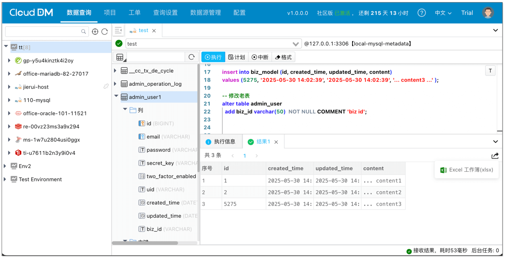

### 创建工单
CloudDM 创建工单时，允许 DDL/DML 在同一个工单中混合使用。子账号如果在可视化操作过程中没有对应权限，系统会帮助用户快速创建对应的工单，方便继续走流程。

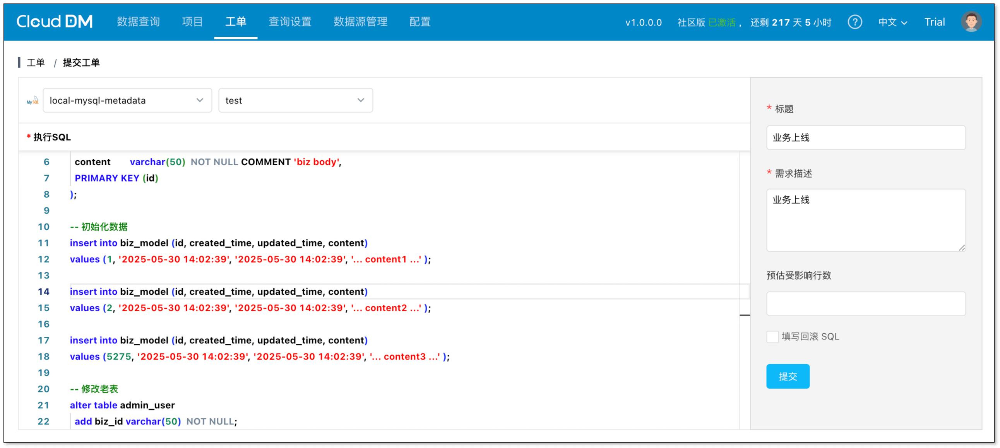

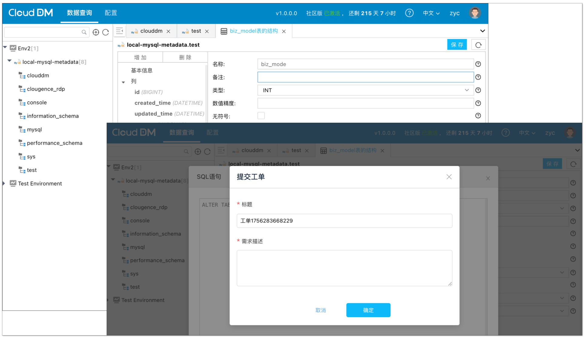

通过修改环境策略，CloudDM 可以禁止环境中数据源的工单功能，在只提供查询的环境中，可以更好地保证数据库的安全。

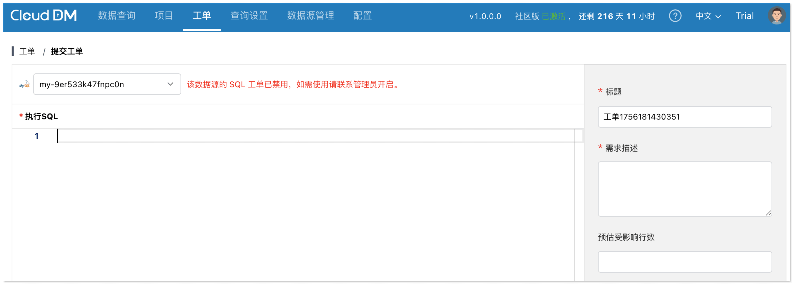

### SQL 审核
CloudDM 内置了 **60** 多条规则，并且基本适用于支持的 **18** 种数据源。比较极客的是，CloudDM 的所有规则全部使用特定的 **DSL** 语言来编写，并且支持自定义新的规则。这意味着除了内置规则之外，还可以根据自己特殊需要使用 DSL **编写个性化规则**，免去二次开发的烦恼。

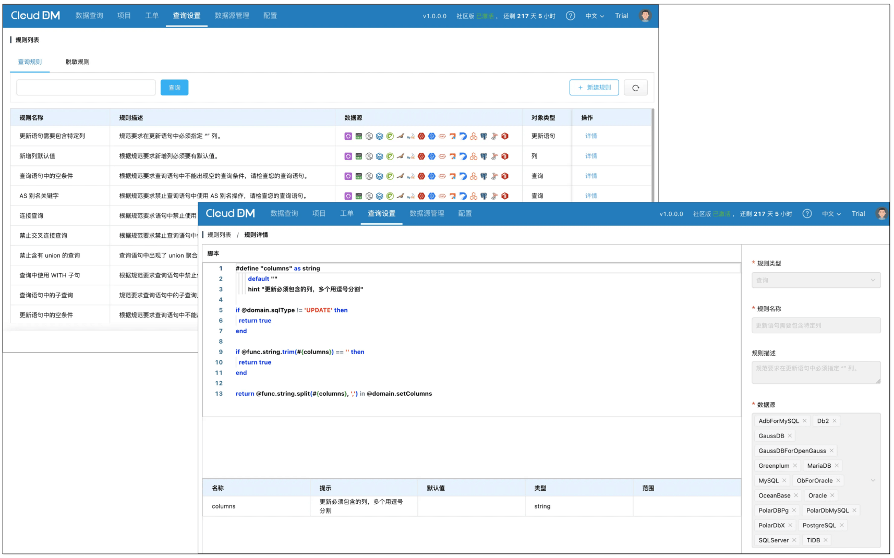

工单创建时，CloudDM 会自动检查 SQL，并明显地提示检查结果，标出问题 SQL 所在行。有多条语句的情况下，定位问题很快，改起来也方便。

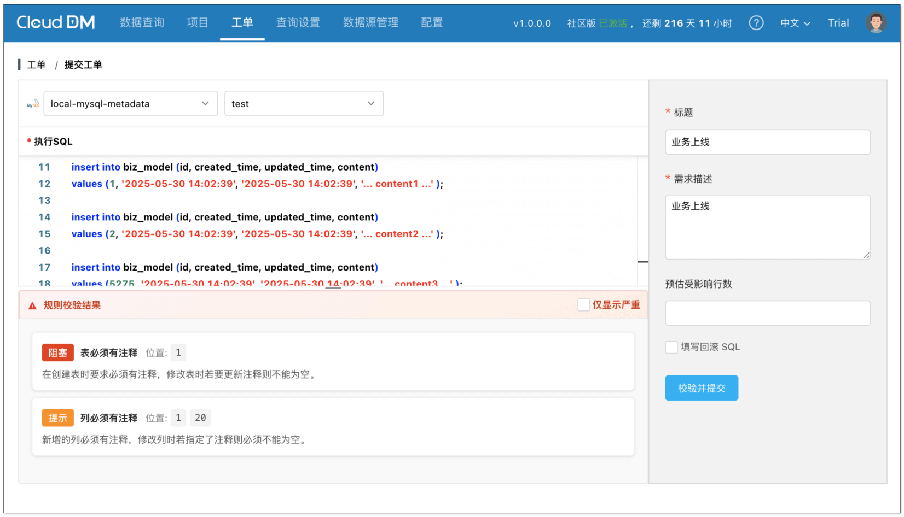

在对工单进行 SQL 审核时，CloudDM 提供了两个安全级别。如果 SQL 命中了等级较高的 **阻塞** 级，就不能创建工单，只有 **提示** 级时可以选择强制递交工单。

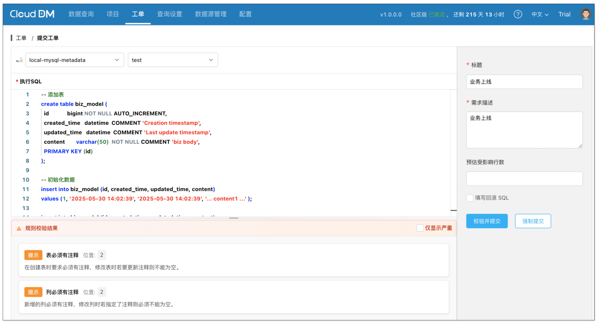

### 审批流程
CloudDM 有一个内置简易审批程序，可以提供审批的基本功能，也可以对接 **钉钉**、**飞书**、**企业微信**作为外部审批流程引擎，完成复杂的审批流程。

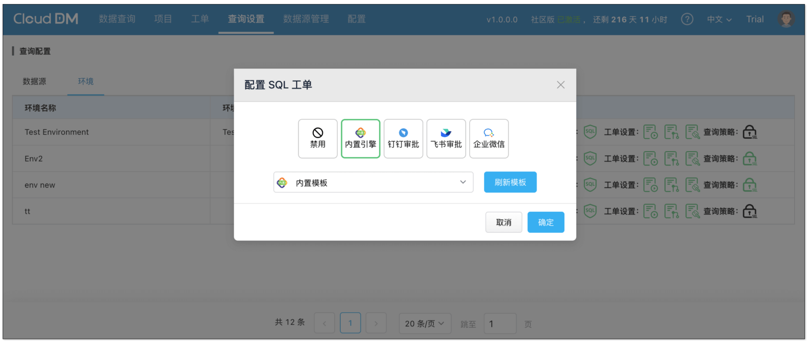

### 工单执行
CloudDM 支持以事务方式执行工单，并提供 **手动、立即、定时** 三种执行模式。选择“已手动完成”意味着 DBA 可以自行处理工单，而不是完全交给系统。这在面对大型数据库或复杂 SQL 时更灵活，可以降低 DBMS 系统带来的不确定性。

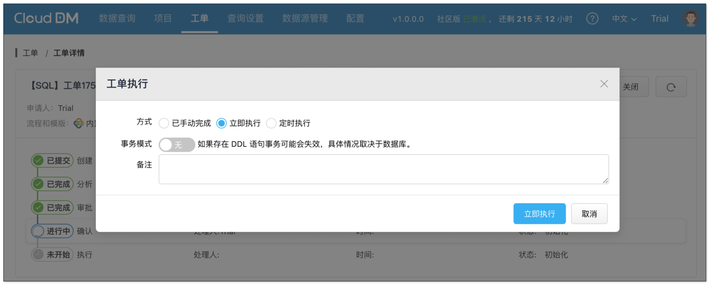

CloudDM 支持工单调试功能，在“数据订正”场景里，即使遇到预设的报错，也可以人工介入处理，再继续执行后续 SQL，而不是简单地中断执行。

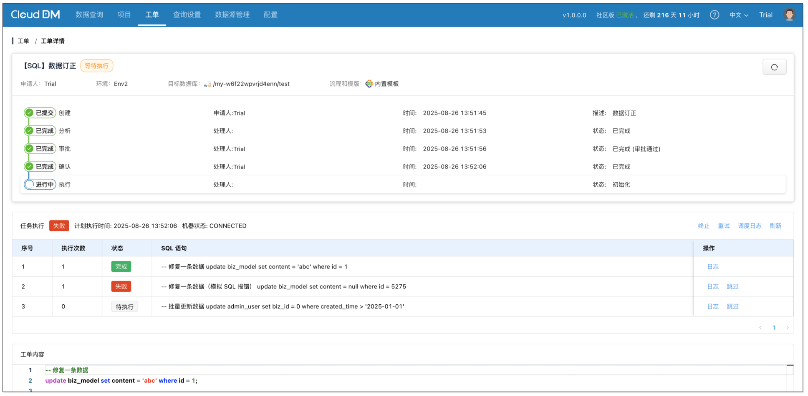

### 小结
**亮点**

+ UI 交互和权限控制结合得不错，操作体验顺滑，也有安全管控措施。
+ SQL 审核可以精确定位问题语句所在行，方便排错。
+ 审批可以对接钉钉、飞书、企业微信，适合团队协作。
+ 工单执行方式灵活（立即 / 定时 / 手动），还能选事务模式。
+ 支持工单调试，执行的时候碰到错误 SQL 可以人工介入后继续执行。

**不足**

+ 在工单递交时没有整合查询计划信息。
+ 回滚 SQL 需要手动补充，不够自动化。

## Bytebase
[Bytebase](https://www.bytebase.com/) 在产品上有 **SQL 编辑器、工单** 两种模式。SQL 编辑器可以执行 SQL 语句，而工单用于管控变更发布。Bytebase 的设计中，数据库变更主要依托于 Git 的 CI/CD，同时也提供了页面递交工单。通过页面递交工单的入口在 CI/CD 中通过创建变更计划来实现，分为 **Schema 变更**、**数据变更** 两类。

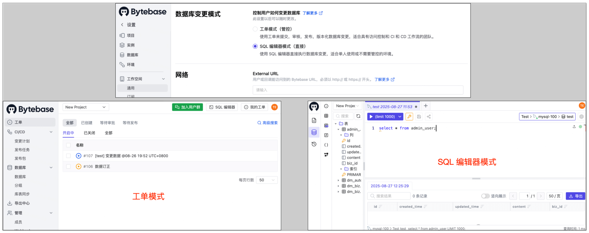

### 创建工单
Bytebase 有两种创建工单的方式，一种基于可视化 UI 交互，另一种是纯 SQL 递交。通过 SQL 递交工单时 Bytebase 支持混合 DDL/DML 语句。

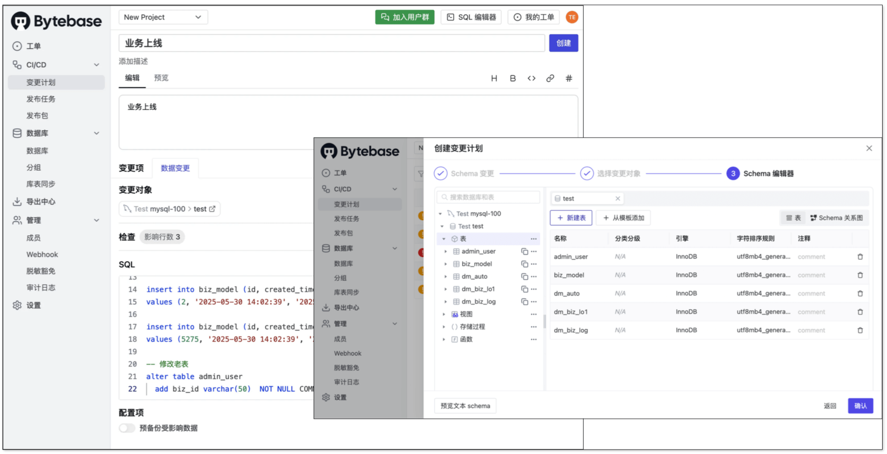

在 Bytebase 创建工单时，SQL 审核默认是非必须环节，即便工单中包含严重的 SQL 错误也可以正常递交工单。因此建议在安全策略中启用 “禁止提交包含错误告警的工单” 选项，防止不符合规范的 SQL 被递交。

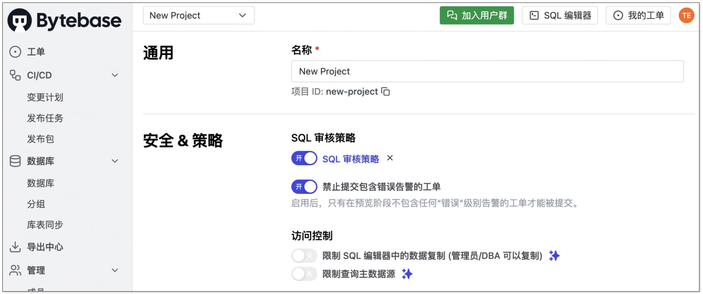

### SQL 审核
Bytebase 内置了 **111** 条审核规则，其中部分可以在不同数据源之间共用，用户可以在 **7** 种数据源下配置它们。

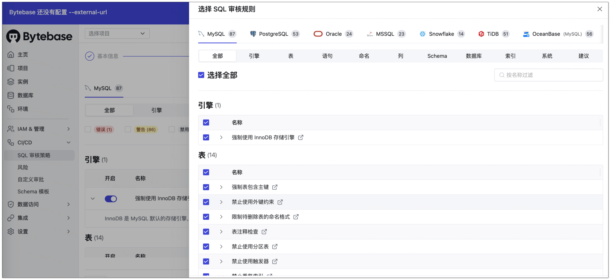

Bytebase 在递交工单时可以手动对 SQL 进行检查，需要先 “运行检查”，再点击“检查结果图标”，方可查看检查结果，结果中会显示问题 SQL 所在行。

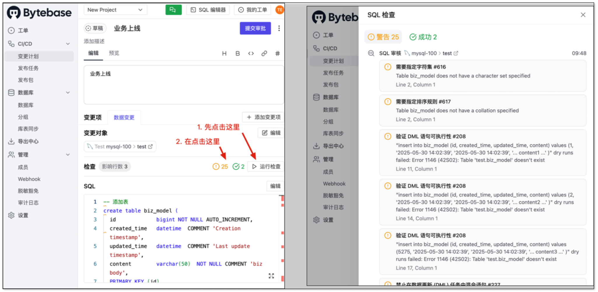

需要注意的是，Bytebase 在进行 SQL 检测时使用自身存储的元信息数据。若在产品之外执行了 DDL 语句，会导致其内部存储的元信息和真实数据库不一致，这种不一致会进一步影响 Bytebase 功能可用性，例如 SQL 在检测环节出现幻觉。

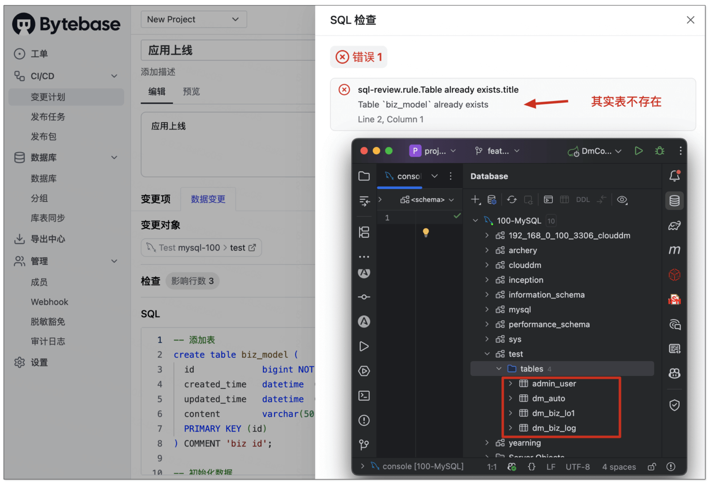


### 审批流程
Bytebase 不支持外部流程引擎，但可以在内部定义审批流程。另外社区版不支持审批功能，需要购买企业版以解锁该功能。

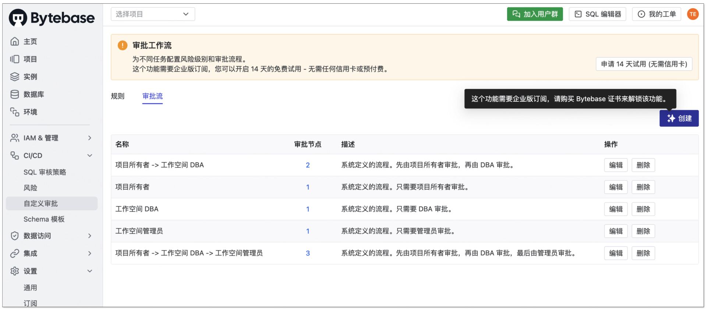

### 工单执行
Bytebase 提供了 **立即**、**定时** 两种工单执行方式，虽然没有明确提示，但在实际体验过程中发现 Bytebase 在执行工单 SQL 时会默认启用事务。当工单失败，整个变更会被回滚，由于 DDL 回滚操作需要数据库的支持，因此用户需要谨慎对待 DDL/DML 混合情况的工单。

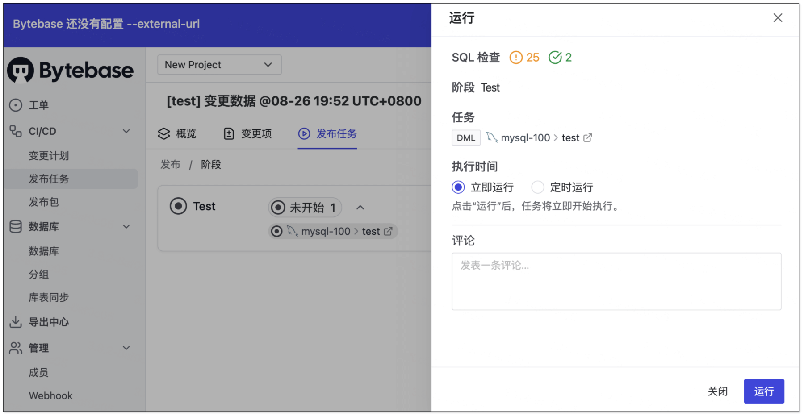

Bytebase 不支持工单调试，并默认以事务方式执行。这意味着在我们设计的 “数据订正” 场景中，报错出现后，需要手动将原始工单进行拆分处理。

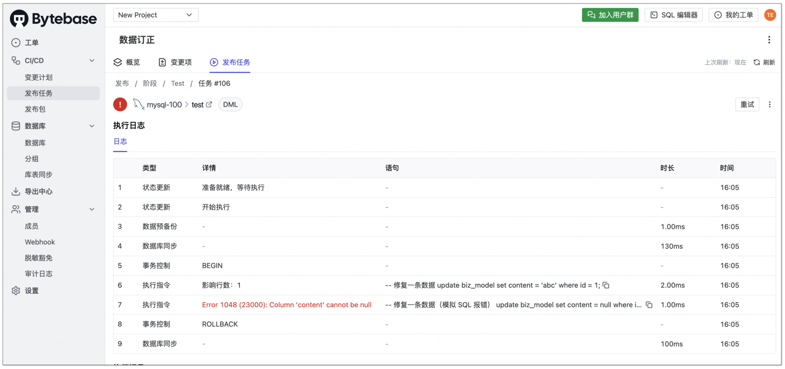

Bytebase 支持同一个工单的 SQL 同时在多个数据库作为执行目标，这个功能可以避免在多环境中递交多个工单。

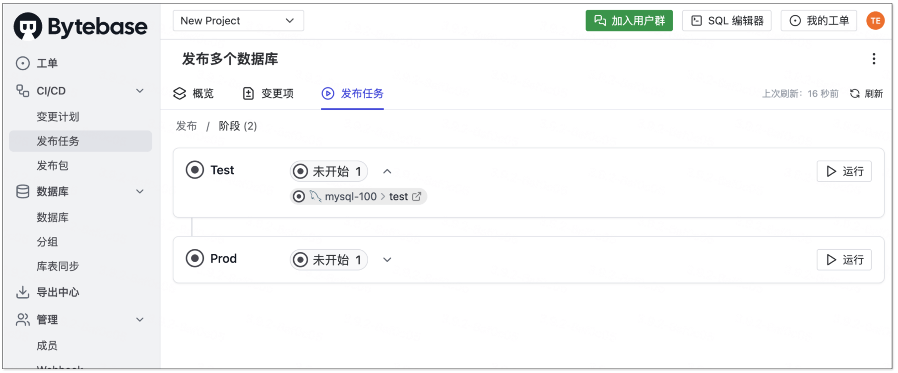

### 小结
**亮点**

+ 工单模式和编辑器模式分工明确，更聚焦不同场景下的需求。
+ 可视化生成 SQL 并提交工单，可以降低写错 SQL 的概率。
+ 审核结果能精准定位问题 SQL 行，方便排查。
+ 可以将多个数据库作为目标，简化多环境发布流程。

**不足**

+ 产品会存储数据库元信息，当多种工具结合运维数据库时容易出现问题。
+ 社区版本不支持审批功能，并且产品不支持对接钉钉、飞书等外部审批引擎。
+ 工单不能调试，在数据订正场景中遇到错误后需要手动拆分工单。

## Archery
[Archery](https://archerydms.com/) 是开源免费的数据库审核工具，它对数据库的操作分为 **SQL 查询** 和 **SQL 上线**，并且包含一定的 **数据库运维** 能力。查询控制台只支持查询类语句，并且不支持查看数据库对象。所有 DDL、DML 语句都需要通过工单才能执行。

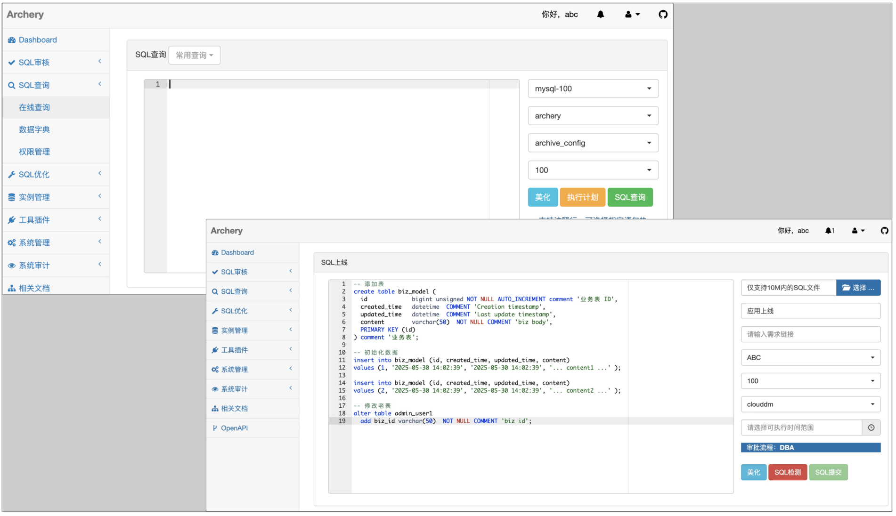

### 创建工单
在 Archery 中工单递交允许 DDL/DML 混合使用。

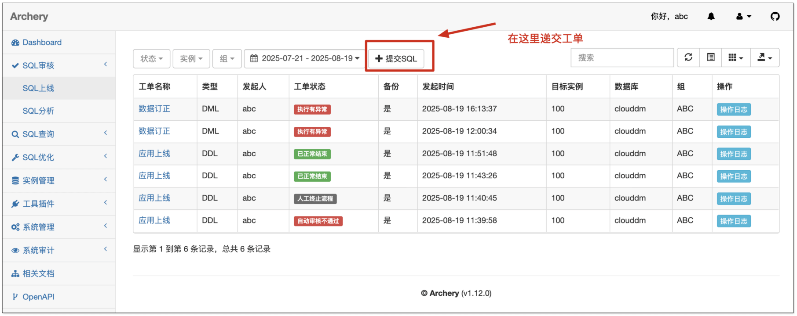

### SQL 审核
在提交工单时，Archery 会清晰地提示 SQL 审核结果，并在支持的情况下会将查询计划及每条 SQL 语句集合在一起展示。若 SQL 命中高等级的 Error 规则，工单将无法递交；而命中 Warning 级规则时，系统会提示，但仍可继续递交工单。

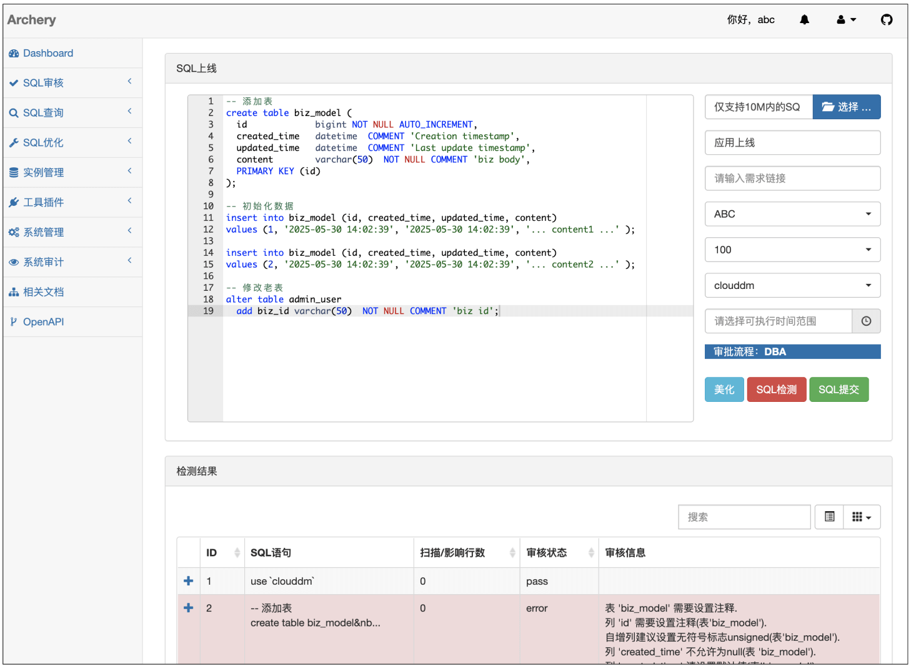

受限于 goInception 的数据源支持，Archery 在 SQL 审核上仅支持 MySQL、Oracle 和 MongoDB，审核规则数量有限且不支持自定义配置。

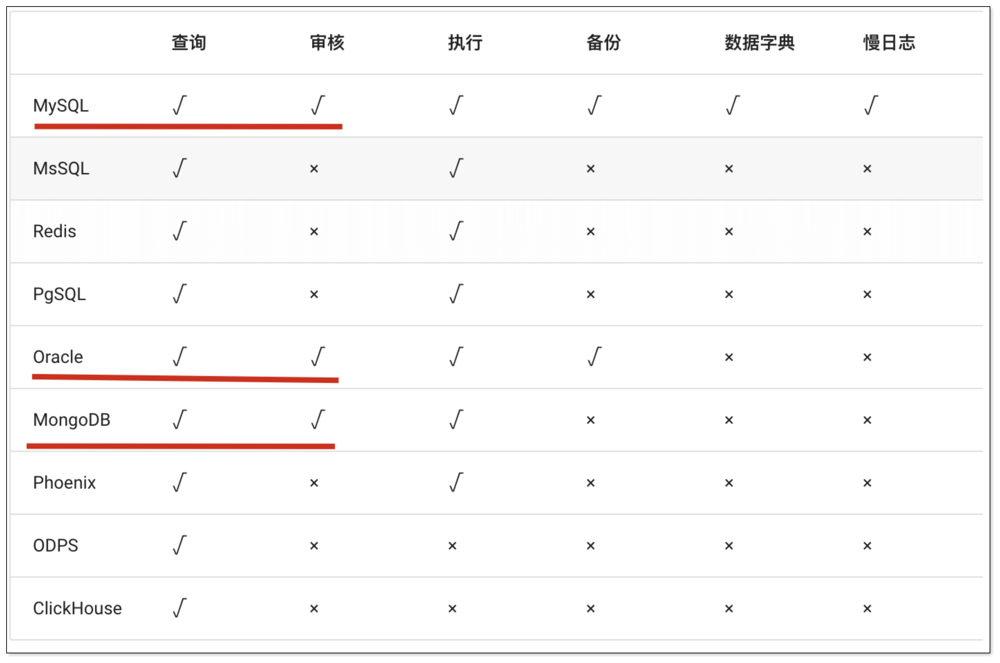

### 审批流程
Archery 无法接入外部流程引擎，但可以通过内部特有的方式定义基于权限组的简单审批流程，工单会在不同权限组之间流转，用户可以加入特定权限组参与审批。

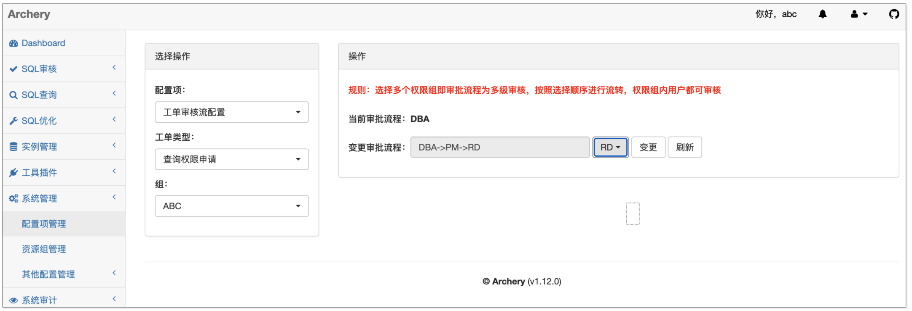

### 工单执行
Archery 在工单执行时提供“手动完成”选项，允许 DBA 自己处理工单，而不是完全依赖系统。对于大型数据库或复杂 SQL，这提供了更灵活的操作方式，能有效降低 DBMS 系统带来的不确定性。（该功能默认关闭，需要手动开启）

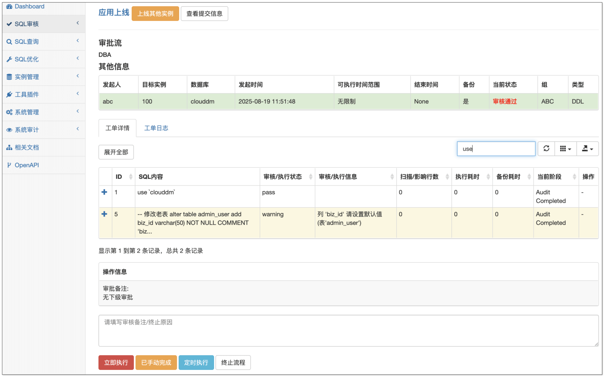

Archery 不能调试工单，也不具备事务模式，这意味着在处理强一致性的“数据订正”工单时，DBA 需要格外谨慎。在 “数据订正” 场景中，预先设置的报错场景触发后，Archery 需要创建新的工单来进行后续处理。

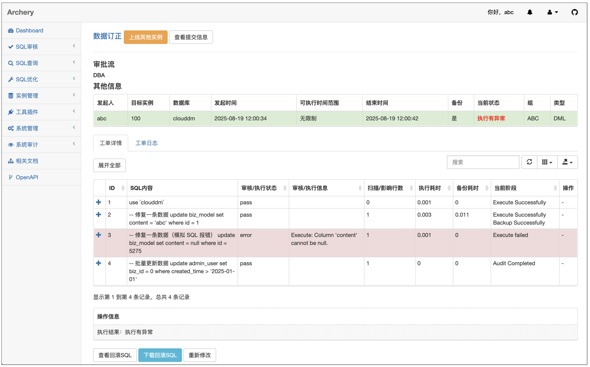

受限于 goInception 的数据源支持，对于 MySQL、Oracle、MongoDB 以外的数据源，Archery 会将工单内容当作一条语句交给数据库处理。

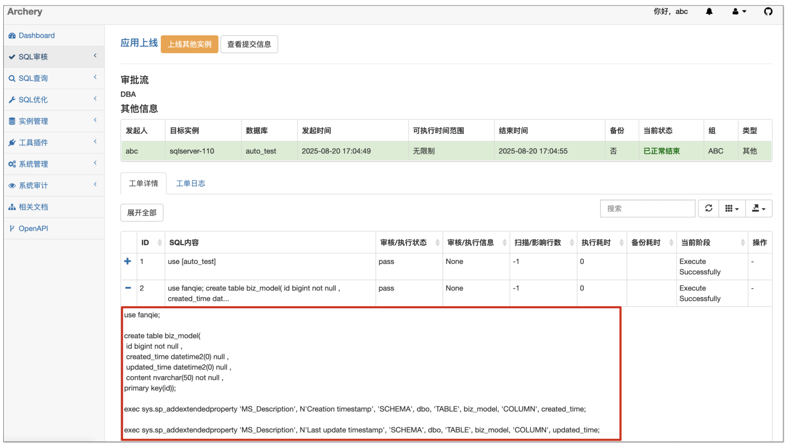

### 小结
**亮点**

+ 全部功能开源且免费，在遵守开源协议的前提下可以自由定制。
+ 在工单中可以混合使用 DDL/DML，在变更发布需要初始化数据的时候会方便很多。
+ SQL 审核结果中整合了查询计划，有助于识别潜在风险 SQL。

**不足**

+ 受限于 goInception 组件，完整功能只支持 MySQL、Oracle 和 MongoDB。不能配置审核规则，也无法在控制台查看完整的规则列表。
+ 工单无法调试，数据订正场景中出现错误时，只能创建新工单来继续处理剩余 SQL，操作不够顺畅。

## Yearning
在 [Yearning](https://yearning.io/) 中，对数据库的操作都通过工单来实现，包括数据库的查询。

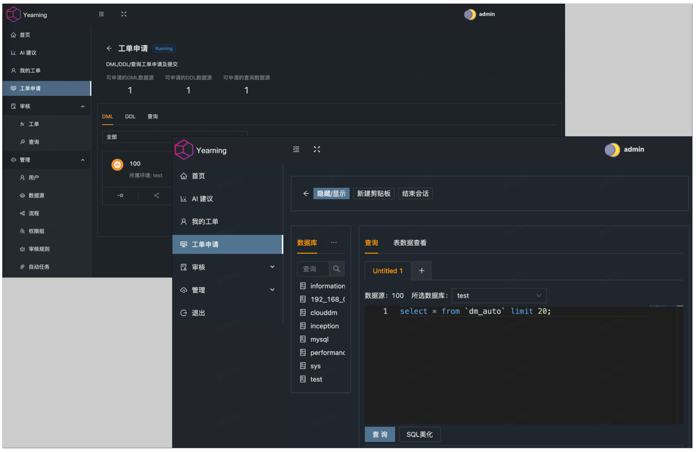

### 创建工单
Yearning 默认限制每个 DDL 工单只能包含一条语句，需要在规则中将这个限制改为允许执行多条 DDL，否则实际使用中会比较麻烦。

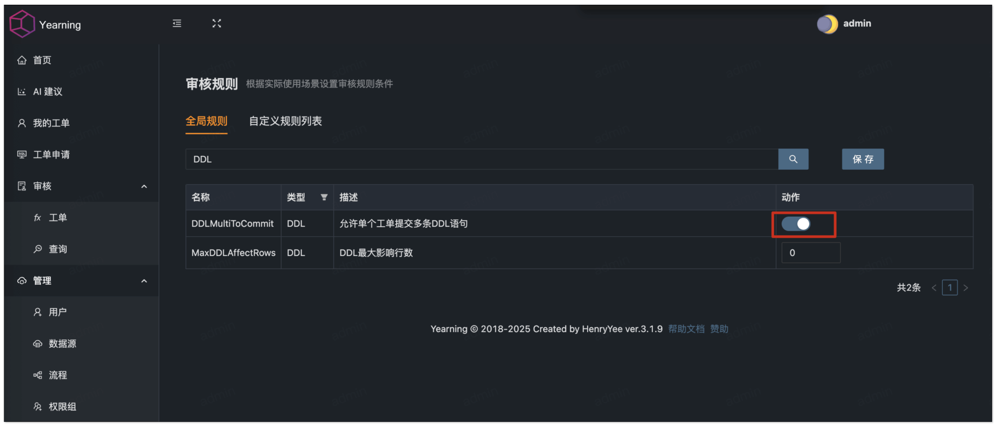

Yearning 不支持 DDL/DML 语句混合，需要把它们拆成单独的工单分别执行。虽然在需要混合语句的情况下，这种限制会带来一定的不便，但在不同的场景下，拆分或者合并都有各自合理的依据。

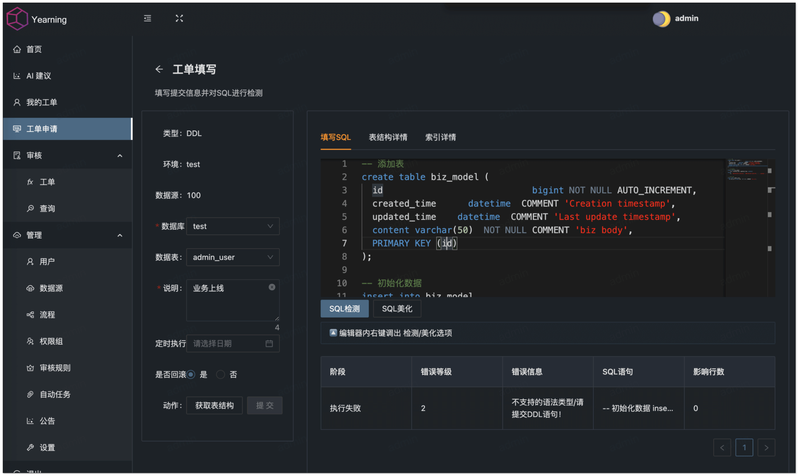

需要格外注意的是，Yearning 工单递交时 “是否回滚” 这个选项的真正动作是生成回滚语句，而不是工单以事务方式执行在遇到错误后自动回滚事务。

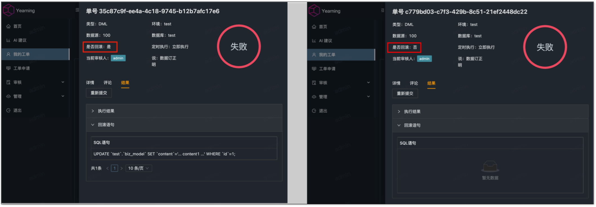

### SQL 审核
Yearning 内置 46 条审核规则，其中大部分针对 DDL。目前不支持自定义规则。你可以通过创建 SQL 规范或在全局模式中启用已有规则。

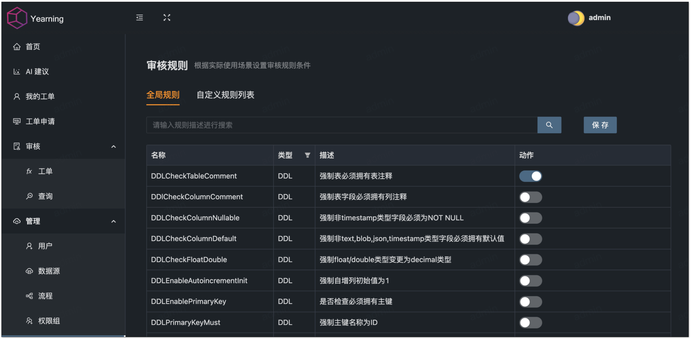

启用 SQL 规则校验后，Yearning 在提交工单时会对 SQL 进行检查，只有通过审核的 SQL 才能提交。

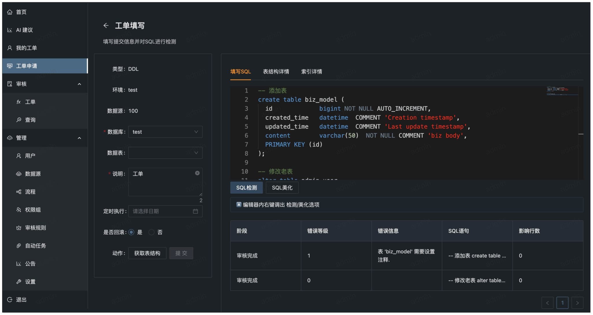

在 Yearning 中，SQL 规范是绑定在数据源上的，如果同一个环境中多个数据源想使用相同的规则，就需要为每个数据源进行单独设置。

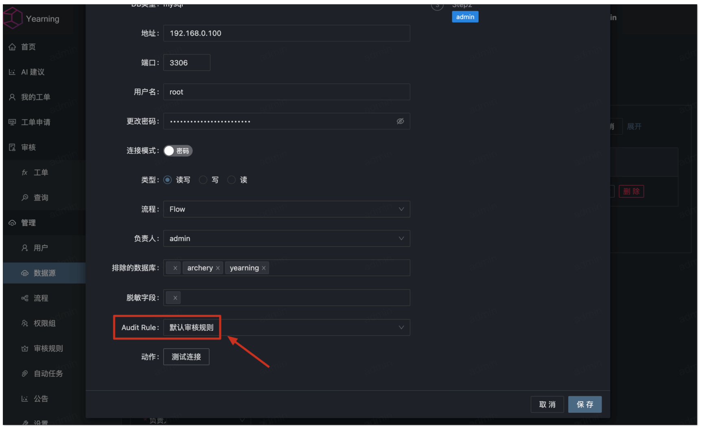

### 审批流程
Yearning 不支持外部流程引擎，但可以通过内置流程引擎进行简单节点定义。

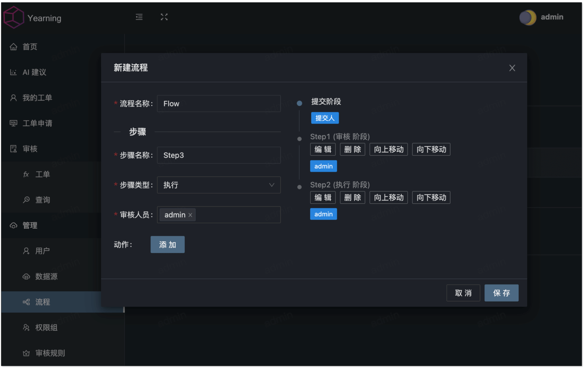

### 工单执行
在“数据订正”场景中，Yearning 能在预设的报错语句处成功中止执行。但它不支持报错后的后续处理，如果是一批需要一对一更新的数据，遇到报错后只能新建工单来继续执行剩余 SQL。

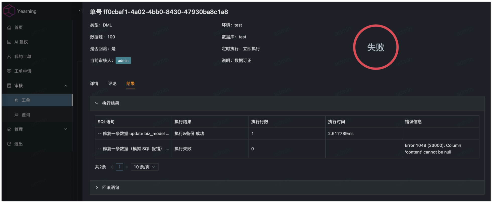

### 小结
**亮点**

+ 上手门槛很低，基本不需要看文档，仅凭探索就可以上手操作，这一点非常棒。
+ 产品非常聚焦，以工单驱动，没有多余复杂的功能，上手体验很轻松。

**不足**

+ 相比其他几款产品，功能比较单一。
+ 和其他产品一样，缺少工单调试功能，在数据订正出错时只能再建一个工单处理剩余部分。

## 总结
这四款 SQL 审核工具在功能和体验上各有优缺点，总体来说：

+ **服务支持**：所有产品都有免费的社区版本可用，同时 CloudDM、Bytebase 背后有商业公司支撑，提供长期的更新与支持保障。
+ **查询控制台**：在查询控制台简单体验中，CloudDM、Bytebase 用户体验较为友好，可以很好适配开发环境和生产环境的实际需求。
+ **数据源支持**：除 Yearning 外所有产品都支持多种数据源。
+ **开放性**：Archery、Yearning、Bytebase 有开源版本可供选择，但功能限制较多，CloudDM 虽然不开源，但开放的功能是最全面的。
+ **工单处理**：CloudDM、Archery 允许在平台中标记工单已完成，DBA 可以根据工单内容，自己手动处理 SQL，这个设计给了 DBA 更大的灵活空间来应对一些特殊数据库。
+ **回滚**：CloudDM 可选是否开启事务；Bytebase 不能选择但默认为事务模式；Archery、Yearning 提供了生成逆向 SQL 的能力。

接下来，我还会继续体验测试其他 SQL 审核工具并分享出来，欢迎持续关注。