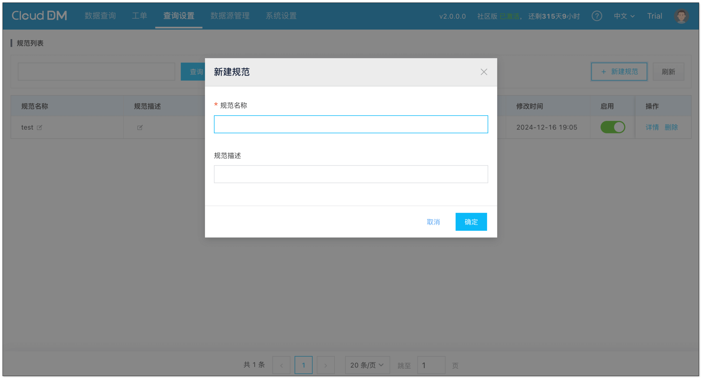
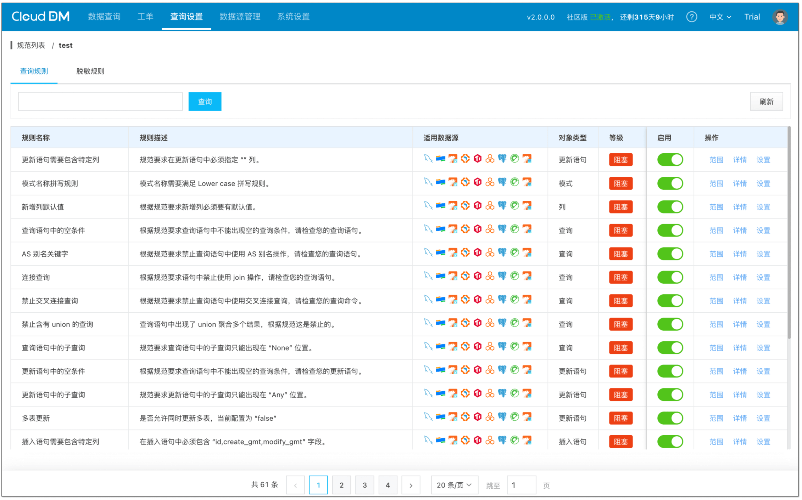
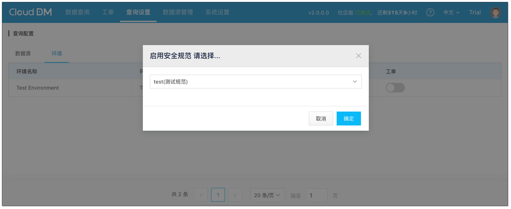
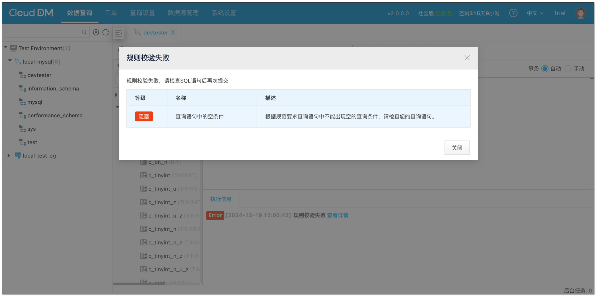
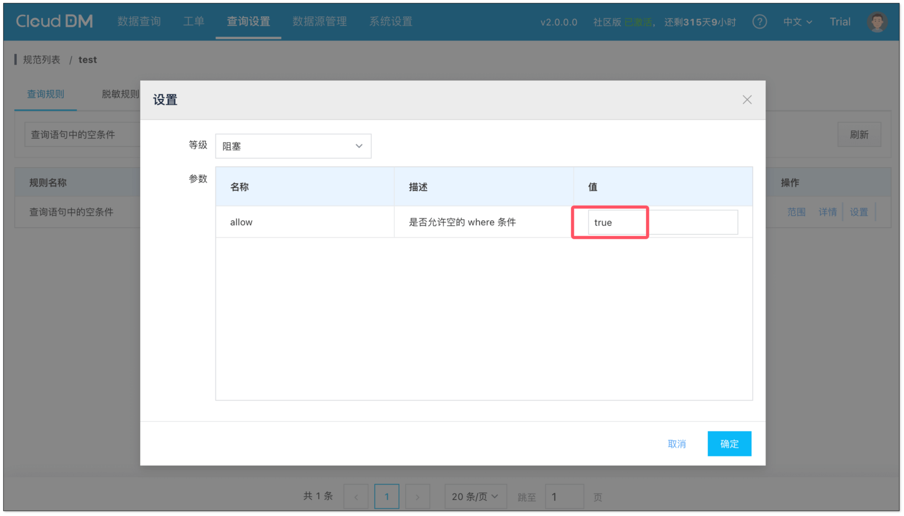

对于任何一款数据库管理工具，SQL 审核都占据重要地位，因为它直接关系到数据库的安全性和业务稳定性。通过 SQL 审核，可以有效发现并纠正 SQL 编写不当的问题，从而避免可能引发的数据库故障，如性能下降或数据泄露等严重后果‌。

CloudDM 是 ClouGence 公司推出的面向团队使用的数据库管理工具，支持云上、云下、多云多环境。目前支持 **15** 种数据源。未来更多数据源将逐步开放。对于 SQL 审核，CloudDM 提供了 **59 个内置规则**，并且 **97%** 以上规则同时适用于多种数据源。

| **支持的数据源** | **内置查询规则** | **内置脱敏规则** |
| --- | :---: | :---: |
| MySQL | **53** 个 | **5** 个 |
| PostgreSQL | **35** 个 | **5** 个 |
| Greenplum | **35** 个 | **5** 个 |
| OceanBase for MySQL | **52** 个 | **5** 个 |
| PolarDB-X | **41** 个 | **5** 个 |
| TiDB | **49** 个 | **5** 个 |
| 阿里云 AnalyticDB MySQL 版 | **39** 个 | **5** 个 |
| 阿里云 RDS for MySQL | **53** 个 | **5** 个 |
| 阿里云 RDS for PostgreSQL | **35** 个 | **5** 个 |
| 阿里云 PolarDB for MySQL | **53** 个 | **5** 个 |
| 阿里云 PolarDB-X | **41** 个 | **5** 个 |
| 亚马逊 AWS MySQL   | **53** 个 | **5** 个 |
| 亚马逊 AWS PostgreSQL | **35** 个 | **5** 个 |
| 微软 Azure for MySQL | **53** 个 | **5** 个 |
| 微软 Azure for PostgreSQL | **35** 个 | **5** 个 |

## CloudDM SQL 审核架构特点
CloudDM 的 SQL 审核架构具有三大特点：**统一性、开放性、自由性**。

**统一性**，是指技术架构层面 CloudDM 会通过 SQL 解析器将 SQL 的特征抽取为特定的审核数据模型。无论何种数据源都遵循同一个原则并使用相同的审核数据模型。这样做有两个好处：

+ 最大化减少技术实现差异，保证 SQL 审核功能的稳定性。
+ 后续自定义规则时，降低学习门槛。

**开放性**，是指 CloudDM 中的所有规则，包括内置的众多规则，无一例外，全部通过其特有的 **Rule Script** 脚本来编写实现，并且所有内置规则的脚本全部 **免费**、**开源**。

CloudDM 不会藏有任何黑魔法。得益于 CloudDM 强大的 **Rule Script** 脚本引擎及统一的模型架构，所有规则都以高度透明的形式呈现出来。

**自由性**，是指用户可以利用 **Rule Script** 脚本自由编写符合自己需要的 SQL 规则，并将其应用到不同环境中。当内置规则不满足需求时，用户可以在此基础上自由改写。也正是由于所有内置规则的脚本全部 **免费**、**开源**，用户才可以自由扩展、定制和改进。

## SQL 审核架构全新升级
CloudDM 的 SQL 审核引擎架构在 **Rule Script 脚本引擎** 和 **审核数据模型** 方面都做出了重大升级：

### 脚本引擎
上一代 SQL 审核架构的脚本引擎参考了 **BASIC** 语言并面向规则脚本开发而设计，脚本语言支持如下能力：

+ 程序逻辑控制：**多条语句顺序执行**、**IF 条件分支**、**ELSEIF 多条件分支**。
+ 丰富的表达式运算符：**算数运算**、**比较运算**、**位运算**、**逻辑运算**、**匹配运算**（CloudDM 特有）。
+ 通用的类型系统：**布尔**、**数值**、**字符串**、**时间**、**空值**、**集合**、**键值对。**
+ 表达式运算：**一元**、**二元**、**三元** 表达式计算，还可以通过括号进行表达式提权。
+ 属性访问：可以通过 “.” 对多层对象进行属性访问，并且支持对数组下标、键值下标的访问。
+ 可以完整地表示 JSON 格式数据。
+ 支持隐式类型转换及通过 CAST 进行强制类型转换。
+ 可以调用自定义函数并传递参数。

新一代 SQL 审核架构对 **复杂编程场景** 进行了更深入的支持，具体如下：

+ 新增定义并使用 **变量** 的能力：通过变量可以在较为复杂的 SQL 检查程序中有效地提升代码结构。
+ 丰富表达式运算：支持 **自增(++)**、**自减(--)** 运算。
+ 增强表达式处理能力：对 **空值** 的情况做了更深入的兼容和处理。
+ 重构类型跟踪机制，在新的机制下有效解决了对象访问中因类型跟踪异常导致的报错问题。

### 审核数据模型
上一代 SQL 审核架构的审核数据模型中，SQL 语句和审核数据模型之间呈现 “一对一” 的关系：

+ 从 SQL 解析器出发，一条 SQL 语句归属于一种类型。
+ 一种类型的 SQL 对应一个数据模型。
+ 在此基础上支持多种 SQL 语句，覆盖了 DDL、DML 中绝大部分情况。

新一代 SQL 审核架构中，SQL 语句和审核数据模型之间的 **“一对一” 关系升级为 “一对多” 关系**。

上一代模型架构在处理复杂语句时会出现特征抽取不够完整的问题。虽然丰富模型属性可以解决此类问题，但这会破坏 **统一性** 原则，并且增加学习门槛。例如 “INSERT ... SELECT” 语句，在上一代架构中将其识别为 INSERT。部分 SELECT 的特征只能作为更加离散的几个特征属性值。如果通过增加属性来解决 SELECT 语句特征提取的问题，势必会造成数据模型之间的混乱。

新架构中使用 “一对多” 关系，可以将这类语句有效地解释为多个结果，解决了部分特征无法抽取的问题，甚至面对更为复杂的查询也可轻松应对。

同时新架构对于不同数据源可进行差异化的处理。例如 MySQL 表上独特的 engine 属性只会出现在 MySQL 专用模型上，不会影响通用表模型。

## 全新架构在未来的优势
新架构在模型结构化上更进一步，呈现更加清晰的数据结构。有了清晰的结构化数据将会带来诸多好处，例如：

+ 未来可以有机会为用户提供 **Rule Script** 语言 IDE 环境，并提供更加智能的代码编写补全能力。
+ 在未来基于模型的差异化可以使核心模型更加稳定，在产品迭代中使产品运行更加稳定。

## 使用 CloudDM SQL 审核
1. 请参考[官方文档](https://www.clougence.com/dm-doc/maintain/maintain_guide) 进行安装。
2. 添加好数据源之后，点击 **查询设置** > **安全规范** > **新建规范**，新建一个安全规范。

新建的规范默认会启用所有内置规则，用户可以根据需要自由选择和配置。

3. 点击 **查询设置** > **查询配置**，切换到环境选项卡。可以在启用安全规范时绑定新建的 **安全规范。**

4. 点击 **数据查询**，进入查询控制台，执行 SQL 语句，例如：“select * from `tb_mysql_types` limit 20;”。CloudDM 可以对其语句进行检测，并做出相应的提示。

5. 点击 **查询设置** > **安全规范置 > 具体规范**，在具体规范中搜索 “查询语句中的空条件” 可以找到这个规则。如果不需要这个规则，可以选择下面两种方式关闭这个规则。
    - 点击 **禁用**。
    - 设置规则属性中的 allow 配置为 true（没有关闭规则，只是规则上允许空条件）。

## 总结
CloudDM 的 SQL 审核架构延续统一性、开放性、自由性的特点，在此基础上进行了重大技术升级，适配复杂编程场景及查询需求。如果您感觉本文有所收获，欢迎注册试用。

