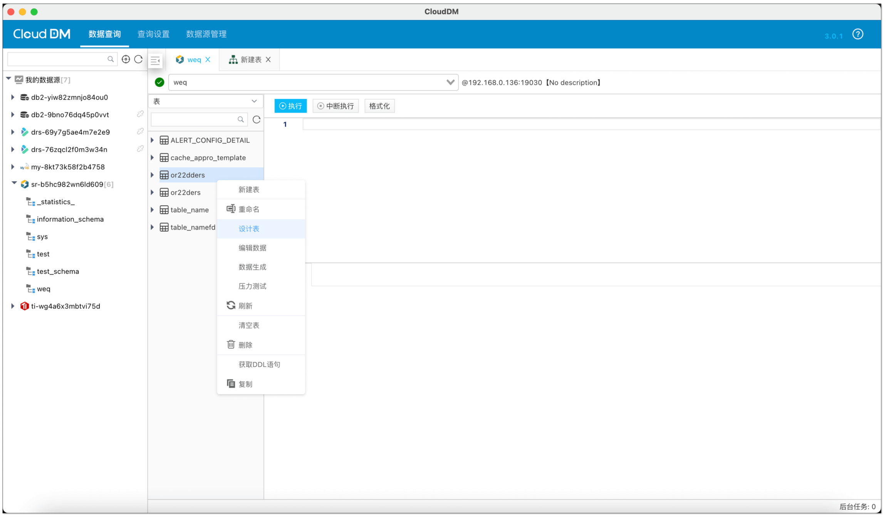
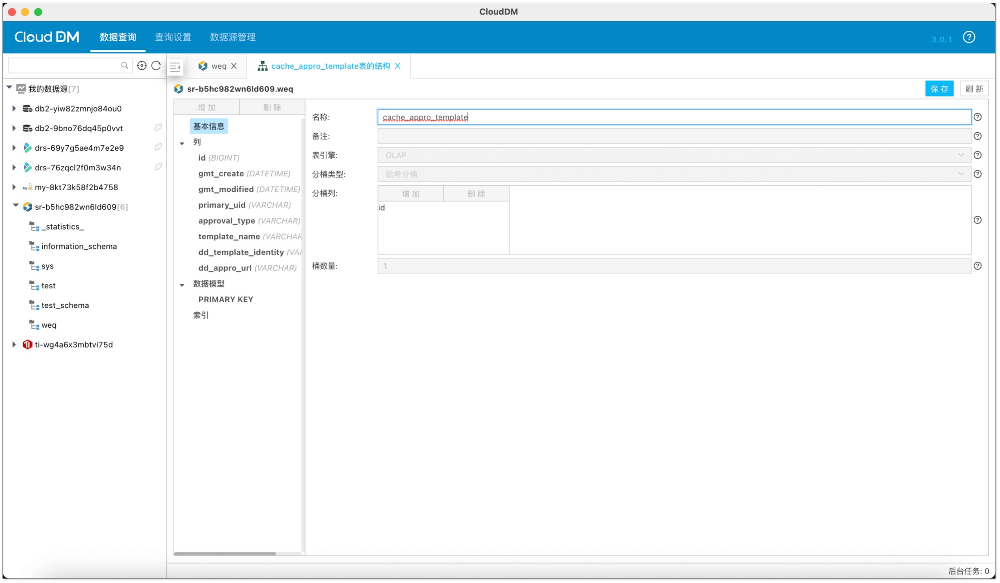
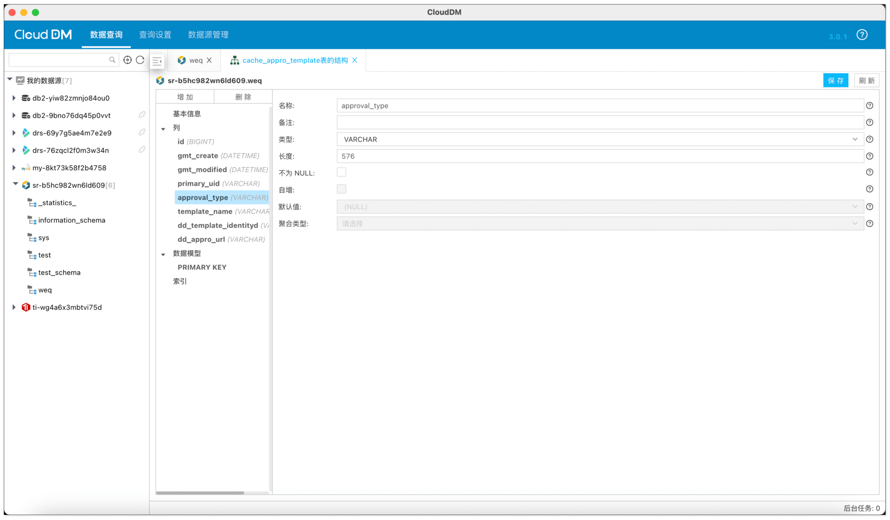
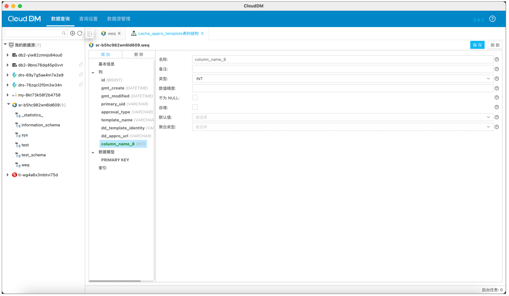
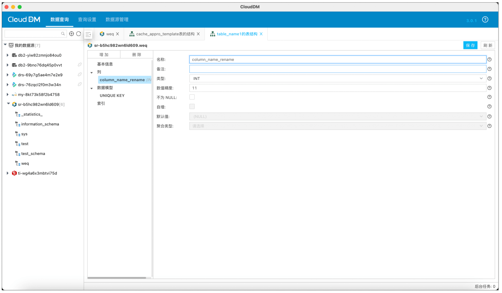
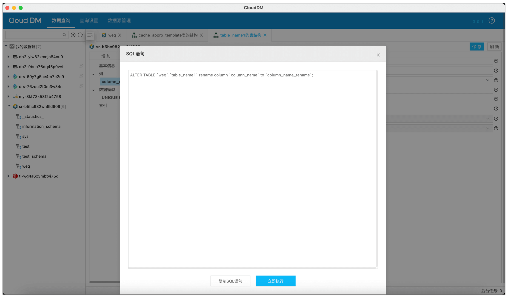
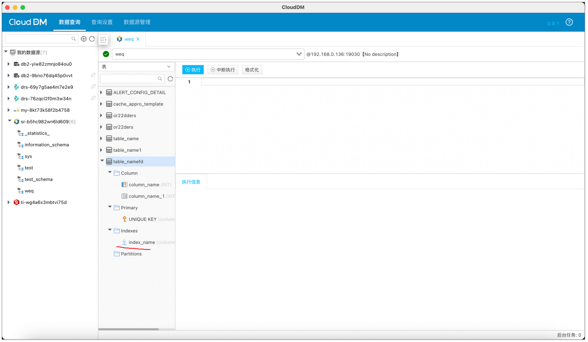
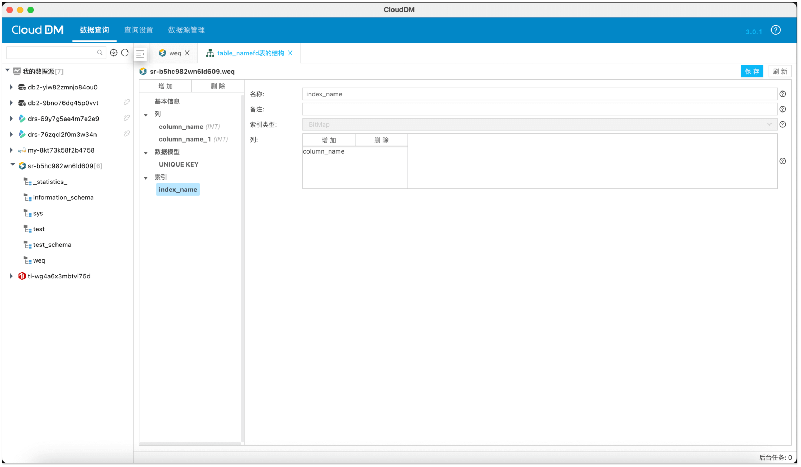
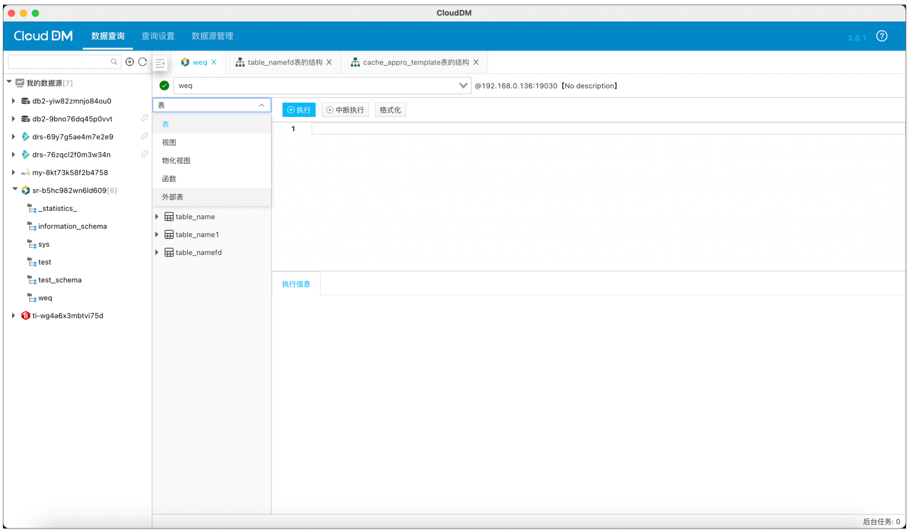

CloudDM 个人版是一款数据库数据管理客户端工具，支持 [StarRocks 可视化建表](https://forum.mirrorship.cn/t/topic/10747)，创建表时可选择分桶、配置数据模型。
目前版本持续更新，在修改 StarRocks 表结构方面进一步优化，大幅提升 StarRocks 表结构设计效率。当前 CloudDM 支持：

+ 可视化设计表
+ 查看索引
+ 筛选查看外部表

下面依次展示如何修改表结构、查看索引及区分外部表。

<!-- truncate -->
 
## 如何修改表结构
使用 [CloudDM](https://www.clougence.com/clouddm-personal)，添加完 StarRocks 数据源之后，右键需要修改的表，点击 **设计表**。

### 修改表名
在结构设计器中选择 **基本信息**，可直接修改表名。

### 修改字段
在结构设计器中选择 **列**，然后选择一个存在的列，在右侧可以配置列的信息。

### 添加字段
在结构设计器中选择 **列**，然后点击 **增加** 按钮新建一个列，在右侧可以配置列的信息。

### 修改列名
CloudDM 个人版会识别 StarRocks 版本，对于 StarRocks 3.3 以上版本，允许修改列名。

## 如何查看索引
右键需要查看索引的表，点击 **设计表**，即可查看索引信息。

## 区分外部表
可单独筛选查看外部表。

## 总结
本文我们介绍了如何使用 CloudDM 可视化设计 StarRocks 表，以及区分外部表。感兴趣的话，欢迎试用。