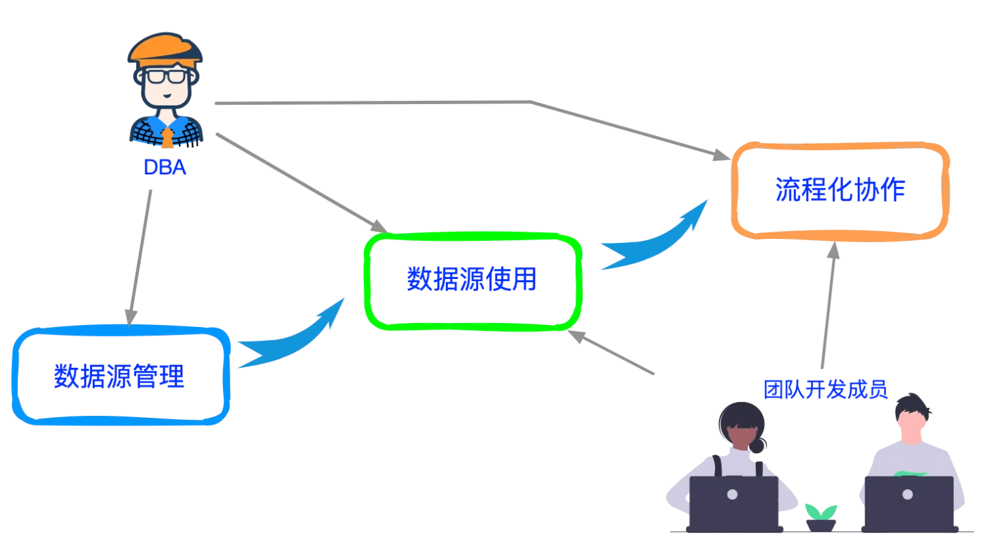
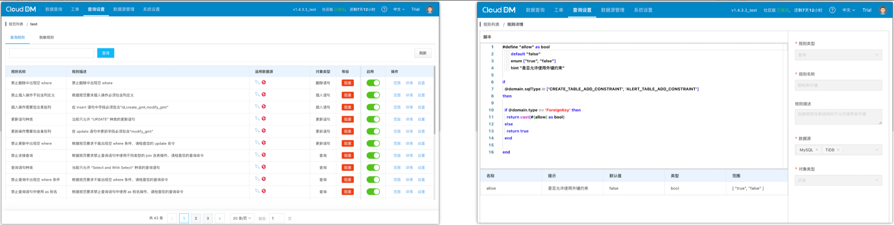
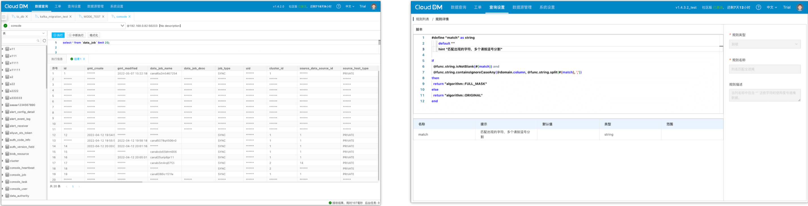
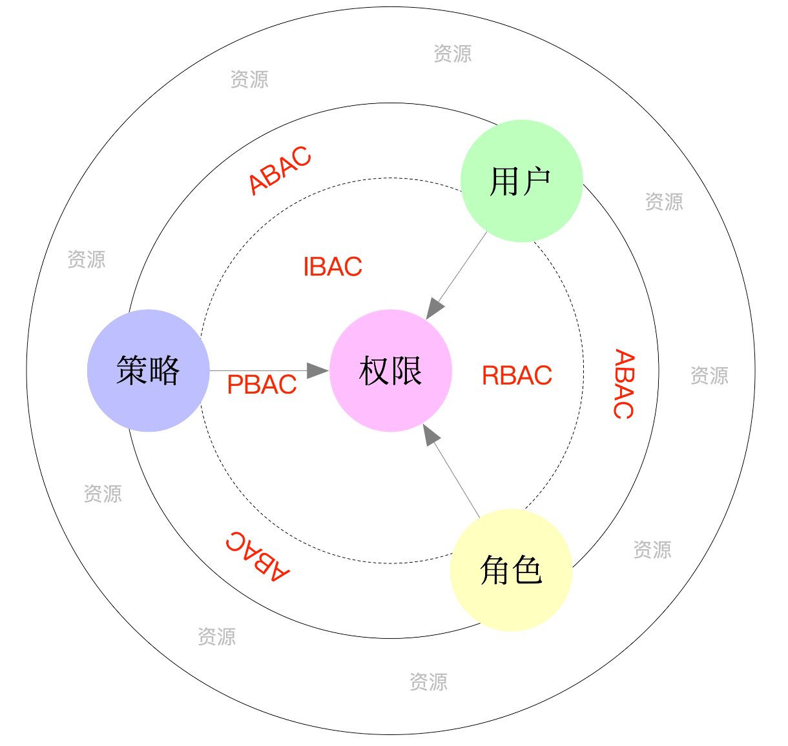
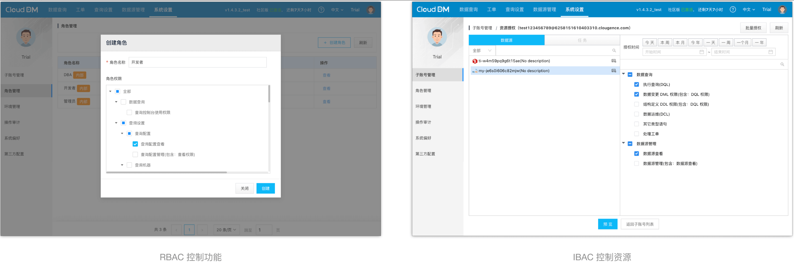
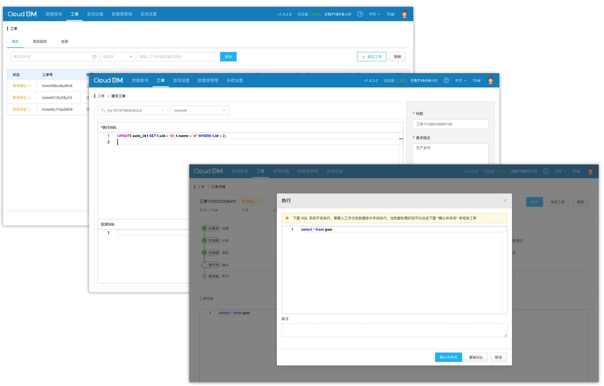

## 面临的问题

在开发过程中避免不了需要访问数据库数据，尤其在团队协作中对于数据库数据的访问会更加频繁。

通常团队成员在管理员或者 DBA 在准备好数据源之后，就可以凭借数据库的账号和密码访问数据库中的数据了。

也正是从这一刻开始，这个团队访问数据库中的数据时就会面临诸多问题，本文枚举其中几个比较典型的问题：

+ 团队成员在设计数据库表结构容易产生随意性，导致数据库结构规范不统一。
+ 容易忽略账号和权限的管控，导致数据库访问缺失权限控制。
+ 数据库的变更的发布在需要多个团队成员通过流程化的方式相互协作，如果协作过程不顺畅则会降低团队效率。

<!-- truncate -->

## 问题的严重性
如果这些问题没有被妥善处理好都会产生哪些影响呢？接下来我们举几个案例。

### 数据库结构规范不统一
‌表结构不规范会导致多种后果，包括数据分析困难、执行速度下降、以及数据可视化困难。‌这些问题普遍带有 **滞后性**、**隐蔽性** 特点，当解决这些问题时又容易产生更多连带风险。

+ **数据分析困难**‌：表结构不规范可能导致数据分析师在处理数据时遇到困难。例如，相同含义字段名称不统一，又缺乏相应的元信息备注。导致后续分析数据时还需要消耗大量时间精力对数据关系进行梳理。
+ **执行速度下降**‌：不合理的表结构设计可能导致数据库查询执行速度下降。例如，某些查询语句的执行计划看似相同，但由于表结构的不合理设计，实际执行效果相差很大导致查询速度变慢。而这个问题往往在数据量变大之后才会凸显出来。
+ **数据可视化困难‌**：原本不为空的字段列由于表结构约束缺失导致脏数据被意外录入，进而在数据可视化结果呈现上产生误导，甚至还会影响用户对数据的准确理解。‌最直观的问题就是 “空字符串” 和 “空值” 之间的差别难以被有效界定。

综上所述，表结构不规范产生的不仅会增加数据分析的难度，降低数据库查询的执行速度，还会影响数据可视化的效果和质量。因此，规范化的表结构设计对于业务演进至关重要。

### 数据库访问缺失权限控制
数据库访问缺失权限控制的危害会比较严重，主要体现在以下几个方面：

+ **敏感数据泄露更显**：由于数据库访问权限的缺失容易让未经授权的用户访问到敏感数据。如，用户个人信息、财务数据等‌。当这些具有高度敏感性的数据被泄漏出去后，会造成更大的灾害。例如，被不法分子用于诈骗。以及错失优质商业机会等。
+ **数据篡改风险‌**：攻击者可能通过越权访问修改数据库中的数据，通过篡改数据谋取私利或者对整个业务运行造成严重影响。如，修改账户余额，删库跑路等‌。
+ **法律责任与声誉损害‌**：由于缺乏权限控制导致用户敏感数据被泄露进而个人隐私被侵犯‌。企业可能临法律责任，同时企业的声誉也将受损。

综上所述，数据库访问缺失权限控制会带来更加严重安全风险和法律后果。所以团队中对于数据库数据的访问必须实施严格的访问控制和权限管理‌，以避免法律风险以及声誉影响。

### 协作过程不顺畅
协作过程不顺畅最主要的影响是团队效率，主要包括：

+ **系统稳定性受损**‌：协作不畅可能导致数据库变更过程中出现错误或遗漏，进而影响系统的稳定性和可靠性，增加系统崩溃的风险‌。
+ ‌**数据安全性问题**‌：协作不顺畅还可能引发数据安全性问题，如数据丢失或泄露，对组织造成重大损失‌。
+ ‌**团队资源浪费**‌：不顺畅的协作可能导致不必要的重复工作或错误操作，浪费人力和时间资源‌。

综上所述，数据库变更协作不顺畅会对系统稳定性、‌数据安全性、团队资源利用等多方面造成不良影响。进而使团队的效率变得更加底下。

## 解决问题的手段
这些问题在业内通常有着比较明确的解决思路，核心思想是通过团队化的工具将数据库的访问集中到统一平台上进行。并通过统一平台达成如下几个关键控制手段：

+ 通过SQL规则校验，拒绝不合理的数据库结构变更。从而保证数据库规范。
+ 集中权限控制，方便一目了然的管理和控制。
+ 避免直接连接数据库，保护数据库账号。
+ 对查询结果进行脱敏保护，从而避免避免数据隐私及法律风险。
+ 通过工单流程提升团队协作效率。
+ 通过企业统一认证，让团队的账号管理变得更加轻松和简单。

目前能够提供上述问题解决方案的产品有很多这里就不再展开。

CloudDM Team 作为全新的企业级数据库数据访问工具，在团队使用场景中做了更加细致和深入的思考。自然也包含上述问题。

### 规则校验
使用脚本化方式实现 SQL 规则校验是一个比较常见的方法，常见的方案中有两种技术路线。

+ 使用已有语言 **Java**、**JavaScript**、**Lua**、**Groovy** 作为规则引擎。
+ 使用具有较高限制的自研 **DSL** 作为规则引擎。

使用已有语言通常会面临两个问题：

+ 程序如何接入？
+ 安全如何控制？

在采用通用编程语言作为规则引擎后，安全控制是最难以解决的。这是由于通用编程语言通常是面向更加广泛而又复杂的场景，需要提供更加灵活和底层的 API 作为保障。比如不受限制的访问网络、文件等资源。

如果采用通用编程语言作为引擎，虽然可以快速满足需求并节省开发成本。但需要在安全控制上做更加深入的控制，本文列出一些用于思考：

+ 网络：通常 SQL 规则脚本中是用来承担逻辑判断并不需要网络通信，因此网络能力通常是不必要的。
+ 文件：理由同上
+ CPU/内存：这两类资源具有高度相似性，都是难以被控制。例如：规则脚本出现一个死循环，通常作为脚本宿主程序是无法主动干预的。
+ 调动外部程序：这和网络、文件、比较相像。原则上规则脚本的执行是不能调用外部程序的。
+ 其它技术组件导致的安全漏洞：常见的如 OGNL 表达式的越权访问。

如果采用使用场景更加明确的自研 DSL 作为规则引擎，通常不会出现上述问题。因此普遍情况下只要技术投入成本可以接受都会选择此类技术方案，其主要优点是在于可控性较高。

CloudDM Team 采用了全新的自研 Rule Script 引擎，并通过 Rule Script 强大的编程能力使得 CloudDM Team 的所有内置规则实现了全部脚本化。这包括 SQL 规则和脱敏规则。下面这张图向大家展示了基于 Rule Script 的在 CloudDM Team 中的样貌。

SQL 查询规则展示

查询规则展示

### 权限控制
使用团队化的工具将数据库的访问集中到统一平台，天然的好处是可以避免直接连接数据库以保护数据库账号。而在权限控制方面，一个团队化的数据库访问工具必然会面临来自两个新维度上的要求：

+ 功能上的权限控制
+ 资源上的权限控制

在工程实践过程中权限系统的设计会受到诸多因素的影响，比较常见的权限控制模型和特点有：

+ **IBAC/ACL**，基于身份的访问控制。核心思想是为资源制定一个 **策略列表**，当访问资源时通过策略列表来保护资源的访问。
+ **RBAC**，基于角色的访问控制。模型核心定义了 **用户**、**角色**、**权限** 三个元素，在软件产品的功能控制中具有较为普遍的应用，它是一个静态模型。
+ **PBAC**，基于策略的访问控制，相比较 **RBAC** 模型而言 **PBAC** 动态基于规则和策略动态确定访问权限。它属于动态模型。
+ **ABAC**，基于属性的访问控制，模型重点在于对属性的策略化运用。**角色**、**策略**、**身份** 在 ABAC 模型中都是属性中的一种，ABAC 和 PBAC 某种程度上来看比较相似。而 ABAC 最大的弊端就是在于它的复杂性，在落地 ABAC 时某些情况下甚至需要借助 XACML 语言脚本来实现权限控制。

为了方便理解我们以 “**资源是否具备某个权限的访问权限**” 为典型内在需求。以 **用户**、**角色**、**策略** 为支点，对已知的权限模型做一个梳理可以做如下总结：

+ 当选择 **策略**、**权限**、**用户** 三角关系作为权限访问控制三要素时，便是 ACL/IBAC 模型。
    - 当某个资源被访问只需要执行一遍策略规则即可得到权限，这便是最简单的 ACL（Access Control Lists）
    - 将用户/资源 进行 **标识符** 归类，在利用 ACL 对 **标识** 的用户资源进行访问控制，这便是 IBAC（Identity-Based Access Control）
+ 使用 **角色、用户、权限** 三角关系作为权限访问控制三要素便是最常见的 RBAC 模型。
    - RBAC（Role-Based Access Control）是一种基于静态状态下的权限控制模型，同时也是用途最为广泛的权限控制模型。
    - RBAC 的运用非常考验角色的设计者，角色的粒度过细容易造成特权泛滥。粒度过粗又会导致拆分角色而造成角色爆炸。
+ 使用 **策略、权限** 关系时便是 PBAC 模型，该模型的最大特点是着重基于策略的访问控制。
    - PBAC（Policy-Based Access Control）它通过定义策略来管理访问控制，这些策略可以根据需要进行定制。
    - 动态的访问控制是 PBAC 模型的核心关键，在实施 PBAC 时往往需要附带 **审计** 记录以方便事后查阅。
+ ABAC（Attribute-Based Access Control） 它基于属性进行访问控制。在模型中访问决策不仅基于用户角色。
    - ABAC 访问控制机制根据主体属性、对象属性、环境参数、操作、策略对该请求进行授权验证，具有更高的灵活性。
    - ABAC 在一定程度上和 PBAC 具有相似性。
    - 在 ABAC 看来 RBAC 中的角色、IBAC 中的标识符都是一种属性。
    - 在 ABAC 模型体系中有很多实现或者标准比如：**XACML**、**NGAC**、**LBAC**。

在实际工程实践中可以选用的权限控制模型可能还会更多。具体如何选择需要基于客观因素来决定，不能一概而论那种模型更好。而在具体落地过程中往往参考上述标准模型也会产生更多的变种和新特性。

CloudDM Team 在实践权限控制的过程中采用了多种模型结合方式：

+ 通过 **RBAC** 模型作为功能权限的访问控制。因此 CloudDM Team 可以定义角色、用户，并且可以为不同角色绑定权限。
+ 通过 **IBAC** 对具体数据库资源进行访问控制。目前支持对实例级资源进行细粒度 ACL 控制。

### 工单流程
在使用团队化数据库访问工具时工单流程是一个比较常见的场景，一个典型的用户场景是：

+ 开发递交了 SQL 发布流程。
+ DBA/管理员或各层级管理人员会执行流程审批。
+ 在流程通过后完成最终 SQL 的执行。

在专业的领域中一般由 OA 系统可以完成上述动作。而在 OA 出现之前，办公室解决流程化问题往往是填写各种申请表。然后在各级领导/负责人、部门之间流转这些申请单。对于数据库变更的审核往往更加难以管理通常交给更加专业的 DBA 负责数据库的变更操作。

一个 OA 系统面临的主要问题是如何方便的定义表单以及流转表单。所以在技术上 OA 系统通常包括如下核心技术：

+ 表单设计器
+ 工作流引擎
+ 用户/组织管理

表单系统主要解决的问题是表单的设计以及表单数据的存储/提取。在早年一个很好的可视化 HTML 设计器可以解决大部分问题，而如今已经有更多可用的方案可以被选择。

+ 表单系统的最大难度是在于提供可供交互的类 HTML 设计器，并允许终端用户自由的设计表单的样式。这些用户往往对于计算机原理了解并不深入。
+ 早年比较常见的方案是基于 Eclipse 开发一个工作流设计平台，其核心原理是对 Eclipse Web Developer Tools 的二次开发提供表单设计器。
+ OA 系统将表单设计器产生的数据进行存储，在需要时按照设计器设计的样式重新展现并填充具体数据。

流程引擎，解决的主要问题是提供一个统一的模式让企业可以设计自己的流程。

+ 在流程设计中比较典型的场景有：加签、会签、顺序流程、子流程、并行流程等。
+ 在工作流领域也存在很多成熟的解决方案如：**Activiti**、**Flowable**、**jBPM** 本文不在详细展开。

CloudDM Team 在工单流程的设计上简化了技术负担，其核心只关注审批的 **发起 **和审批**结果**。让外部 OA 系统以更加专业的角度来负责工单流转工作，这样做可以获得以下好处：

+ 专业的事情专业系统来负责，减轻技术负担、提升整个系统稳定性。
+ 可以接入用户已有 OA 系统，从而和用户的 IT 系统结合更加紧密。

# 总结
本文提出了团队使用数据库面临的问题以及问题的后果，介绍了行业中解决问题的常用手段，及 CloudDM Team 在众多产品中的独特优势。如果您感觉本文有所收获，欢迎注册试用。

