CloudDM 是一款全新的国产自研数据库管理工具。本文将会介绍如何在 Ubuntu Linux 中安装并初步使用这款数据库管理工具。

## 准备工作
### 安装 Docker
CloudDM 安装过程中需要用到 docker、docker-compose（或 docker compose） 两个命令，因此需要确保它们可以正常工作。通过下列命令可以检查系统中 Docker 的版本：

+ docker --version

如果没有安装过 Docker，可以使用下列命令安装：

+ apt install docker.io

Ubuntu 还提供了全新的 snap 软件包管理方式，类似一个容器拥有一个应用程序，所有的文件、库、应用程序之间完全独立。使用 snap 方式安装 Docker 需要使用以下语句：

+ snap install docker

安装完后，运行以下命令，检查 docker、docker-compose 两个命令是否正常。

+ docker --version
+ docker-compose --version 或 docker compose --version

最后启动 Docker 服务。

+ sudo systemctl start docker

如果你无法正常启动 Docker，且出现如下报错信息，那么可能安装过程出现了问题。

+ Failed to start docker.service: Unit docker.socket failed to load properly, please adjust/correct and reload service manager: Device or resource busy

可以运行以下命令，清理 Docker 安装，并再次安装。

+ apt remove docker.io
+ sudo snap remove docker

### 安装 7z 工具
安装包使用了 7z 压缩格式，解压需要用到 “7z” 命令。可通过下列语句安装 7z 工具。

+  sudo apt-get install -y p7zip 

如果你是全新的操作系统，在安装 7z 工具时可能会遇到找不到软件包的情况，可按以下方式解决：

```plain
// 执行命令
sudo apt-get install -y p7zip

// 遇到的错误
Reading package lists... Done
Building dependency tree... Done
Reading state information... Done
E: Unable to locate package p7zip

//遇到这个错误，需要执行更新命令，让 Ununtu 系统更新软件包的信息，再重试安装。
sudo apt update
```

## 下载软件
前往 产品官网 可下载 CloudDM 最新安装包，目前仅支持 Docker 版本。根据需要部署的服务器选择对应的版本。本文中以阿里云 ECS 为例，操作系统为 Ubuntu，硬件配置为 x86 架构，4 核 CPU，16 G 内存，120 GB 硬盘。

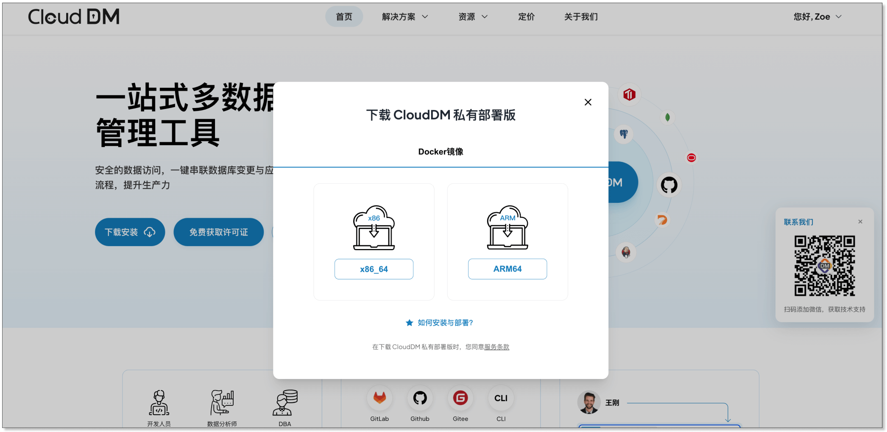

## 安装软件
1. 使用 “7z x clouddm.7z -o./clouddm_home” 命令解压刚刚下载的安装包。这里我们将安装包解压到位于同级目录中的 clouddm_home 新目录里，7z 会自动创建相应的文件夹。

2. 解压完成后，进入安装包中的 install_on_docker 目录。
+ cd ./clouddm_home/install_on_docker

3. 运行 install.sh 脚本，安装软件。
+ ./install.sh

      在安装过程中，如果遇到以下的报错信息，大概率是因为系统中 Docker 服务没有启动，请回看安装 Docker 环节。

+ Cannot connect to the Docker daemon at unix:///var/run/docker.sock. Is the docker daemon running?

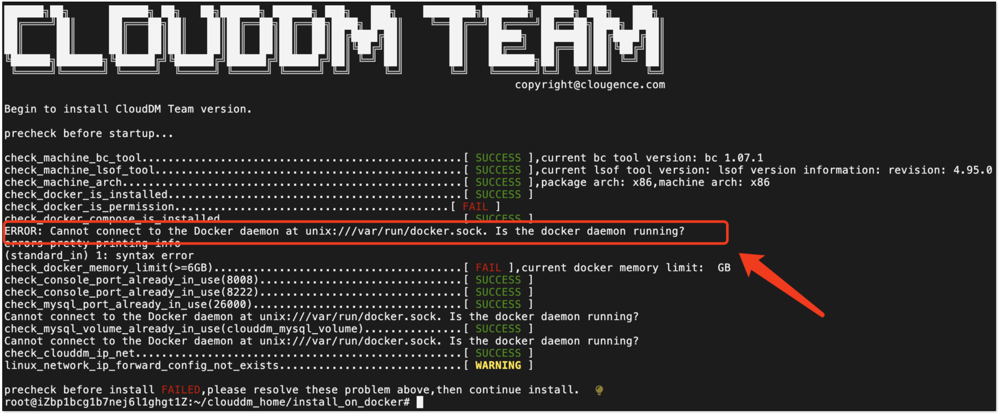

4. 当你看到 “CloudDM Team version is ready! visit console http://`你的ip`:8222” 提示信息时，表示已成功安装。

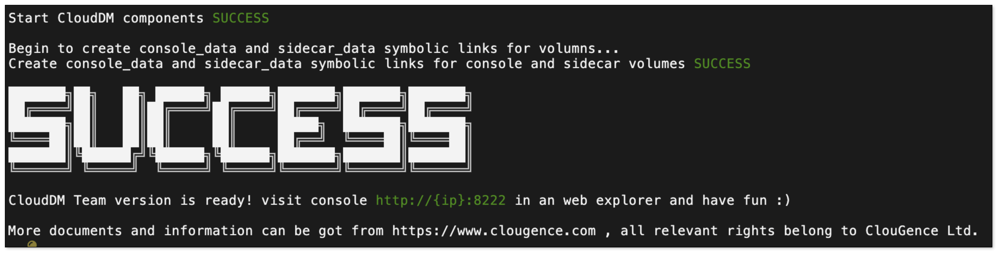

## 激活软件
### 登录软件
1. 安装成功后，在浏览器中访问这台机器的地址，即可打开登录界面。以 192.168.0.101 为例，访问地址为：http://192.168.0.101:8222/

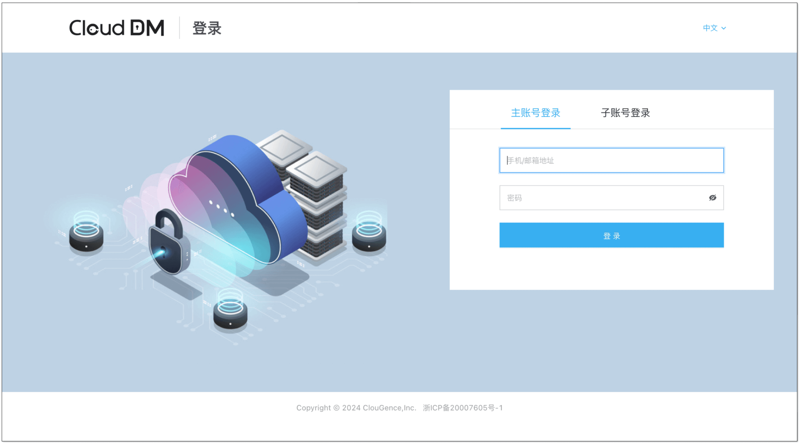

2. 首次登录系统需要使用默认账号和密码：
+ 默认账号: test@clougence.com
+ 默认密码: clougence2021

### 获取许可证
1. 进入软件界面后，点击右上角 “未激活” 字样，可以获得申请码。

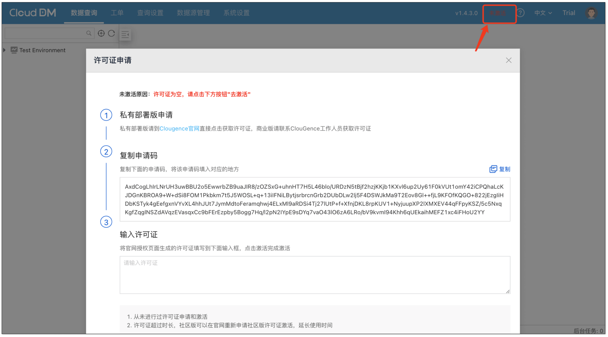

2. 进入 [产品官网](https://www.clougence.com/clouddm) 并点击 **免费获取许可证**，进入许可证获取页面。

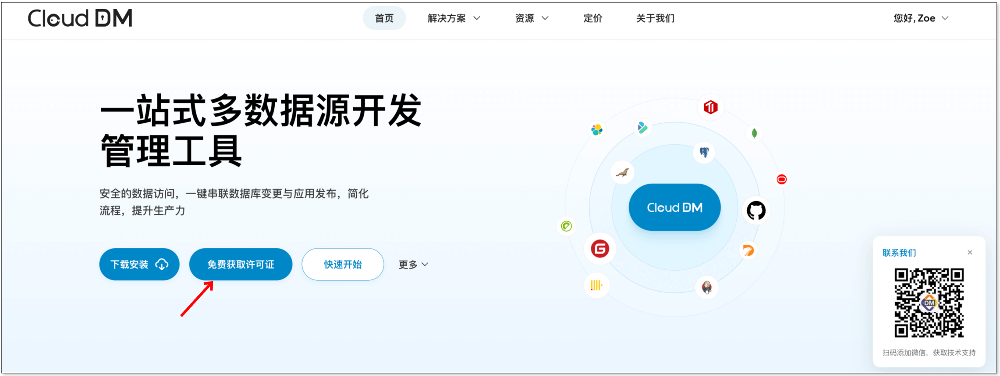

3. 把申请码粘贴至相应输入框内，产品类型选择 CloudDM。点击页面底部 **立即购买** 按钮。

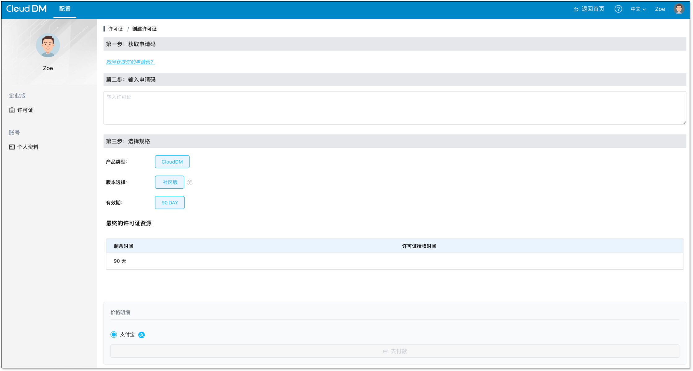

4. “购买” 成功后跳转到查看订单页面，可以在订单列表中查看许可证。把得到的许可证粘贴到软件系统的激活页面中，点击 **激活** 即可。激活后的软件界面右上角会展示 **已激活** 字样。

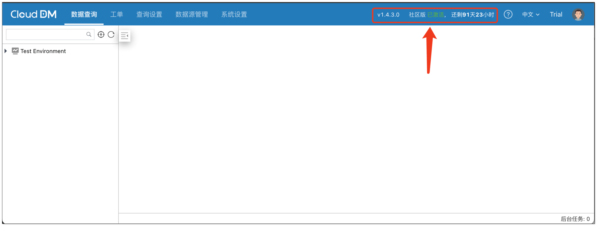

Tips: 软件可以免费使用，但需要每 3 个月重新申请一次新的许可证。

## 添加数据源
1. 在 **数据源管理** 页面，点击 **添加数据源**，填写相应的信息。

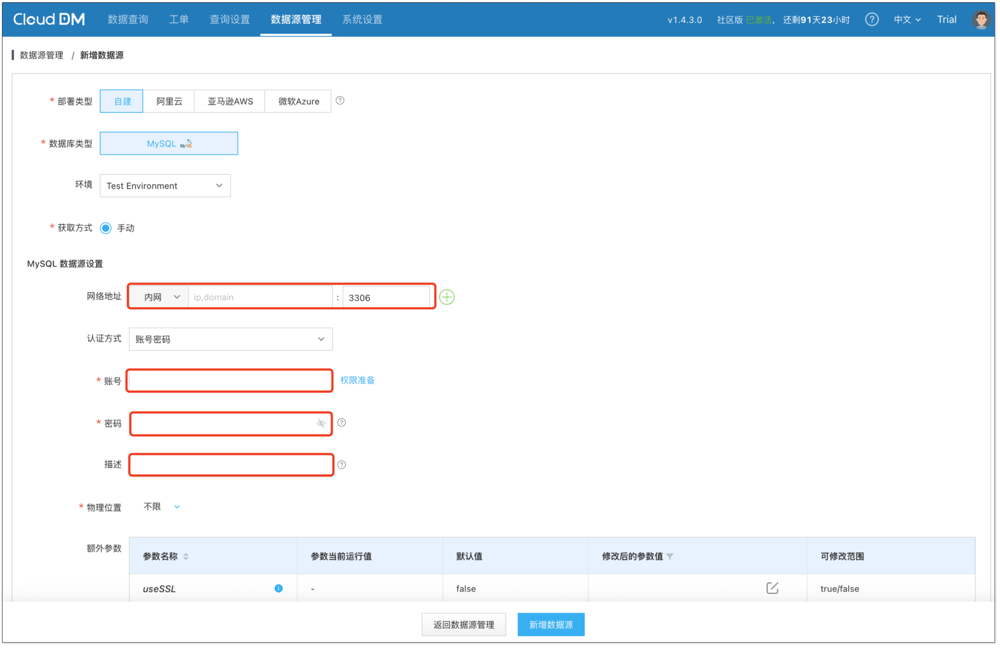


2. 添加好数据源后，点击 **查询设置**，然后启用 **数据管理** 功能。这一步会测试数据源是否正常连接。

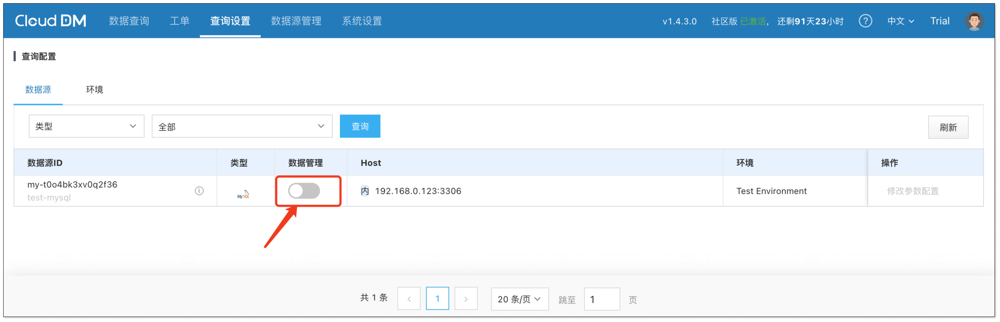

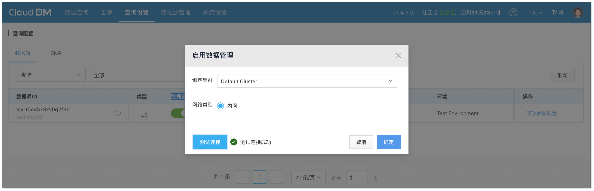


3. 启用 **数据管理** 后，点击 **数据查询** 即可看到刚刚添加的数据源，可以开始查询和使用该数据源。

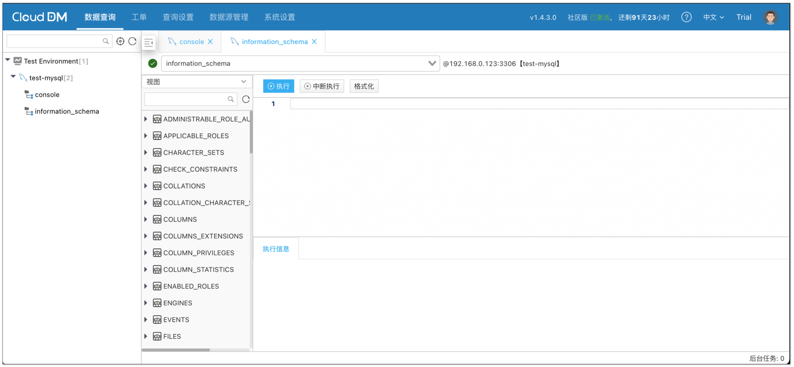

## 分配账号和权限
CloudDM 管控团队成员访问数据库，最核心的方式就是帮助团队管理数据库的账号，避免开发人员用数据库账号直连数据库。因此团队成员使用 CloudDM 之前，需要为成员分配账号。

1. 点击页面顶部 **系统设置**，在 **子账号管理** 页面中点击右上角 **添加子账号**。

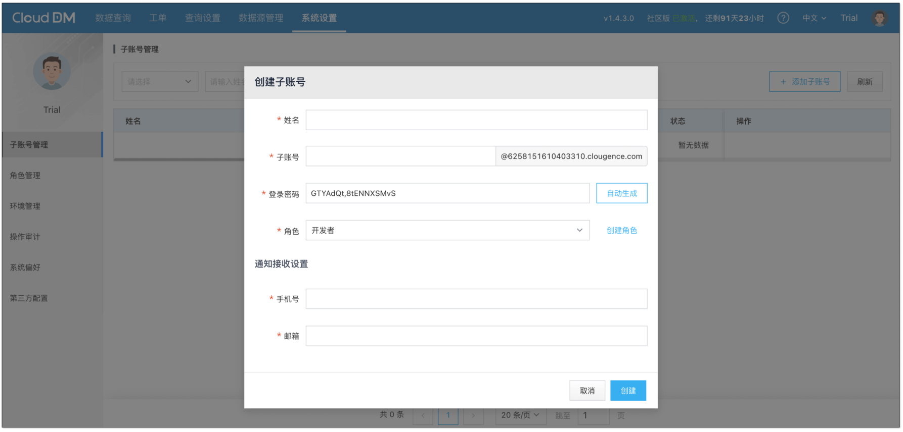

2. 在子账号添加页面中，填写以下信息，并点击 **创建**：
+ 姓名：使用者的名字，当团队成员使用这个账号登录后，右上角显示的名称。
+ 账号：子账号的登录名。
+ 密码：子账号登录使用的密码。
+ 角色：分配给这个账号的角色，内置了 **管理员**、**DBA**、**开发者** 三种角色。
+ 手机号：账号使用者的手机联系方式，这里填写仅为了方便联系到这个人。
+ 邮箱：同上。


3. 账号创建好后，需要为这个账号分配数据库访问权限。管理员可以根据需要，给这个新帐号分配可以访问的数据库和可执行的 SQL 权限。

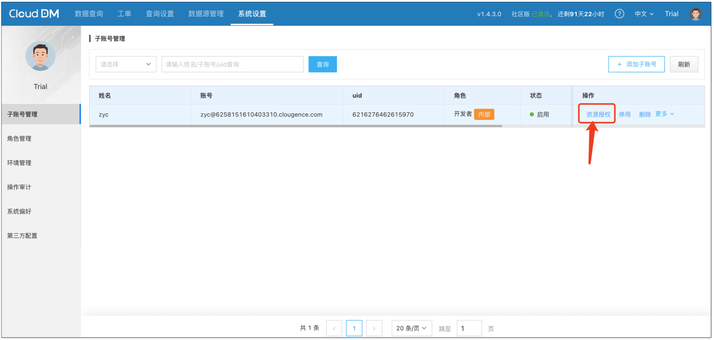

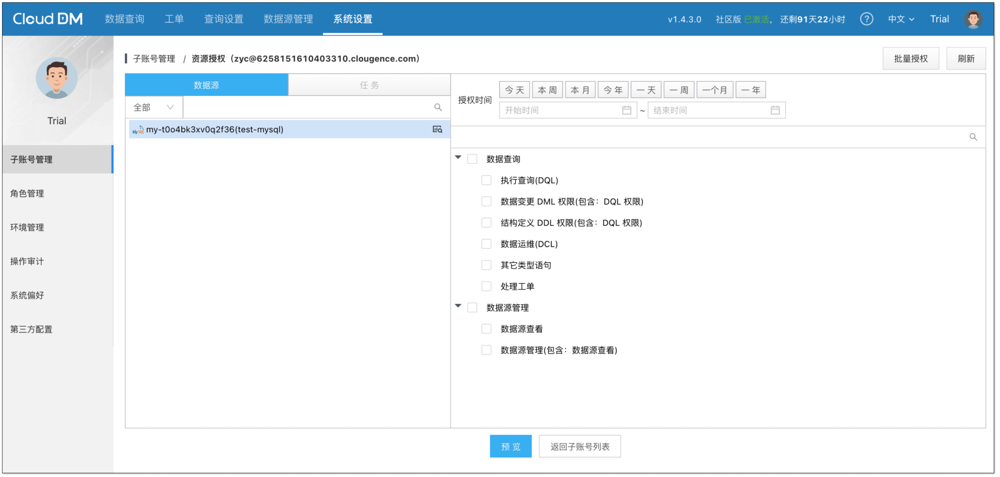


## 团队成员登录系统
CloudDM 的主账号只有一个，相当于管理员帐号。实际使用时主要通过为子账号赋予不同权限来完成。

主账号完成权限分配后，团队成员需要在登录页面中以子账号方式登录。

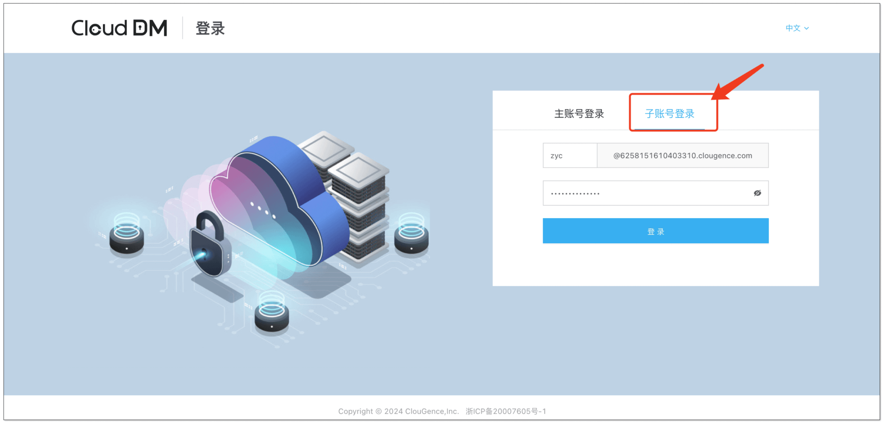

团队成员只能在账号权限范围内使用数据源，例如，当主账号没有赋予子账号 DDL 权限时，子账号在执行 DDL 操作后会提示没有权限。

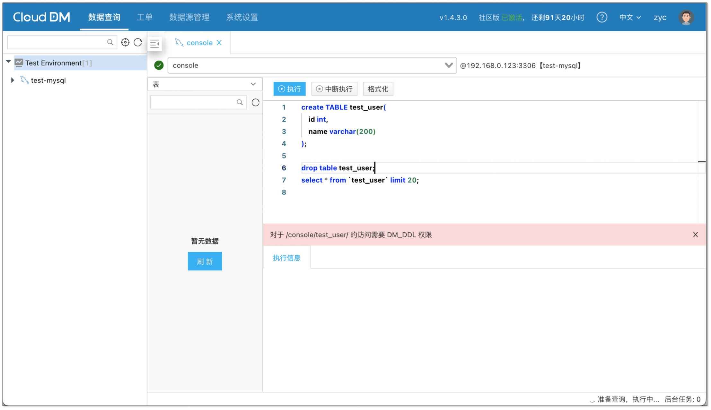

## 总结
CloudDM Docker 版是一款用于团队化访问数据库的工具，本文详细而直观地展示了如何安装及初步使用 CloudDM，相信您在阅读本文之后，对 CloudDM 的安装和使用会更加熟悉。
