CloudDM 是一个专为团队协同工作打造的数据库数据管控平台。在管控数据库安全变更的过程中，为提高效率，方便用户使用，CloudDM 接入了主流 OA 协同办公系统（包括钉钉、飞书、企业微信），支持实时通知与移动办公，满足广大企业用户的实际需求。

本文将介绍如何使用 CloudDM 和企业微信实现高效的数据库变更审批。

## 前置要求
部署 CloudDM Console 的服务器能够被外网访问。

## 创建企业微信应用
1. 登录 [企业微信后台管理](https://work.weixin.qq.com/wework_admin/frame#apps)。
2. 点击 **创建应用**。 
   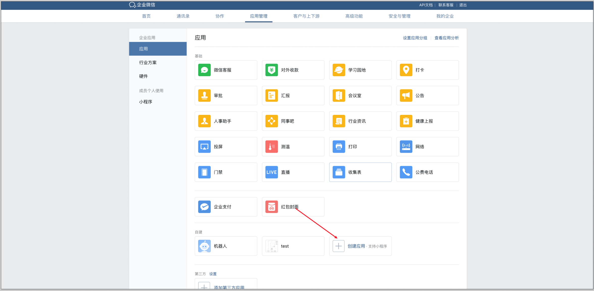
3. 填写应用基础信息，并设置可见范围，点击 **创建应用**。 
   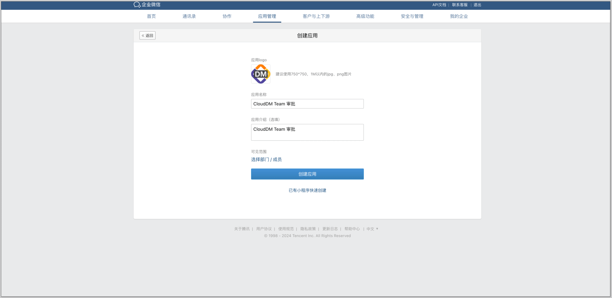

## 配置回调信息
1. 点击 **设置 API 接收**。 
   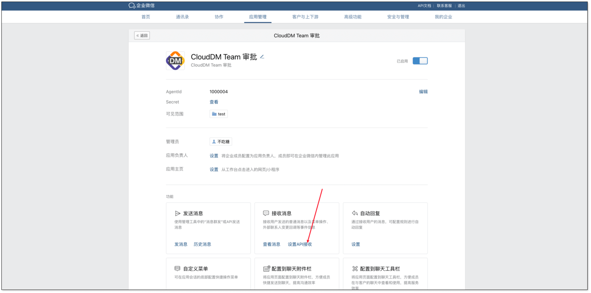
2. 在 CloudDM 登入主账号。在 **系统设置** > **操作审计** 中找到主账号的 uid 并复制。 
   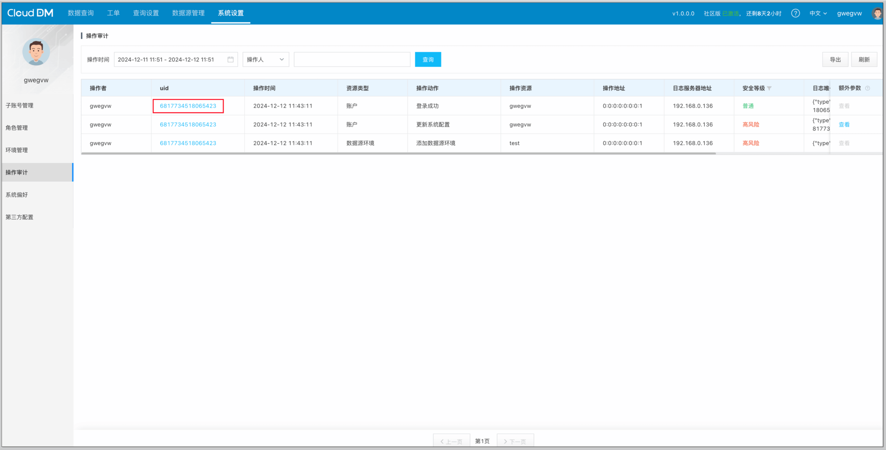
3. 回到企业微信后台管理平台，随机获取 **Token**，**EncodingAESKey**。设置 URL 为 CloudDM Console 部署机器域名+/callback/event?puid=`上一步操作中复制的puid`&platform=WECHAT&eventType=APPROVAL 
   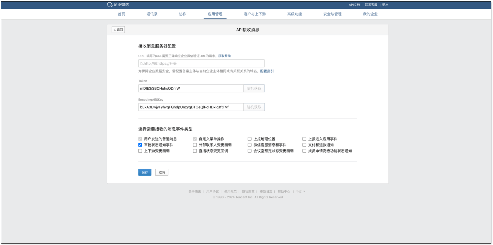
4. 在上方导航栏中点击 **我的企业**。获取 **企业ID**。 
   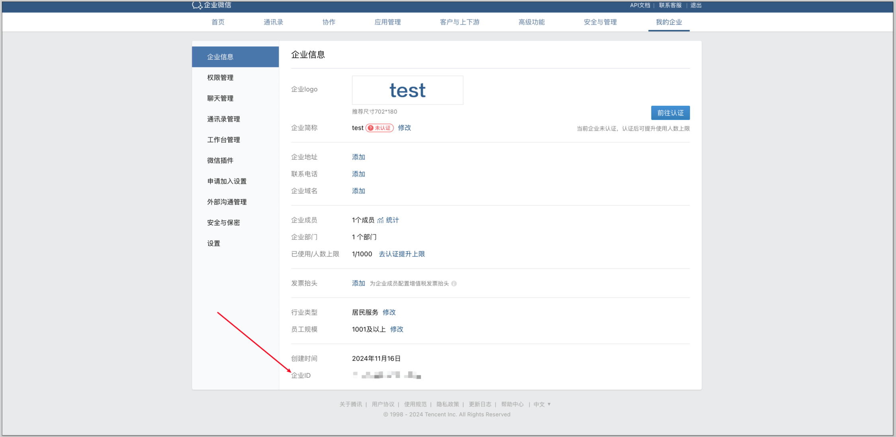
5. 回到 CloudDM 界面。在 **系统设置** > **系统偏好** 中将之前获取的 **Token** 填入 **wechatApprovalToken**，**EncodingAESKey** 填入 **EncodingAESKey**，**企业ID** 填入 **wechatApprovalCorpId**，并开启 **wechatEnableApprovalService**。 
   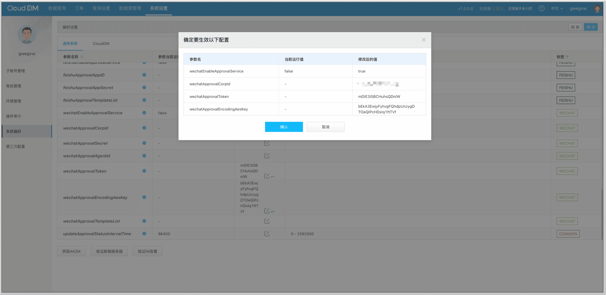
6. 返回企业微信后台管理平台的 **API 接收消息** 页面，点击 **保存**。 
   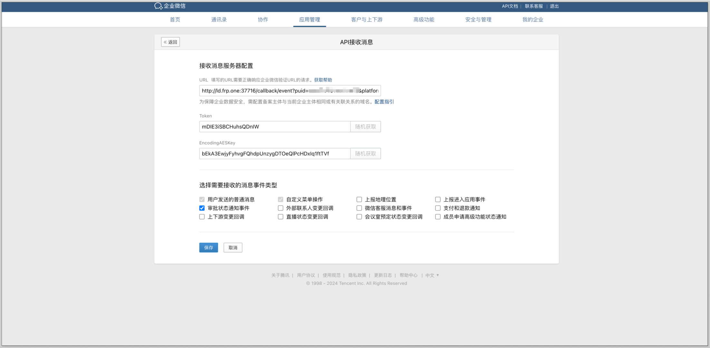

## 创建审批模版
1. 回到 **应用管理**，选择 **审批** 应用。 
   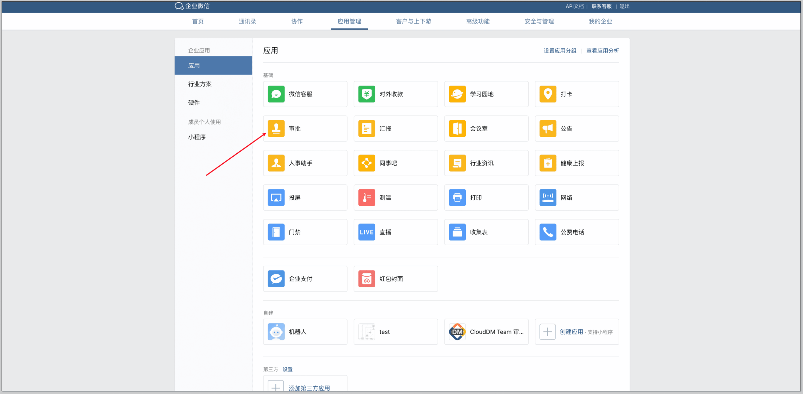
2. 点击 **添加模版**，选择自定义模版。 
   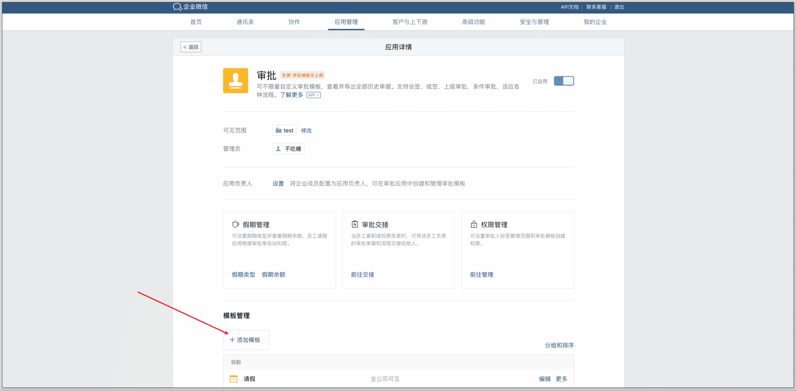
3. 按顺序添加如下控件且均不要开启必填选项：
    - 标题（文本）
    - 目标数据源（文本）
    - 需求描述（多行文本）
    - 执行 SQL（多行文本）
    - 回滚 SQL（多行文本）
    - 预计受影响行数（文本）
   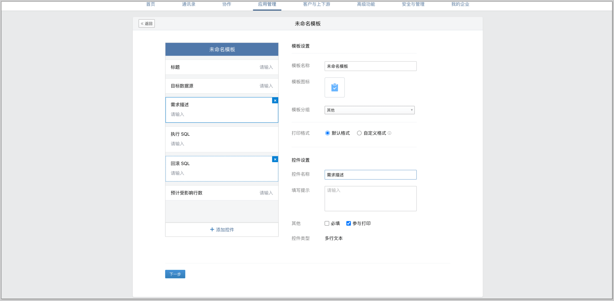
4. 点击下一步后，设置 **审批流程**。根据需要设置审批流程，流程节点需使用指定审批人方式。 
   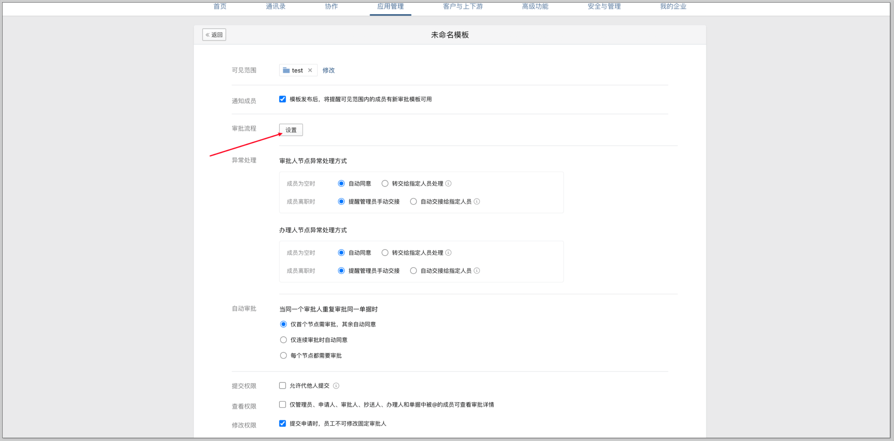
5. 配置完成后，在最下方点击 **保存**。 
   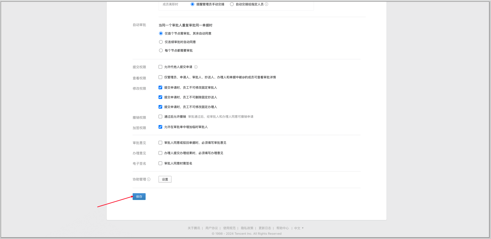
6. 保存完成后，回到 **审批** 应用页面，开启模版回调通知和审批应用。 
   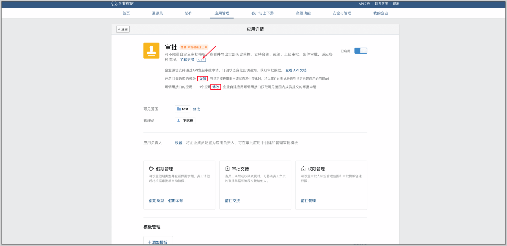
7. 在模版管理，点击编辑需要使用的模版，在页面上方的地址栏中获取 **审批模版码**。 
   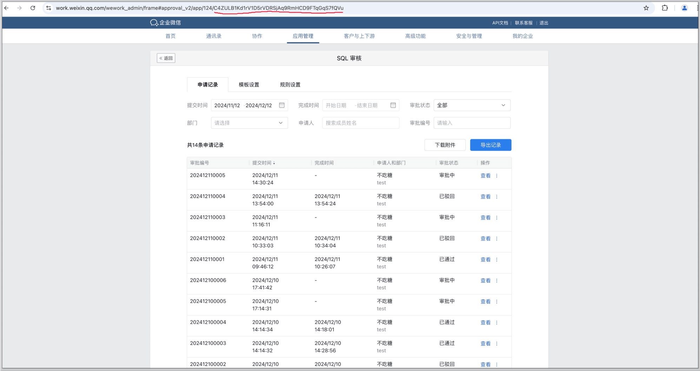

## 配置 API 调用信息
1. 回到创建的应用，获取 **AgentId**、**Secret**。 
   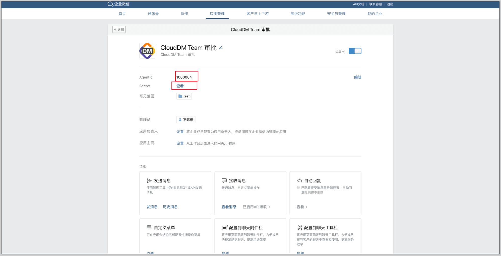
2. 回到 CloudDM 界面。在 **系统设置** > **系统偏好** 中将 **AgentId** 复制到 **wechatApprovalCorpId**，**Secret** 复制到 **wechatApprovalSecret**，**审批模版码** 复制到 **wechatApprovalTemplateList**（如有多个审批模版码，使用`,`分隔），点击 **保存**。
3. 在企业微信应用管理页面最下方，将部署 CloudDM Console 的服务器配置 **企业可信IP**。 
   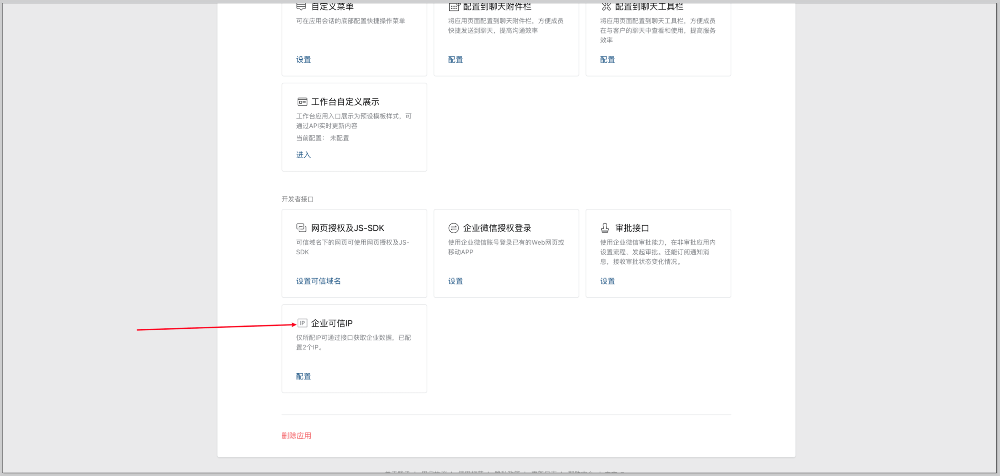

## 创建工单
1. 在 CloudDM 平台上方导航栏，点击 **查询设置**。
2. 在 **环境** 页签下，为对应的环境开启工单功能。
3. 在弹出的对话框中选择引擎为 **微信流程**，模板为刚才在飞书创建的模版。 
   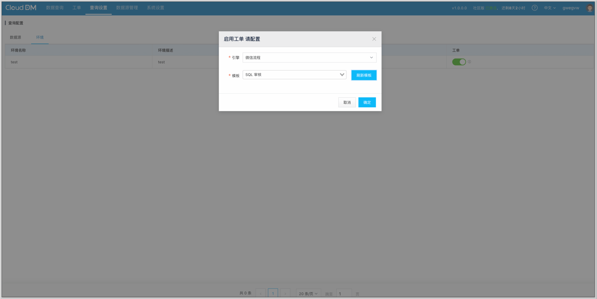
4. 在上方导航栏点击 **工单**，并 [提交工单](https://www.clougence.com/dm-doc/manual/workorder/workorder_promoter)。 
   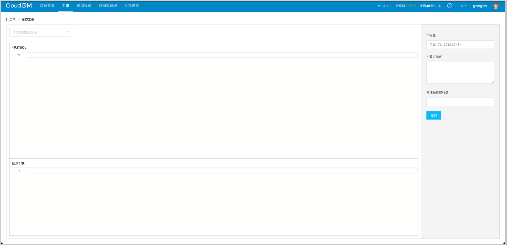

## 效果展示
通过审批

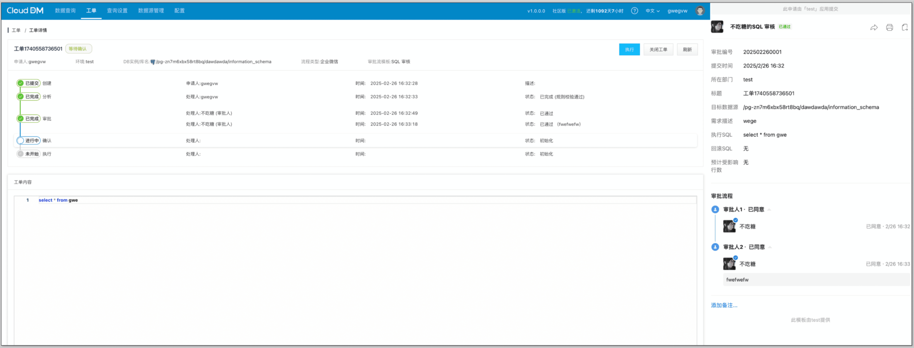

拒绝审批

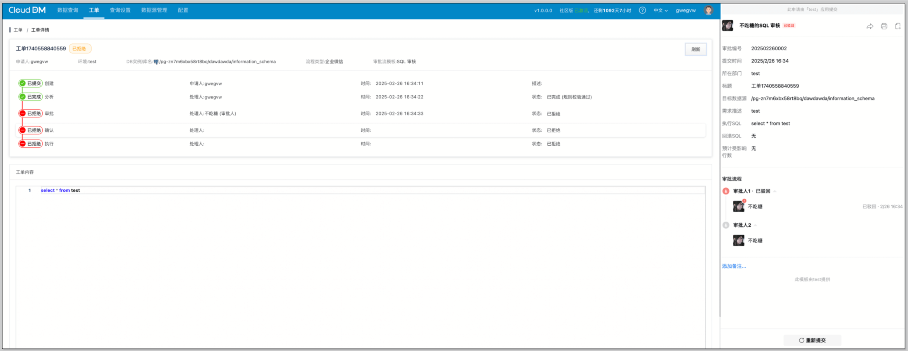

