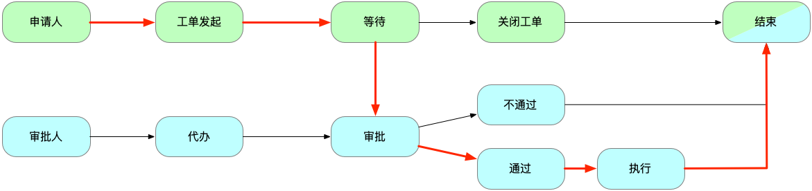

CloudDM Team 的工单运行依托上述流程，其中工单审批可以交由外部第三方工作流系统承载（如上图）
- **绿色**流程代表工单流程发起人
- **蓝色**流程代表工单流程审批人

### 工单分类

在 CloudDM Team 中，工单分为：
- **[SQL 工单](promoter/execute_approval)**：通过工单系统递交的 SQL 工单，包括数据导出、DDL、DML 的执行。
- **[变更工单](../devops/devops_about)**：由 **CI/CD** 的 **SQL 审批** 环节产生的审批工单。
- **[权限工单](./promoter/permission_approval)**：用户发起的权限申请工单。

### 审批引擎

CloudDM Team 支持的流程引擎有如下几种：

- 内置：
  - 内置工单引擎无法定制流程环节，仅基于权限提供有权限的人进行审批的能力。
- 第三方平台：
  - [钉钉](./engine/dingtalk_approval)，使用钉钉审批流进行工单流转。
  - [企业微信](engine/wechat_approval)，在企业微信客户端中使用企业微信审批进行工单流转。
  - [飞书](engine/feishu_approval)，使用飞书审批进行工单流转。
