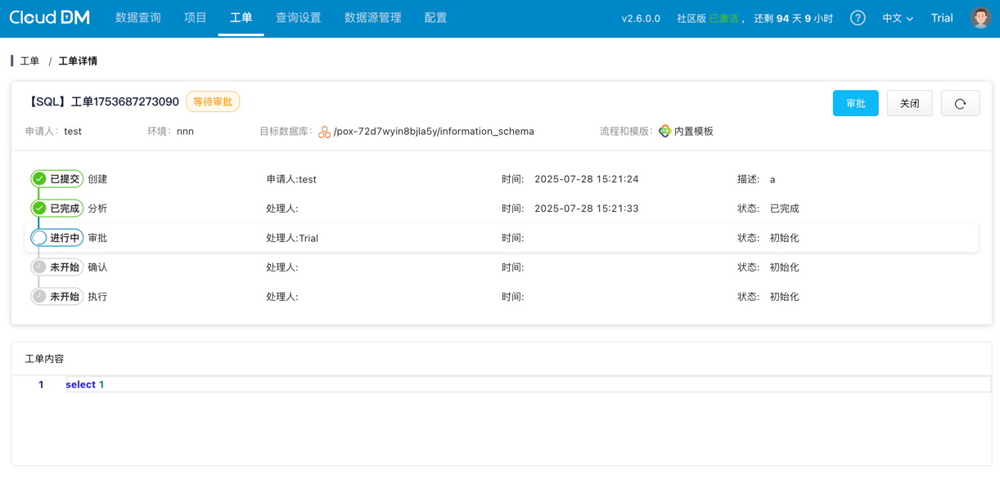
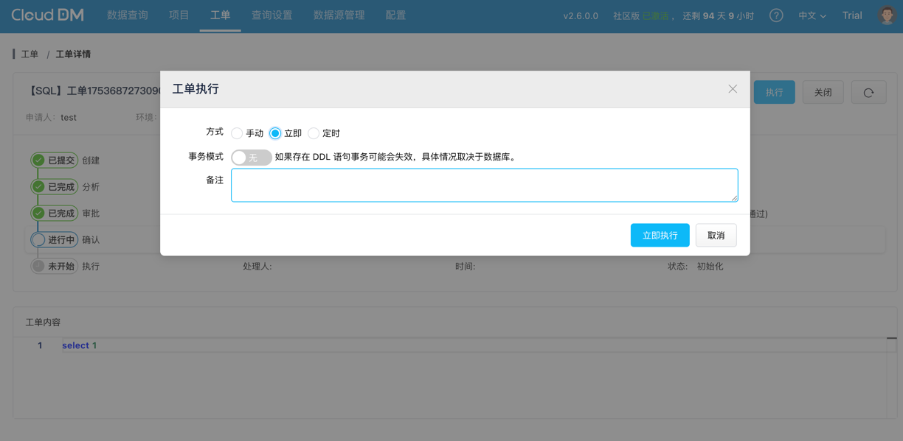

## 审批

若使用内置模板，可直接在对应的工单页面中完成审批操作；

若使用第三方审批流程，则需在相应的外部平台（如钉钉、飞书、企业微信等）中进行审批。

## 执行
### SQL 工单

执行方式可选择以下三种模式：

- 手动：由用户手动执行，工单将被标记为成功并自动关闭。
- 立即：由 CloudDM 立即调度并执行任务。
- 定时：由 CloudDM 在设定的指定时间自动调度执行任务。

### 权限工单
权限工单在审批通过后，系统将自动为用户完成授权操作，无需手动干预。

