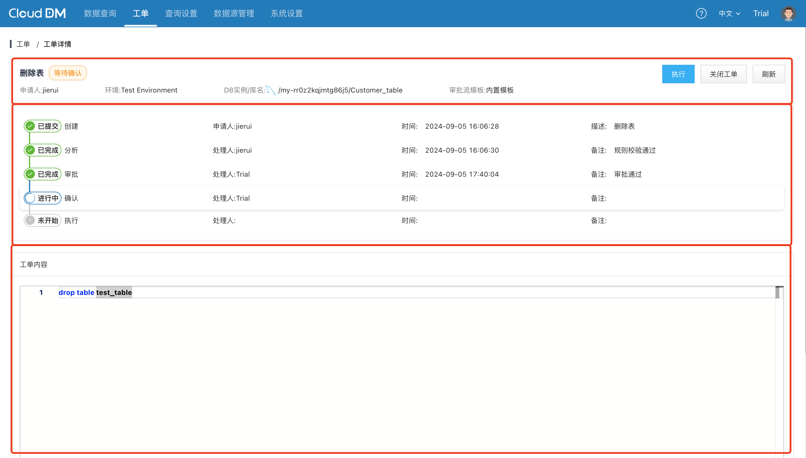

本文档将介绍 CloudDM Team 的工单详情页面中的内容。

## 页面布局

在工单详情页面分为上中下三个部分：
- 上部：包含 **基本信息** 和 **操作按钮**。
- 中部：显示 **流转信息**。
- 下部：为用户发起工单时递交的内容。

## 基本信息

- **工单标题**：标题在创建工单时填写。
- **工单状态**：如 **执行成功**、**等待审批**、**已拒绝**、**执行失败**。
- **申请人**：工单的发起人的名字。
- **环境**：工单操作的数据源所属环境。
- **DB实例/库名**：表示工单想要操作的具体的 **数据库* *或 **Schema**。
- **审批流模版**：工单操作的数据源所属环境上绑定的的审批模版名称。

## 流转信息

流转信息部分会展示工单从递交到当前所经过的详细阶段，在工单系统中流转阶段分为 5 个阶段：

- **创建**：工单刚刚被创建，CloudDM Team 还未对其进一步分析处理。
- **分析**：工单创建后 CloudDM Team 会以异步方式处理分析过程，对工单分析完毕会显示阶段结束。
- **审批**：正式进入审批流程，流程引擎根据工单数据源所处环境决定，环境上会绑定具体工单流程。
- **确认**：当审批通过，会进入确认阶段，通常情况下由 DBA 来做最终的确认和执行。
- **执行**：工单在经过 DBA 确认后，系统会安排具体的执行（内置引擎不支持自动执行）。

## 工单内容

工单内容部分用于展示用户在发起工单时填写的具体 SQL 内容。
