CloudDM Team 开启钉钉审批步骤如下：
1. 创建并配置钉钉应用，请参考 [钉钉应用参考](#config_app)。
2. 使用主账号登录 CloudDM Team 产品。
3. 进入页面 **系统设置** > **系统偏好** > **通用参数** 选项卡。
4. 参考如下表格修改配置项。最后点击右上角 **保存** 按钮后 **确认** 保存。

```text title='(必选) 需要修改的配置'
配置项                     │ 修改后     │ 说明
──────────────────────────┼───────────┼──────────────────────────────────────
dingEnableApprovalService │ true      │ 工单流程服务使用钉钉提供服务
dingEnableApprovalService │ xxxxx     │ 钉钉应用 Client ID
dingEnableApprovalService │ xxxxx     │ 钉钉应用 Client Secret
```

## 钉钉应用参考 {#config_app}

:::info
您可以将 CloudDM Team 中 [单点登录(SSO)](../../operation/sso/sso_dingtalk) 和工单整合进同一个钉钉应用。CloudDM Team 支持独立或分开配置。
:::

**准备工作**
1. 登录 [钉钉开发者后台](https://open-dev.dingtalk.com)，选择相应的组织，进入后台页面。
2. 获取 [开发者权限](https://open.dingtalk.com/document/isvapp/obtain-developer-permissions)，如已有权限则略过。

**应用基本配置**
1. 点击 **应用开发** > **钉钉应用** > **创建应用**。
   
2. 填写应用的基础信息，并点击 **保存**。涉及图标资源可以在 [资源下载](../../resource/resource_download) 中获取。
   
1. 点击 **凭证与基础信息信息**，获取 **Client ID** 和 **Client Secret**。
   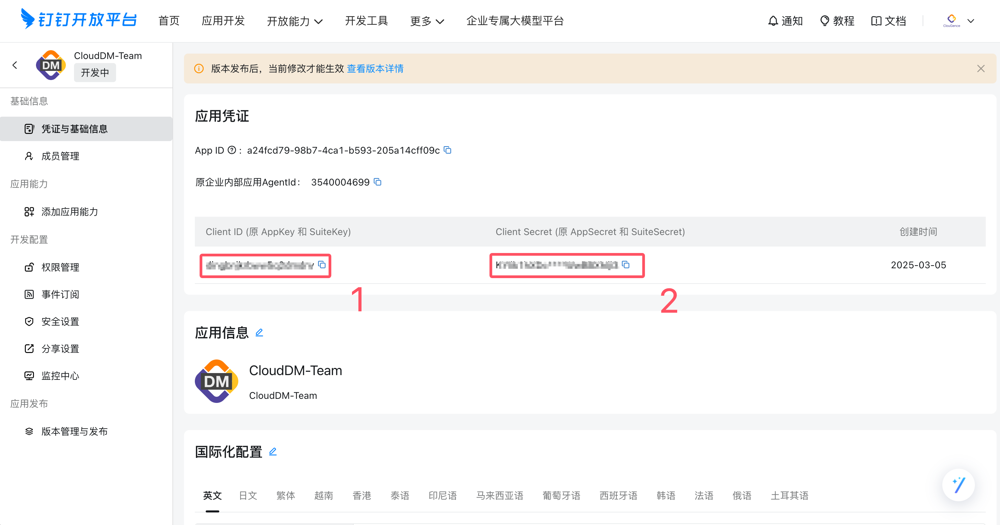
2. 点击 **权限管理**，给应用分配权限。
   ```text
   通讯录管理
      邮箱等个人信息
      成员信息读权限
      根据手机号获取成员基本信息权限
      通讯录部门成员读权限
   OA审批
      获取指定用户可见的审批表单列表
      审批流数据管理权限
      工作流实例写权限
      工作流模板读权限
      工作流实例读权限
   ```
   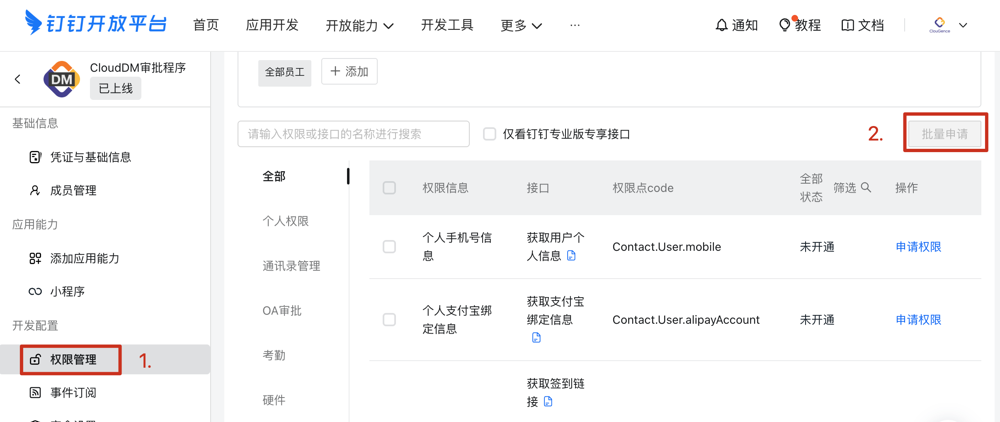
3. 点击 **安全设置**，设置您部署 CloudDM Team 环境中公网出口 IP。
   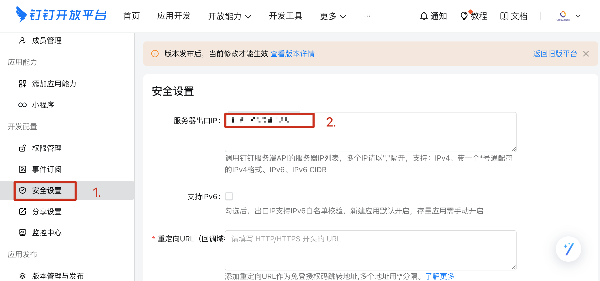
4. 点击 **版本管理与发布**，发布应用。应用可用范围选择 **全部员工**。
   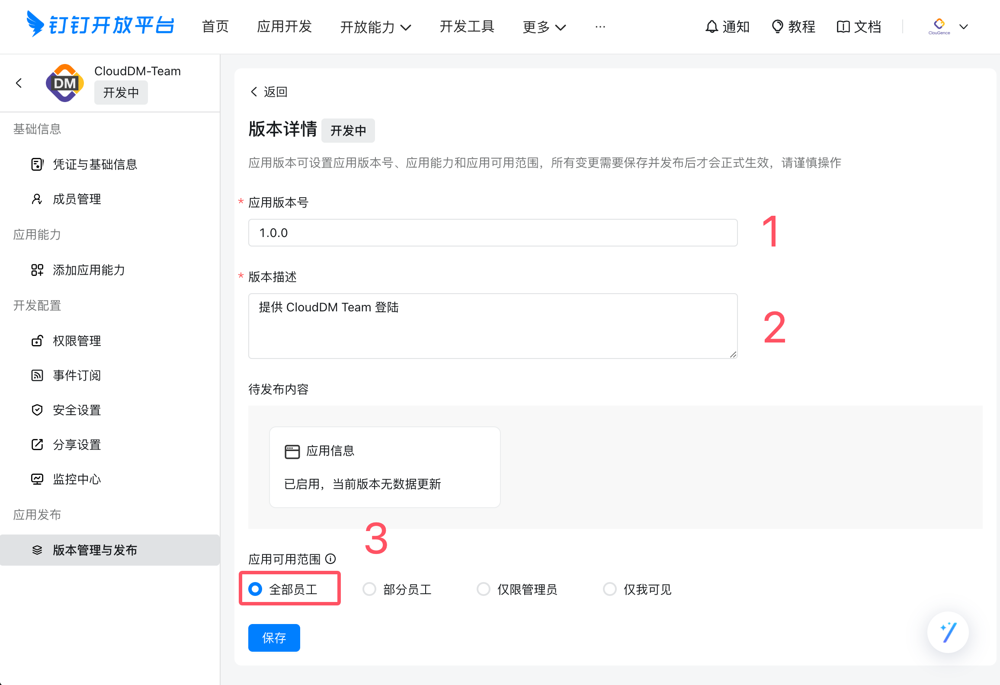

## 表单配置参考 {#create_form}

1. 通过钉钉客户端或浏览器进入钉钉 [OA 审批管理后台](https://oa.dingtalk.com/)。
   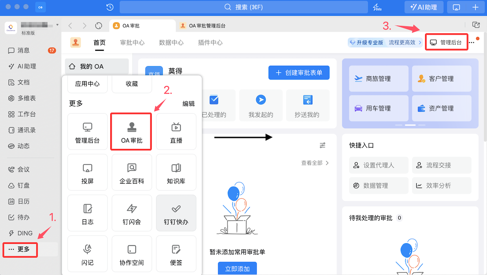
2. 在 OA 审批管理后台点击 **创建新表单**，表单类型选择 **流程表单**。
   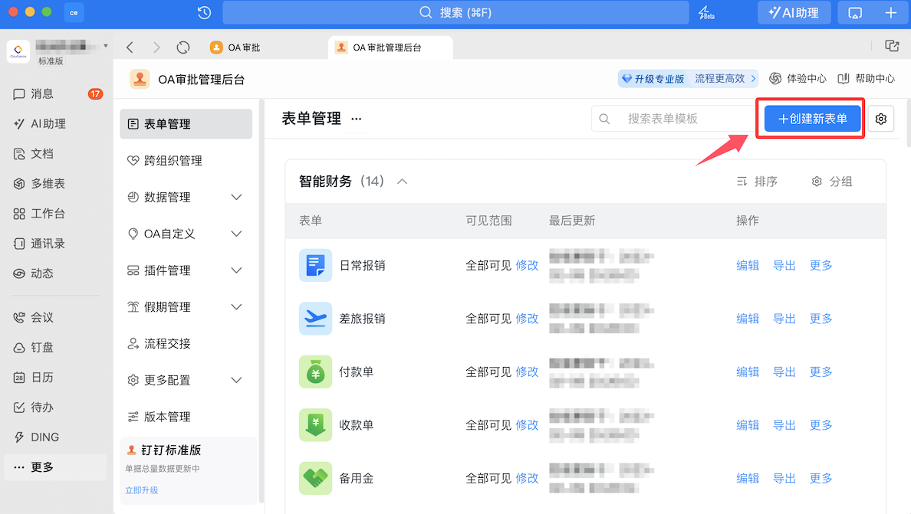
3. 在 **表单设计** 的步骤，按照情况添加必要的控件，在添加过程中请不要开启必填选项。表单内容请参考 **[配置钉钉表单](#config_form)**。
   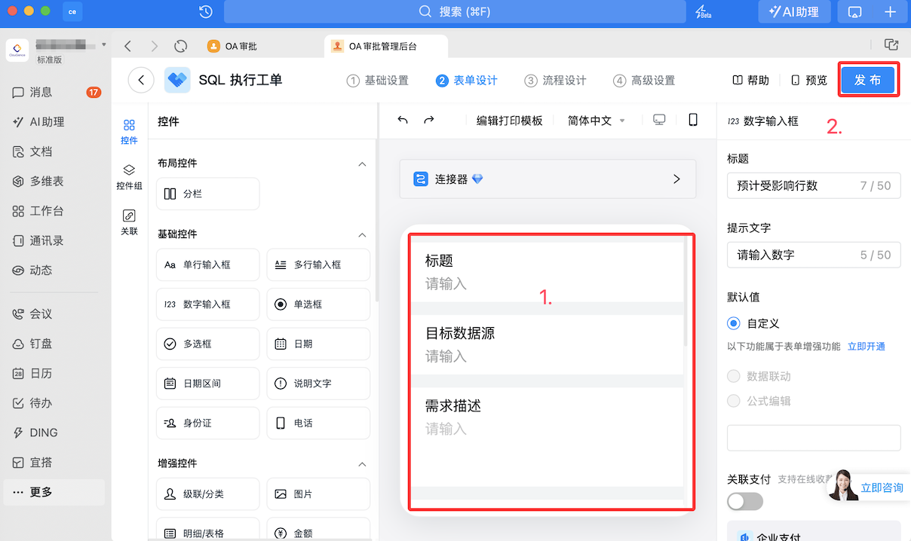
4. 在 **流程设计** 的步骤，设置各节点的审批人及审批方式（<font color="red">需要注意：在设置节点审批人时 CloudDM Team 不支持发起人自选</font>）。
   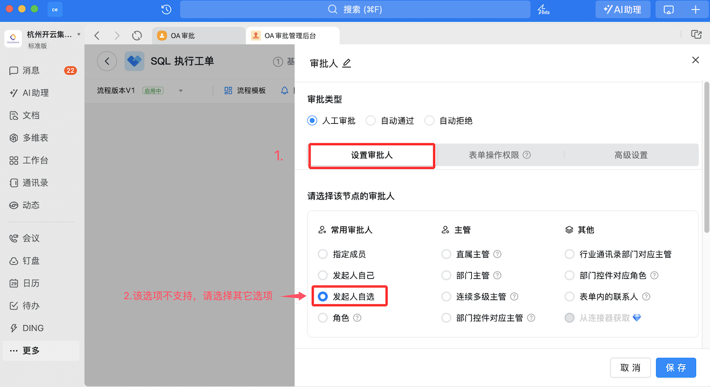

### SQL 工单 {#config_form}

:::info
注意：由于表单大小限制，表单如果内容超长会被截断，完整内容需到 CloudDM Team 控制台。
- 单行输入框，400 长度
- 多行输入框，4000 长度
:::

- SQL 工单的表单按照如下内容填写。
   ```text
   标题（单行输入框）
   目标数据源（单行输入框）
   需求描述（多行输入框）
   执行 SQL（多行输入框）
   回滚 SQL（多行输入框）
   预计受影响行数（数字输入框）
   ```
   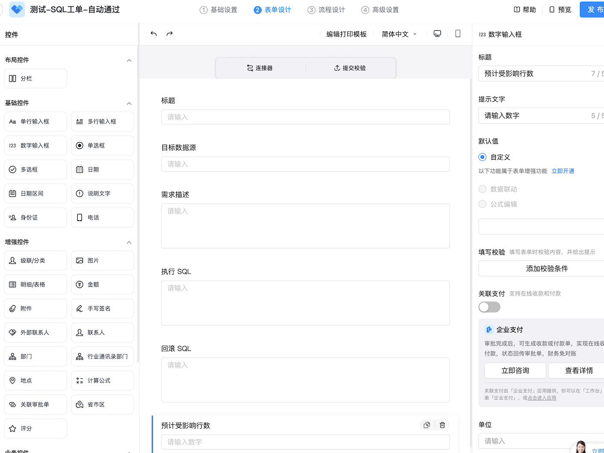


### 权限工单

- 权限工单的表单按照如下内容填写。
   ```text
   标题（单行输入框）
   需求描述（多行输入框）
   申请的权限（明细/表格，填写方式请选择：表格）
      数据源描述（单行输入框）
      资源路径（单行输入框）
      生效时间（单行输入框）
      权限列表（多行输入框）
   ```
   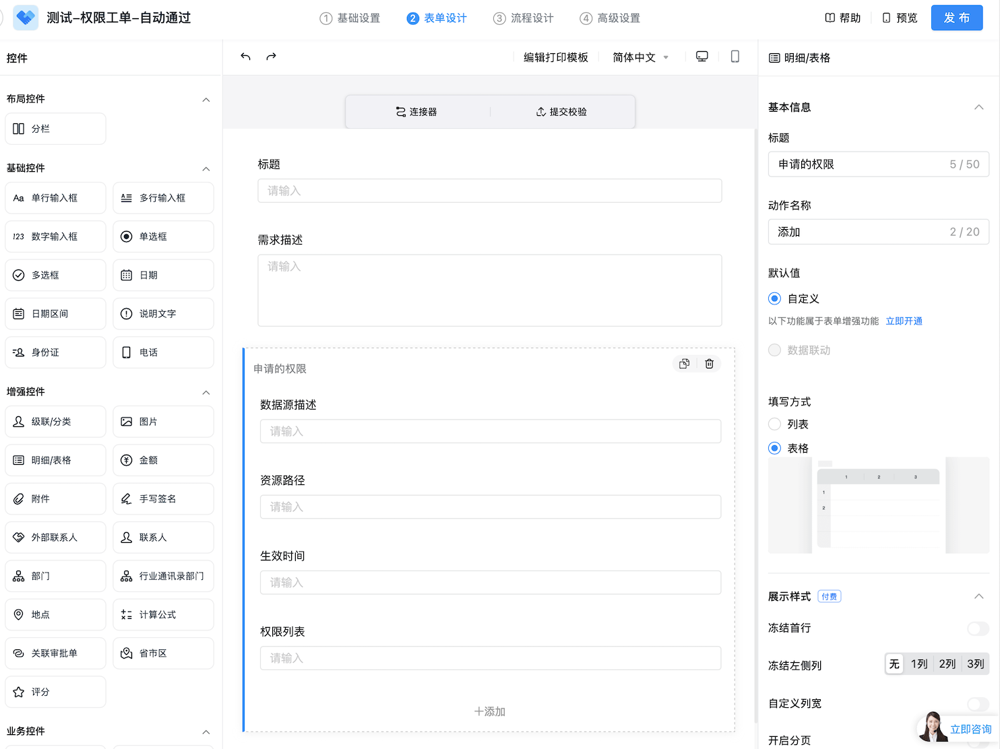

### 变更工单

- 变更工单的表单按照如下内容填写。
   ```text
   标题（单行输入框）
   需求描述（多行输入框）
   目标数据源（单行输入框）
   项目（单行输入框）
   变更（单行输入框）
   分支（单行输入框）
   执行 SQL（多行输入框）
   ```
   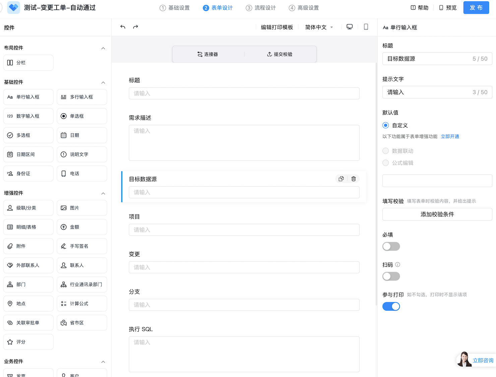

## 配置消息通道 {#event_push}

1. 确保 CloudDM Team 已经开启钉钉审批（参考本文最开始部分）。
2. 回到钉钉应用开放平台，配置消息订阅通道。点击 **事件订阅** > **已完成接入，验证连接通道**，验证通过后点击 **保存**。
   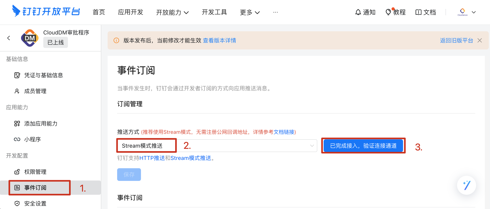

### 订阅设置

1. 订阅设置。
   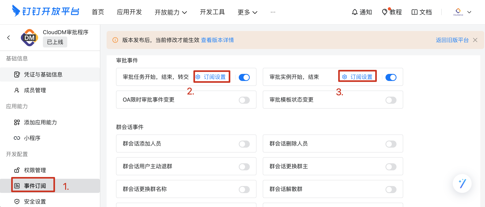
   :::warning
   默认情况下，钉钉会推送所有工单事件。每个事件消息都会消耗 API 调用次数进而产生费用支出。   
   如果您的团队在使用钉钉审批时存在其它类型审批表单，则建议您进行 **[订阅设置](https://open.dingtalk.com/document/orgapp/event-subscription-overview#8dcdbb72adhxy)** 以避免过度消耗产生不必要的费用支出。
   :::
   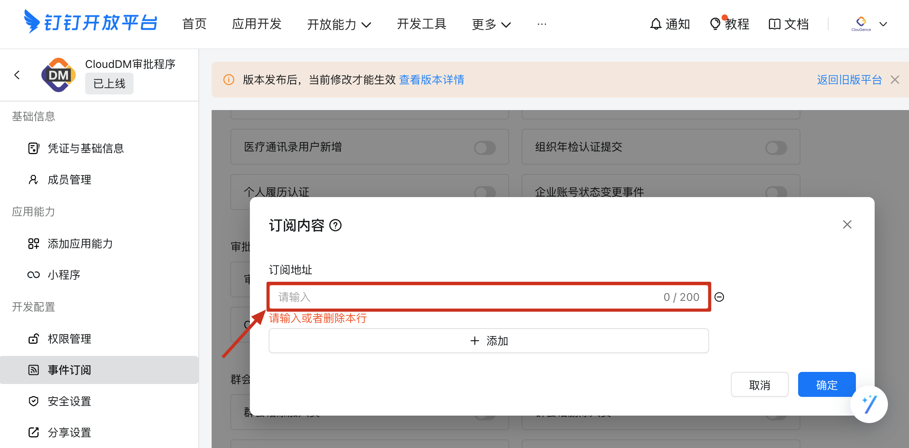
3. 订阅地址填写：
   - 事件 **审批实例开始、结束**
     - 配置格式：`/v1.0/event/bpms_instance_change/processCode/\{processCode\}/type/*`
   - 事件 **审批任务开始、结束、转交**
           - 配置格式：`/v1.0/event/bpms_task_change/processCode/\{processCode\}/type/*`
   - 将上述配置格式中的 \{processCode\} 替换为需要监听的表单模版码。
4. 获取模版码：
   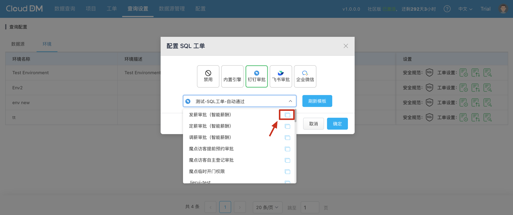
  复制的结果示例：`定薪审批:PROC-88888888-8888-8888-8888-888888888888`，其中冒号后面部分为模版代码。

## 使用钉钉审批

1. 在 CloudDM Team 平台上方导航栏，点击 **查询设置**。
2. 在 **环境** 页签下，为对应的环境开启工单功能。
3. 在弹出的对话框中选择引擎为 **钉钉流程**，模板为刚才在钉钉创建的模版。

## 付费 API 消耗次数说明
- 完整审批消耗次数 = 3 次固定开销 +（审批耗时/设置定时获取最新状态时间间隔）+ 工单详情页面点击刷新次数
- 3 次固定开销 = 获取审批节点 + 创建审批流 + 审批结束获取最新状态
