CloudDM Team 开启飞书审批步骤如下：
1. [创建并配置飞书应用](#config_app)。
2. 使用主账号登录 CloudDM Team 产品。
3. 进入页面 **系统设置** > **系统偏好** > **通用参数** 选项卡。
4. 参考如下表格修改配置项。最后点击右上角 **保存** 按钮后 **确认** 保存。

```text title='(必选) 需要修改的配置'
配置项                       │ 修改后     │ 说明
────────────────────────────┼───────────┼──────────────────────────────────────
feishuEnableApprovalService │ true      │ 工单流程服务使用飞书提供服务
feishuApprovalAppID         │ xxxxx     │ 飞书应用 App ID
feishuApprovalAppSecret     │ xxxxx     │ 飞书应用 App Secret
```

```text title='(可选) 高级参数选项说明'
配置项                       │ 修改后     │ 说明
────────────────────────────┼───────────┼──────────────────────────────────────
feishuApprovalApiTimeoutSec │ 5         │ 调用飞书 API 的最大超时时间，默认 5秒
```

## 飞书应用参考 {#config_app}

:::info
您可以将 CloudDM Team 中 [单点登录(SSO)](../../operation/sso/sso_feishu) 和工单整合进同一个飞书应用。CloudDM Team 支持独立或分开配置。
:::

**准备工作**
1. 登录 [飞书开发者后台](https://open.feishu.cn/app)，选择相应的组织，进入后台页面。
2. 获取 **飞书开放平台** > **企业自建应用** 中找到 **目标应用**，并在 **成员管理** 设置中 **添加您的账号**。
   - 如已有权限则略过。
   - 如创建新的应用则参考下面应用创建流程。

**应用基本配置**
1. 点击 **应用开发** > **飞书应用** > **创建应用**。
   
2. 填写应用的基础信息，并点击 **保存**。涉及图标资源可以在 [资源下载](../../resource/resource_download) 中获取。
   
3. 在 **凭证与基础信息信息**，获取 **App ID** 和 **App Secret**。
   
4. 点击 **权限管理** > **开通权限** > **应用身份权限**：
   ```text
   审批
      访问审批应用
      查看、创建、更新、删除审批应用相关信息
      查看、创建、更新、删除原生审批定义相关信息
      查看、创建、更新、删除原生审批实例相关信息
   通讯录
      获取通讯录基本信息
      获取用户基本信息
      获取用户 user ID
      通过手机号或邮箱获取用户 ID
   ```
   
5. 点击 **安全设置**。<br/>在 **IP 白名单** 选项下配置您 CloudDM Team 环境中公网出口 IP。
   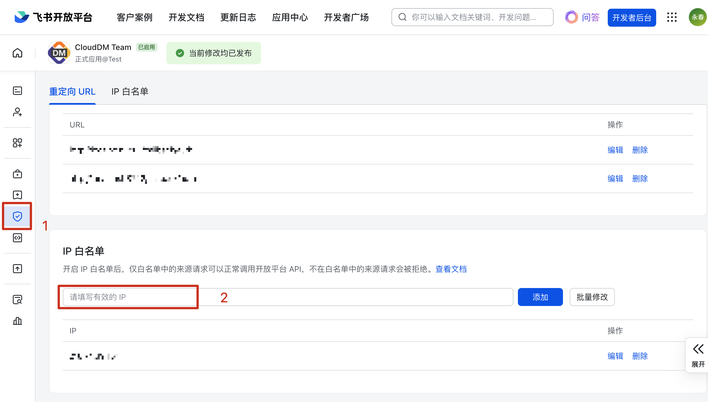
6. 点击 **版本管理与发布**，发布应用。应用可用范围选择 **所有员工**。
   

## 表单配置参考 {#create_form}

1. 进入 [飞书审批管理后台](https://www.feishu.cn/approval/admin/approvalList)，在 **审批管理** > **创建审批** 的弹出页中点击 **创建自定义审批**。
   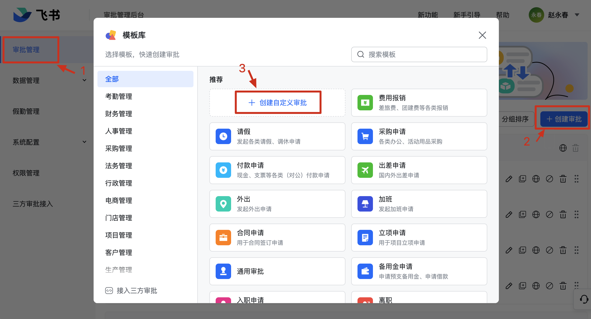
   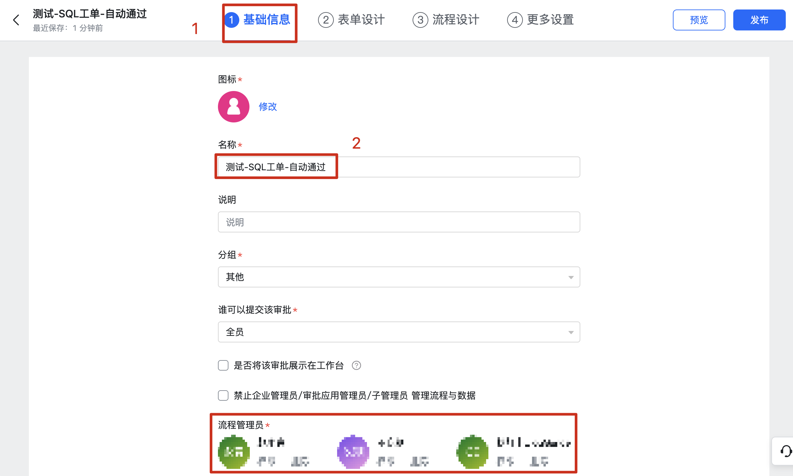
2. 在 **表单设计** 的步骤，按照情况添加必要的控件，在添加过程中请不要开启必填选项。表单内容请参考 **[配置飞书表单](#config_form)**
   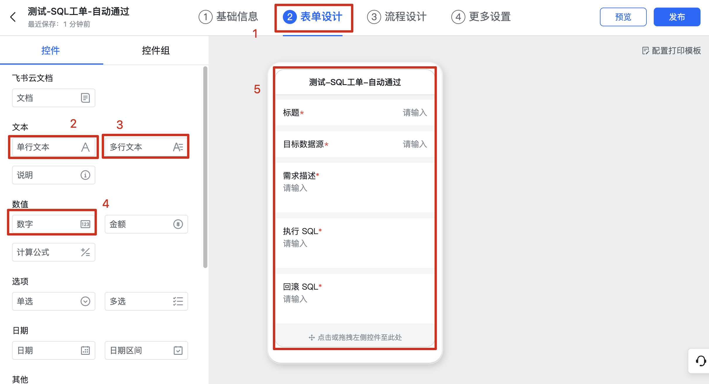
3. 在 **流程设计** 的步骤，设置各节点的审批人及审批方式（<font color="red">需要注意：在设置节点审批人时 CloudDM Team 不支持递交人自选</font>）。
   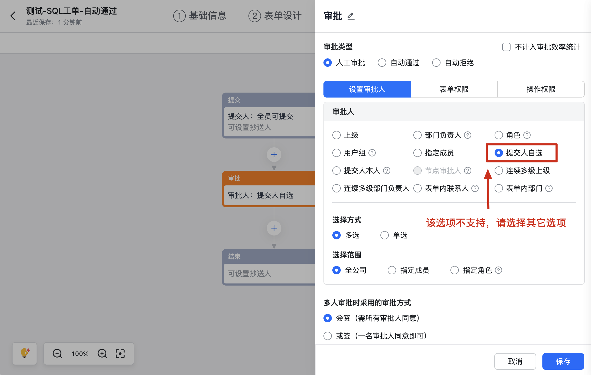
4. 配置完成后，右上角点击 **发布**。
   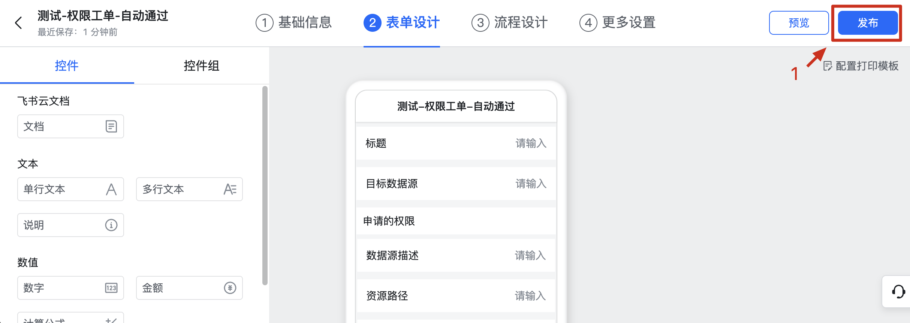

### SQL 工单 {#config_form}

      :::info
      注意：由于表单大小限制，表单如果内容超长会被截断，完整内容需到 CloudDM Team 控制台。
      - 单行输入框：400 长度
      - 多行输入框：4000 长度
      :::

- SQL 工单的表单按照如下内容填写。
   ```text
   标题（单行文本）
   目标数据源（单行文本）
   需求描述（多行文本）
   执行 SQL（多行文本）
   回滚 SQL（多行文本）
   预计受影响行数（数字）
   ```
   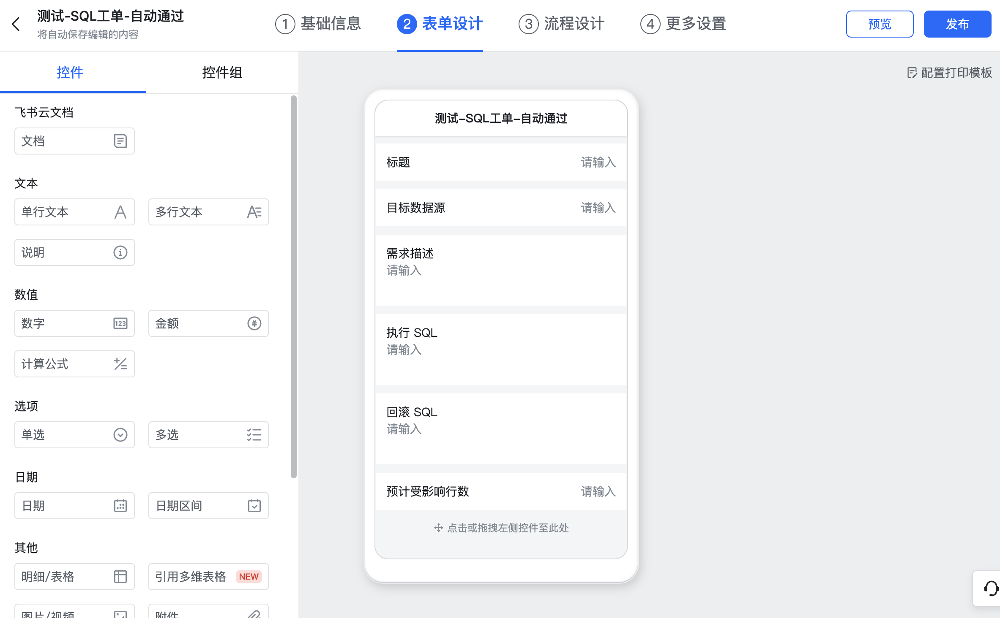

### 权限工单

- 权限工单的表单按照如下内容填写。
   ```text
   标题（单行文本）
   需求描述（多行文本）
   申请的权限（明细/表格，排列方式请选择：横向明细）
      数据源描述（单行文本）
      资源路径（单行文本）
      生效时间（单行文本）
      权限列表（多行文本）
   ```
   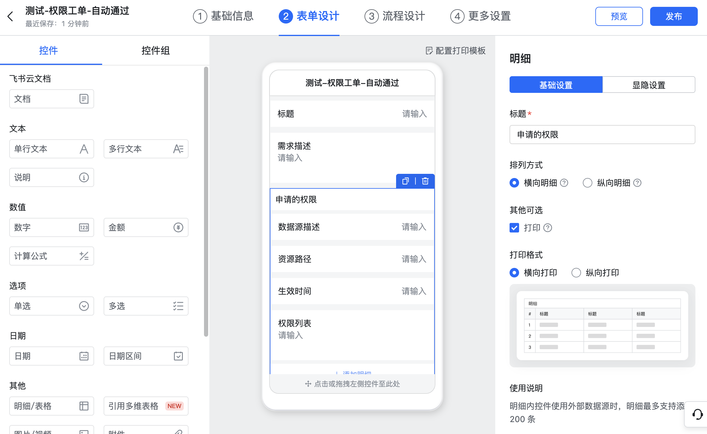

### 变更工单

- 变更工单的表单按照如下内容填写。
   ```text
   标题（单行文本）
   需求描述（多行文本）
   目标数据源（单行文本）
   项目（单行文本）
   变更（单行文本）
   分支（单行文本）
   执行 SQL（多行文本）
   ```
   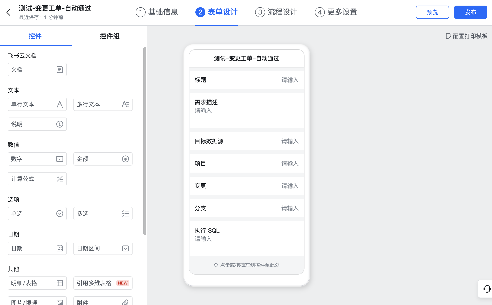

## 配置消息订阅 {#event_push}

1. 确保 CloudDM Team 已经开启钉钉审批（参考本文最开始部分）。
2. 回到飞书开发者后台，配置消息订阅通道。点击 **事件与回调**，在 **事件配置** > **订阅方式** 中选择 **使用长连接接收事件** 点击 **保存**。
   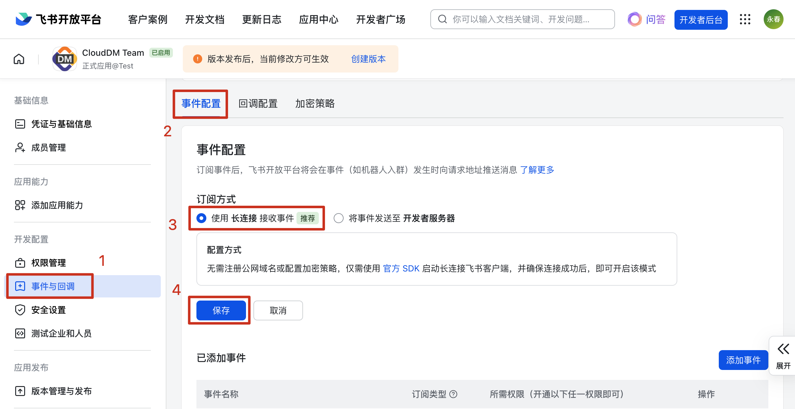
3. 点击 **添加事件**。添加 **审批实例状态变更** 和 **审批任务状态变更** 事件。
   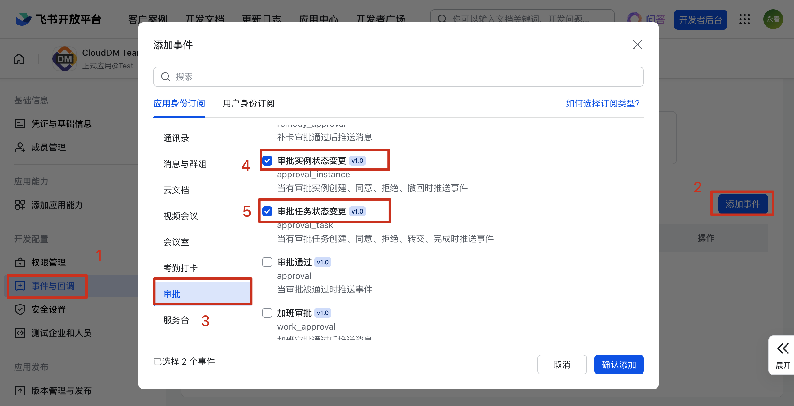
4. 点击 **版本管理与发布**，发布应用（第二次发布应用）。应用可用范围选择 **所有员工**。
   

## 使用飞书审批 {#use}

1. 在 CloudDM Team 平台上方导航栏，点击 **查询设置**。
2. 在 **环境** 页签下，为对应的环境开启工单功能。
3. 在弹出的对话框中选择引擎为 **飞书流程** 点击 **添加模版**，输入模版 URL 再次点击 **添加模版**。
4. 获取 “模版 URL”：
   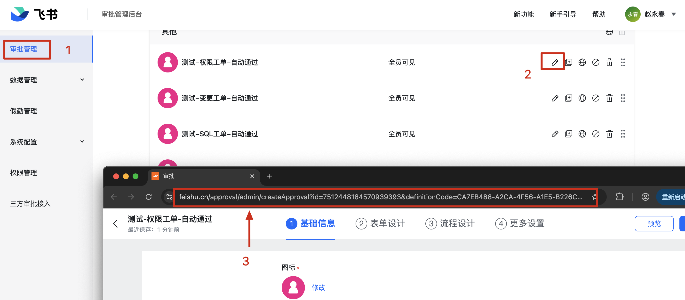
4. 模版添加成功后，选择添加的模版点击 **确定**。

## 付费 API 消耗次数说明
- 1 次完整审批消耗次数= 4 次固定开销 + 审批次数 +（审批耗时/设置定时获取最新状态时间间隔）+ 工单详情页面点击刷新次数
- 4 次固定开销 = 获取审批节点 + 创建审批流 + 审批开始时获取状态信息 + 审批结束获取最新状态
