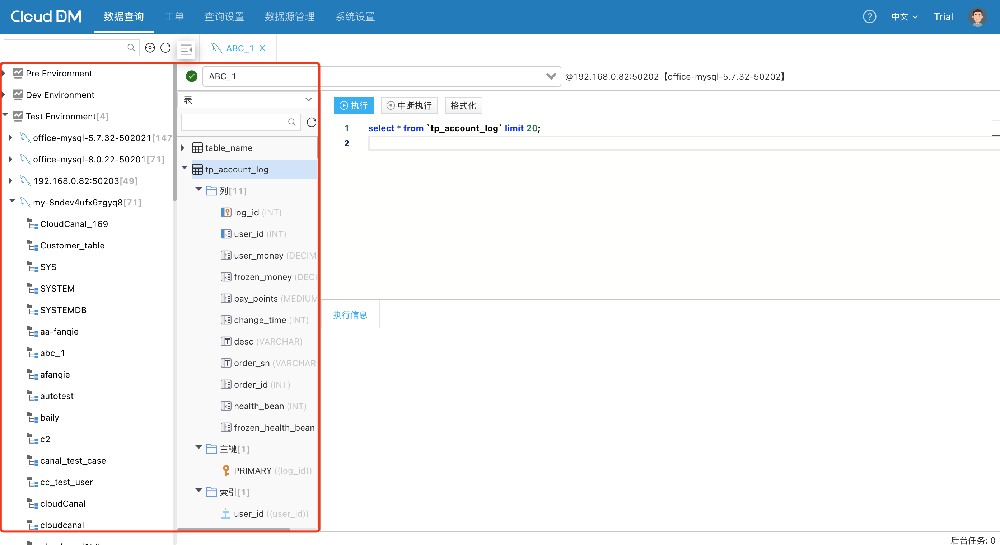

本文主要介绍如何使用 CloudDM Team 数据库对象浏览器查看数据库中的对象。

## 介绍 {#about}

数据库浏览器如图所示，它分为左右两栏：
- 左边栏：常驻页面，负责展示 **环境**、**数据库实例**、**数据库**、**Schema**的关系。
- 右边栏：展示 **数据库**、**Schema** 下面的数据库对象，通常是**表**、**视图**、**存储过程**、**触发器**等。

## 图标示例

数据库对象浏览器最细支持到列级别，通过图标和分组可以更加清晰的查看数据库的信息。

- 列的图标
  - 根据字段类型 CloudDM 将其归为 9 大类别，不同类别会以不同图标来展示
    - 默认、
      文本、
      数字、
      时间日期、
      布尔值、
      二进制、
      地理或几何类型、
      数组类型、
      JSON
  - 带有钥匙的图标表示列参与了：主键、唯一索引或外建
    - 列为主键、
      唯一索引列、
      外建列
  - 带有蓝色背景的字段表示是一个具有普通索引的列
    - 默认、
      文本、
      数字、
      时间日期、
      布尔值、
      二进制、
      地理或几何类型、
      数组类型、
      JSON
- 索引图标
  - 主键、
    唯一索引、
    外建索引、
    普通索引

## 切换数据库对象类型

在 **数据库浏览器** 右边栏的顶部区域中可以通过下拉框切换视图，选择不同的数据库对象类型，默认展示的是表列表。

## 搜索对象

在 **数据库浏览器** 左边栏、右边栏 各自顶部都有一个输入框，通过输入关键字可以快速搜索匹配关键字的数据库对象。
