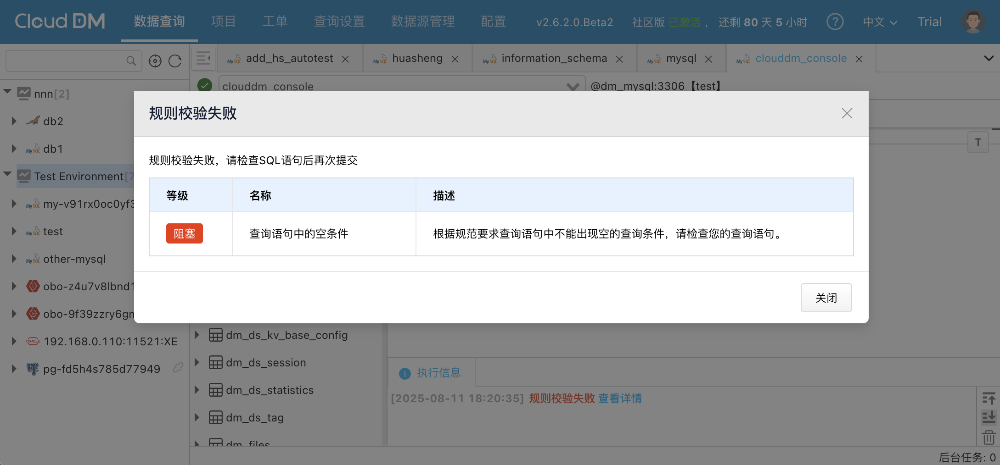

本文档主要介绍如何管理 CloudDM Team 下的安全规则。

:::info
规则的使用需要创建安全规范，并在安全规范中启用这个规则才能生效。
:::

## 规则管理

### 查询规则

当使用 CloudDM Team **递交工单** 或**执行 SQL** 时对要执行的 SQL 语句进行预分析和检查，使其必须满足某些预定的规则后才能进行后续操作。

1. 点击 **查询设置** > **安全规则**。
2. 进入 **查询规则** Tab 页，可以看到 CloudDM Team 中已定义的规则。
   - 规则列表页中会展示出当前账号所属主账号下所有可用的规则。

### 脱敏规则

**脱敏规则** 是在查询执行完毕后接收结果时按照设定的规则对结果集进行脱敏，保护敏感信息和隐私数据。

1. 点击 **查询设置** > **安全规则**。
2. 进入 **脱敏规则** Tab 页，可以看到 CloudDM Team 中已定义的规则。
   - 规则列表页中会展示出当前账号所属主账号下所有可用的规则。

### 内置规则

**内置规则** 是 CloudDM Team 产品内部自带的规则，内置规则不能被删除，不能被编辑。

## 自定义规则

### 新增规则

1. 登录 CloudDM Team 控制台。
2. 点击 **查询设置** > **安全规则**。
3. 点击右上角的新建规则，并完成以下配置：
    - 脚本内容
    - 规则类型
    - 规则名称
    - 规则描述
    - 数据源
    - 对象类型
4. 点击保存后，若提示 **规则"xxx"新建成功**，则说明 **新建规则** 成功。

### 修改规则

1. 登录 CloudDM Team 控制台。
2. 点击 **查询设置** > **安全规则**。
3. 选择需要修改的规则，点击操作栏中的编辑，按需修改以下内容：
    - 脚本内容
    - 规则类型
    - 规则名称
    - 规则描述
    - 数据源
    - 对象类型
4. 点击编辑规则后，若提示 **规则"xxx"已更新**，则说明 **修改规则** 成功。

### 删除规则

1. 登录 CloudDM Team 控制台。
2. 点击 **查询设置** > **安全规则**。
3. 选择需要修改的规则，点击操作栏中的删除，并确认。
4. 点击编辑规则后，若提示 **规则"xxx"已删除**，则说明 **删除规则** 成功。

## 创建规范

1. 登录 CloudDM Team 控制台。
2. 点击 **查询设置** > **安全规范**。
3. 点击新增规范，并完成以下配置：
   - 规范名称
   - 规范描述
4. 点击保存后，若提示 **新建规范成功**，则说明 **创建规范** 成功。

## 修改规范

### 修改规范基本信息

1. 登录 CloudDM Team 控制台。
2. 点击 **查询设置** > **安全规范**。
3. 点击需要修改的规范的 **规范名称** 或 **规范描述** 旁边的修改符号 。
4. 输入修改值后，点击确认。
5. 若提示 **新建规范成功**，则说明 **修改规范** 成功。

### 配置规范中的规则

安全规范中的规则配置请查看 配置规则 文档。

## 删除规范

1. 登录 CloudDM Team 控制台。
2. 点击 **查询设置** > **安全规范**。
3. 点击需要删除的规范操作栏中的 **删除**  点击确认。
4. 若提示 **安全规范"xxx"已删除**，则说明 **删除规范** 成功。

## 启用规范

1. 登录 CloudDM Team 控制台。
2. 点击 **查询设置** > **安全规范**。
3. 打开需要启用的规范启用栏中的开关 。
4. 若提示 **安全规范"xxx"已启用**，则说明 **启用规范** 成功。

## 禁用规范

1. 登录 CloudDM Team 控制台。
2. 点击 **查询设置** > **安全规范**。
3. 关闭需要启用的规范启用栏中的开关。
4. 若提示 **安全规范"xxx"已禁用**，则说明 **启用规范** 成功。

## 环境绑定规范
1. 登录 CloudDM Team 控制台。
2. 点击 **查询设置** > **查询配置** > **环境**。
3. 打开安全规范开关，选择要绑定的安全规范，点击确认。
4. 若提示 **已启用** 则说明，绑定规范成功。

## 启用规则

1. 登录 CloudDM Team 控制台。
2. 点击 **查询设置** > **安全规范**。
3. 选择一个规范，点击详情。
4. 选择需要开启的规则，在启用栏中，打开开关。
5. 若提示 **安全规范"xxx"已更新** 则说明启用规则成功。

## 禁用规则

1. 登录 CloudDM Team 控制台。
2. 点击 **查询设置** > **安全规范**。
3. 选择一个规范，点击详情。
4. 选择需要开启的规则，在启用栏中，关闭开关。
5. 若提示 **安全规范"xxx"已更新** 则说明禁用规则成功。

## 设置生效范围

1. 登录 CloudDM Team 控制台。
2. 点击 **查询设置** > **安全规范**。
3. 选择一个规范，点击详情。
4. 选择一个规则，在操作栏中，点击范围。
5. 点击右上角的 **新建范围**，并完成以下配置：
   - 匹配模式
   - 范围
   - 环境
   - ...
6. 点击确定后，若提示 **安全规范"xxx"已更新** 则说明规则设置生效范围成功。

## 设置规则参数

1. 登录 CloudDM Team 控制台。
2. 点击 **查询设置** > **安全规范**。
3. 选择一个规范，点击详情。
4. 选择一个规则，在操作栏中，点击 **设置**。
5. 输入需要设置的值。
6. 点击确定后，若提示 **安全规范"xxx"已更新** 则说明规则设置规则参数设置成功。

## 设置规则严重等级

:::info
严重等级仅在查询规则上才可以配置。
:::

1. 登录 CloudDM Team 控制台。
2. 点击 **查询设置** > **安全规范**。
3. 选择一个规范，点击详情。
4. 选择一个查询规则，在操作栏中，点击 **设置**。
5. 在弹出框中选择 **等级**：
   - 提示 (会提示用户查询语句不符合规范，用户可以点击直接执行)
   - 阻塞 (用户必须解决此规范产生的问题才能够执行)
6. 点击确定后，若提示 **安全规范"xxx"已更新** 则说明设置成功。

## 设置数据脱敏方式

:::info
脱敏方式仅在脱敏规则上才可以配置。
:::

1. 登录 CloudDM Team 控制台。
2. 点击 **查询设置** > **安全规范**。
3. 选择一个规范，点击详情。
4. 选择一个脱敏规则，在操作栏中，点击 **设置**。
5. 在弹出框中选择 **脱敏方式**：
   - 整行 (整行数据都会被脱敏)
   - 值 （只对当前字段脱敏）
6. 点击确定后，若提示 **安全规范"xxx"已更新** 则说明设置成功。
