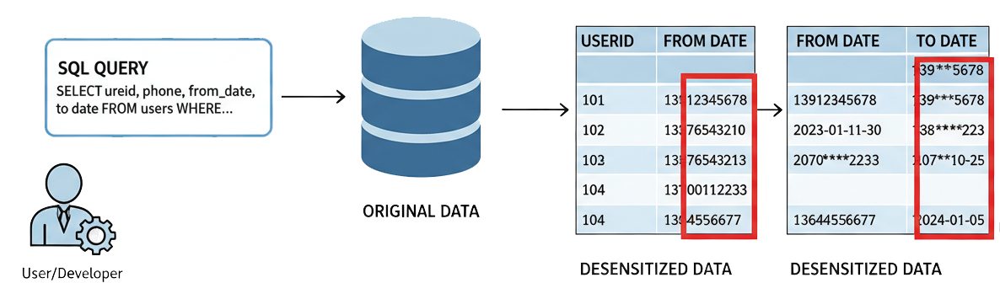
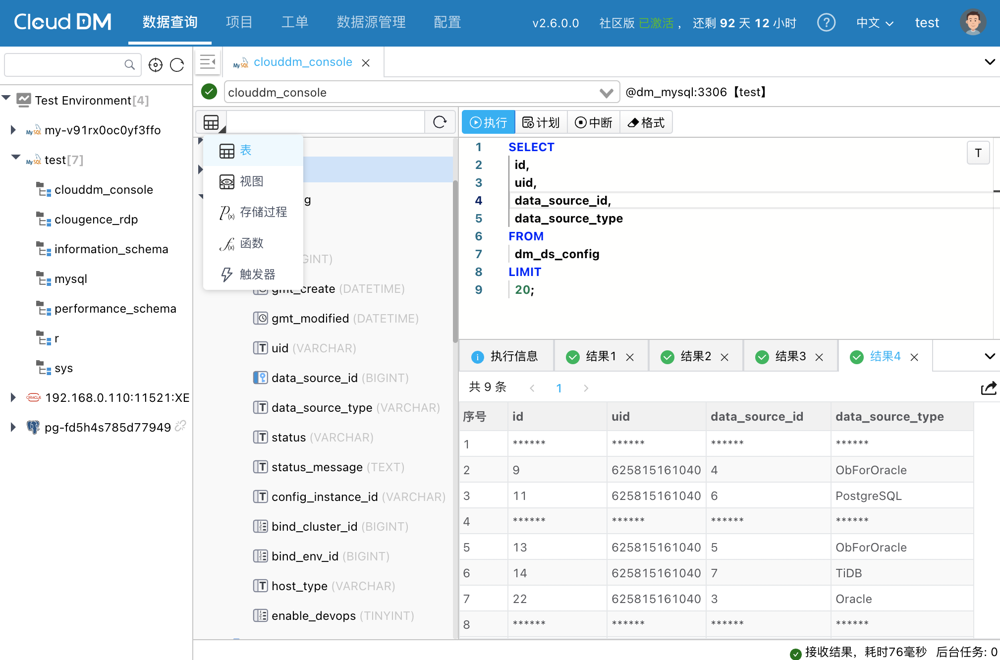

# 数据脱敏简介

在数字化时代，企业数据库中存储着大量高价值的敏感信息，如**个人身份信息 (PII)**、**银行卡号**、**手机号码**等。如果这些数据在开发、测试或运维过程中被随意访问，将面临极大的数据泄露风险，甚至违反《个人信息保护法》(PII)、GDPR 等法律法规。

CloudDM 的 **数据脱敏 (Data Masking)** 功能旨在解决这一难题。它能够在不改变底层存储数据的前提下，对查询结果中的敏感数据进行实时、动态的变形处理（如遮盖、替换），确保只有经过授权的人员才能看到明文，从而在保障业务开展的同时最大程度降低数据泄露风险。

## 核心价值

使用 CloudDM 数据脱敏功能，您可以获得以下价值：

- **零代码改造**：无需修改业务代码或数据库结构，通过配置即可生效。
- **动态实时**：脱敏发生在查询结果返回阶段，数据在数据库中仍以明文存储，不影响生产环境的正常写入和计算。
- **灵活策略**：支持针对不同环境（如生产、测试）、不同用户角色制定差异化的脱敏策略。
- **合规保障**：帮助企业满足数据安全合规要求，防止内部人员无意或恶意的敏感数据获取。

## 核心概念

CloudDM 的脱敏体系主要由以下两个核心部分构成：

### 1. 脱敏算法 (Masking Algorithms)
定义了“**怎么脱敏**”。
CloudDM 内置了多种常见的脱敏算法，例如：
- **遮盖 (Masking)**：将敏感部分替换为 `*` 或其他符号（如 `138****1234`）。
- **替换 (Replacement)**：将值替换为固定文本。
- **哈希 (Hashing)**：将数据转换为哈希值。

### 2. 脱敏策略 (Masking Policies)
定义了“**对谁、在什么地方、用什么算法脱敏**”。
通过安全规范（Security Policy），您可以将脱敏算法应用到具体的字段类型或列名上，并指定生效的环境和范围。

## 典型应用场景

- **生产运维查询**：DBA 或运维人员在排查线上问题时，无需查看用户的真实身份证号或密码，通过脱敏数据即可完成分析。
- **开发测试**：开发人员在测试环境中验证功能时，使用脱敏后的真实数据副本，既保证了数据的真实分布特性，又避免了隐私泄露。
- **报表分析**：业务分析师在导出数据报表时，自动隐藏敏感客户信息。

## 如何开始？

在 CloudDM 中开启数据脱敏非常简单，通常只需以下几步：

1. **识别敏感数据**：CloudDM 会辅助识别数据库中的敏感字段。
2. **配置安全规范**：在 **查询设置 > 环境** 中，为指定环境关联安全规范。
3. **验证效果**：在 SQL 控制台中执行查询，验证敏感字段是否已被自动脱敏。

:::tip 提示
脱敏功能通常与 **[权限管控](../console/permission_apply)** 配合使用。您可以为特定管理员配置“白名单”或“特权”，允许其查看明文数据，实现精细化的访问控制。
:::