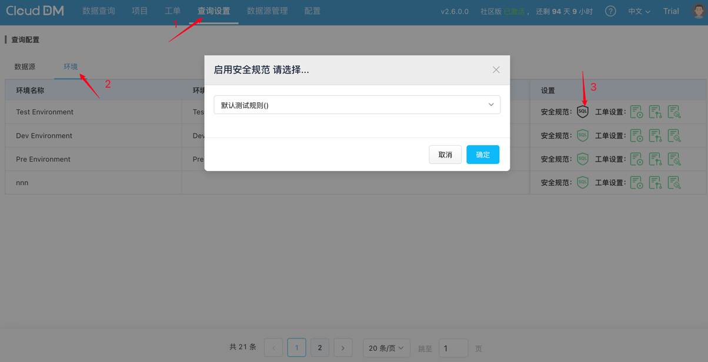
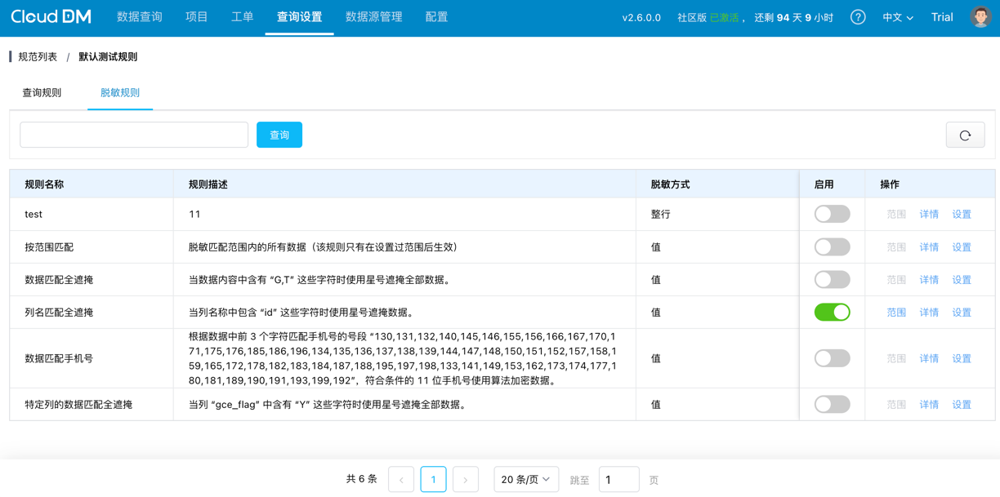
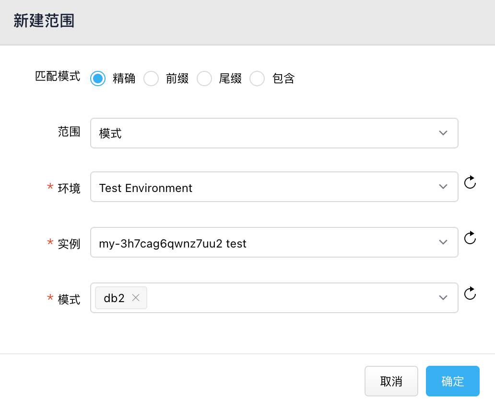
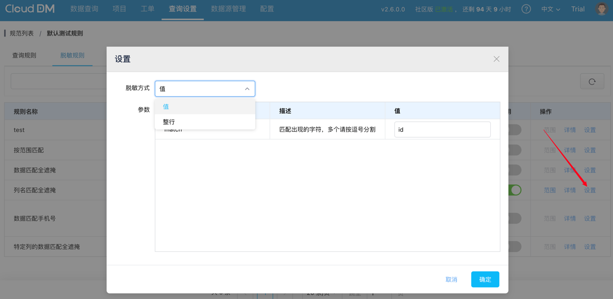

## 配置规范

1. 进入 **查询设置** 页面。
2. 进入 **环境配置** 页面。
3. 点击安全规范。
4. 选择绑定的安全规范。
5. 点击确认。

## 访问脱敏规范

进入 **查询设置**->**安全规范**，选择规范进入详情，点击脱敏规则

## 脱敏范围

当我们配置了只脱敏精确匹配模式 db2 的数据时，则只有 db2 的数据将被脱敏

### 匹配模式
- 精准：目标对象名称与设置值完全一致
- 前缀：目标对象名称以指定前缀开头
- 后缀：目标对象名称以指定后缀结尾
- 包含：目标对象名称中包含指定字符

### 范围
- 环境：包含指定环境下所有数据
- 实例：包含指定实例下所有数据
- 库：包含指定库下所有数据
- 模式：包含指定模式下所有数据
- 表或视图：包含指定表或视图下所有数据
- 列：包含指定列下所有数据

## 脱敏规则设置

### 脱敏方式
- 值脱敏：对需要进行脱敏处理的数据项，仅对其敏感内容进行脱敏处理，保留其他非敏感信息的可读性。

- 整行脱敏：对包含敏感数据的整行记录进行脱敏处理，即当某行数据中存在需脱敏字段时，对该行所有字段的数据统一进行脱敏，确保整行信息不泄露。

### 参数
若脱敏规则中包含参数，可在“值”一栏中进行相应配置，以实现对脱敏规则的灵活控制。