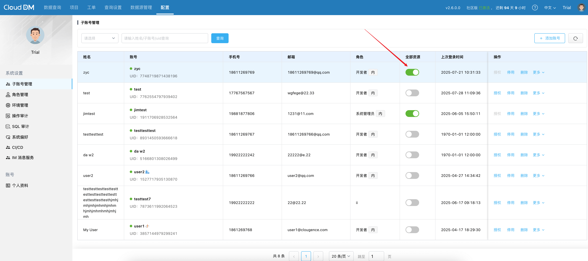
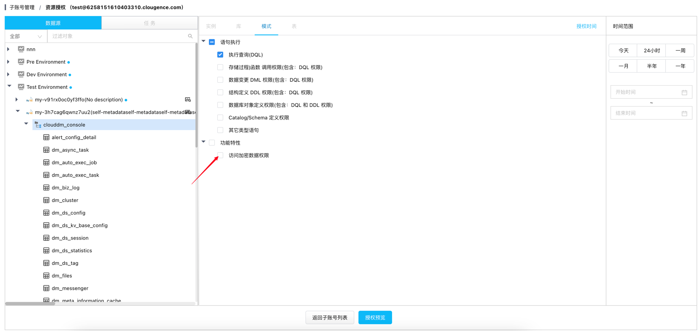

CloudDM 允许您的组织设置哪些用户能够访问敏感数据，确保在保护敏感信息的同时满足不同业务需求。

## 允许访问脱敏数据的用户
某些特定用户可以访问未脱敏的数据，包括：
- 主账户
- 被授予全部资源权限的用户
- 被授权访问对应数据源中加密数据的用户

此类访问权限应严格控制，确保仅授权于有合法访问需求的用户。

## 授予访问权限
### 全部资源权限

1. 进入**配置** -> **子账号管理**。
2. 选择要授权的用户。
3. 开启全部资源权限。

:::tip
授予全部资源权限后，该用户将获得组织下所有数据库的全部权限，请务必谨慎操作。
:::

### 数据库资源权限

1. 进入**配置** -> **子账号管理**。
2. 选择要授权的用户，点击授权。
3. 选择数据源。
4. 设置访问加密数据权限。
5. 提交授权。