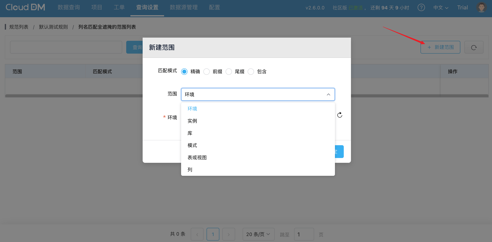

CloudDM 支持为脱敏规则设置生效范围，以实现更细粒度的数据安全管理。

## 匹配模式
- 精准：目标对象名称与设置值完全一致
- 前缀：目标对象名称以指定前缀开头
- 后缀：目标对象名称以指定后缀结尾
- 包含：目标对象名称中包含指定字符

## 范围
- 环境：包含指定环境下所有数据
- 实例：包含指定实例下所有数据
- 库：包含指定库下所有数据
- 模式：包含指定模式下所有数据
- 表或视图：包含指定表或视图下所有数据
- 列：包含指定列下所有数据

