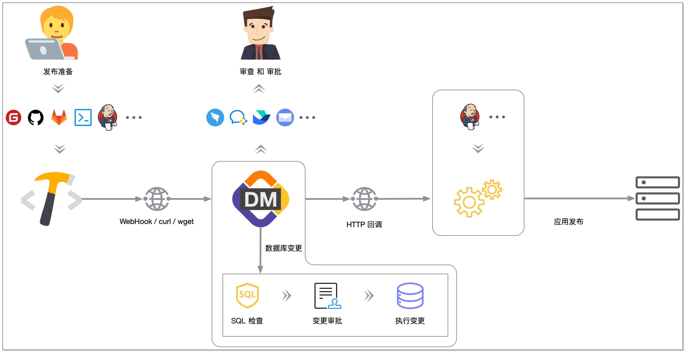

发布一个应用到生产环境时，通常需要进行数据库变更发布和应用发布两个流程。数据库变更发布需要通过工单向 DBA 发起变更申请，而应用发布却是在另外一个 CI/CD 工作流中，这大大降低了生产效率。

通过 CloudDM Team，数据库变更发布和应用发布两个流程可以串联起来。无论发布是基于 DevOps Pipeline 机制还是通过例如 Jenkins 任务，通过 CloudDM Team 都可以灵活地将其组装起来。

- CloudDM Team 可以通过[三种方式触发构建](devops_trigger)，与 Gitee、Jenkins 等无缝衔接。
- 在数据库变更执行完毕后，CloudDM Team 支持回调 CI/CD 系统，从而让发布继续进行。
- 可选择在 DevOps 的 Pipeline 环节中加入一个节点，让 DevOps 可以发布数据库（该功能即将到来）。

## 核心概念

- **[项目](devops_project)**：用来统一管理发布流，同一个项目中的发布流会共享部分配置。例如：流程、IM 消息服务。
- **[发布流](devops_flow)**：定义了明确的 **源端变更仓库** 和 **目标端数据库**，发布流在启用时在所有项目中具有全局唯一性。
- **[变更](devops_change)**：变更是数据库 CI/CD 的最小单位，一个变更的完整生命周期包括
     初始化 >
     SQL 检查 >
     审批 >
     执行。

## 工作原理

数据库 CI/CD 包含 **源端变更** 和 **目标端数据库** 两个端点，通过 **[发布流](devops_flow)** 来驱动源端 SQL 变更到目标端数据库的发布。

当发布流被触发后，变更的发布过程如下：
1. **初始化**：从源端源码仓库中获取 SQL 变更内容，并与已有快照做对比，确定增量 SQL 变更。
2. **SQL 检查**：对增量 SQL 变更做 SQL 检查（依照目标端数据库所绑定的安全规范）。安全规范设置请参考 [查询设置 > 安全规范 > 启用规范](../operation/security/spec)。
3. **SQL 审批**：为每次发布的变更创建变更审批工单。使用目标端数据库所处环境绑定的审批流程，具体配置请参考 [工单设置](../approval/approval_setting)。

## 约束限制

CloudDM Team 数据库 CI/CD 目前有如下使用限制：
- 保存 SQL 变更的源码仓库目前只支持 **[Gitee](provider/devops_cicd_gitee)**，未来开放更多选择。
- 仓库中支持多个 SQL 脚本文件，执行顺序根据 `文件路径 + 文件名` 排序决定。
- 保存 SQL 变更的文件需要以 .sql 结尾，其它类型文件会被忽略。
- 需要在已有或新增 .sql 文件的末尾添加新增变更。其它位置上的变更 CloudDM Team 会自动忽略。
- 每个发布流中只允许一个状态为处理中的变更。
- 在所有项目中以 源端 > 对端 构建的发布流在启用状态下 **具有全局唯一性**。
   - 源端仓库中依据：1.仓库；2.分支
   - 对端数据源依据：1.数据源实例ID；2.发布的目标数据库/Schema

## 启用/禁用

在 **查询设置** 中：
1. 确保目标数据源对 [数据管理](../operation/query/dsconfig) 功能处于启用状态。
2. 通过启用 [CI/CD](../operation/query/dsconfig#cicd) 来打开数据源的 CI/CD 功能。
