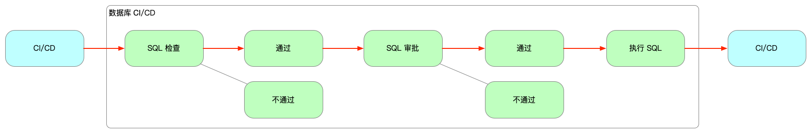

在 CloudDM Team 中发布流是维护所有变更的最小单位，以项目维度进行管理，一个项目可以创建多个发布流。

CloudDM Team 中 **数据库 CI/CD** 完整流程包括上述步骤，其中 **每个步骤** 都可以根据需要灵活地 **启用/禁用**（线框部分）。

- **CI/CD**：CloudDM Team 可以加入到您已有的发布流程中作为一个环节使用。
  - 例如通过 Jenkins 触发数据库发布，在数据库发布完毕后，由 CloudDM Team 触发 Jenkins 后续发布。
- **SQL 检查**：需要变更的 SQL 在此环节进行必要的规范性检查，如：新增列必须要有注释等。
  - 该阶段 CloudDM Team 提供了多种流程控制方案可以选择。
- **SQL 审批**：变更 SQL 在正式发布生产前，根据发布流程可能需要经过 DBA、业务、安全等部门的审批。
  - 该阶段用户根据自己的需要可以选择是否使用工单进行审批。
- **执行 SQL**：将需要变更的 SQL 在生产环境上执行。
  - 该阶段用户可以选择定时、立即或手动三种方式处理 SQL 的执行。

:::info
变更发布的流程环节是否启用可以通过 [发布流程配置](devops_project#flow_conf) 进行配置。
:::

## 添加发布流

1. 登录 CloudDM Team 控制台。
2. 点击顶部 **项目** 进入，在具体的项目上点击 **进入** 打开项目详情页。
3. 点击项目详情页顶部右侧 **添加发布流** 按钮，打开发布流添加页面。
4. 在发布流添加面板中根据要求配置源端仓库、目标数据库及初始化方式。

:::info
- **脚本路径**：以仓库根路径为起始。如果配置为空则表示匹配整个仓库中的 **.sql** 文件。
- **目标分支**：指当变更 SQL 推送到 **这个分支** 上时，CloudDM Team 的数据库 CI/CD 识别推送的增量变更。
- **初始化方式**：指在发布流添加后的初始化行为。
  - **创建快照**：在发布流创建后自动触发构建快照。
  - **创建变更**：在发布流创建后自动触发一次变更。
  - **不处理**：仅创建发布流，不会附带任何初始化动作。
:::

## 触发变更

为满足不同场景的需要，CloudDM Team 支持**[三种方式触发变更](devops_trigger)**。当触发变更后会进行如下操作：
1. 下载 **目标分支** 的仓库的最新源码。
2. 扫描发布流所指定 **脚本路径** 中的所有 **.sql** 文件。
3. 将扫描到的所有文件和已有发布流的快照进行对比，找出差异新增部分。
4. 如果存在新增差异，则会按照后续 **SQL 检查** > **审批** > **执行** 阶段进行发布。

## 构建快照

在项目详情页面中点击发布流卡片上的 **快照** 按钮可以触发构建快照任务。

构建快照会进行如下操作：
1. 下载 **目标分支** 的仓库的最新源码。
2. 扫描发布流所指定 **脚本路径** 中的所有 **.sql** 文件。
3. 将扫描到的所有文件作为发布流的最新快照，后续变更会以这次快照作为基础。

## 激活/禁用

在项目详情页顶部右侧菜单，可以通过 **激活**、**禁用** 对发布流进行操作。默认情况下发布流在添加后处于 **激活** 状态。
:::info
两个操作同一时刻只有一个按钮会出现。
:::

:::info
- 发布流在被禁用后可被其它项目重复添加，在启用状态下其它项目无法添加相同的发布流。
- 发布流在 **新添加** 或 **激活** 时，会检测是否存在相同的发布流，如果存在，则添加或激活操作会失败。
:::

## 删除发布流

发布流在禁用后可以进一步选择删除发布流。删除发布流后可以重新添加，但是历史数据无法恢复。

## 集成配置

发布流的集成配置包括：
- 触发配置：用来在服务商平台上配置 WebHook 回调，通过回调可以即时触发变更。例如：[使用 码云(Gitee)](provider/devops_cicd_gitee)。
- 回调配置：当 CloudDM Team 完成发布后会调用 CallBack 所配置的地址，通过 **[回调外部系统](devops_callback)**，用户可以和其它工具集成。
