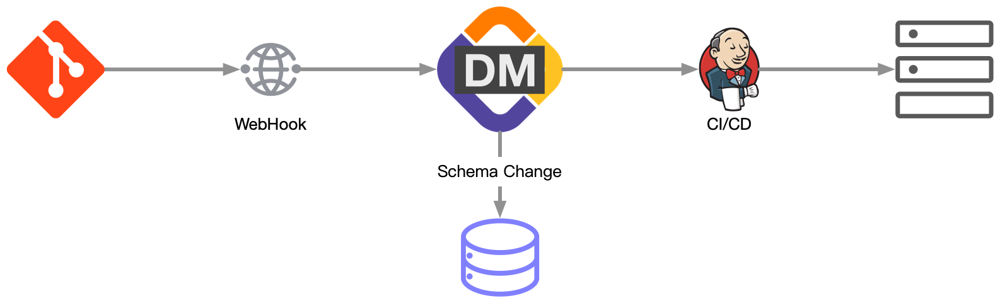
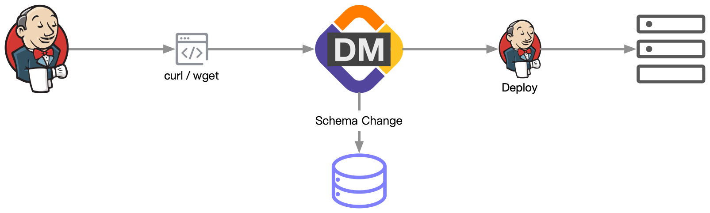
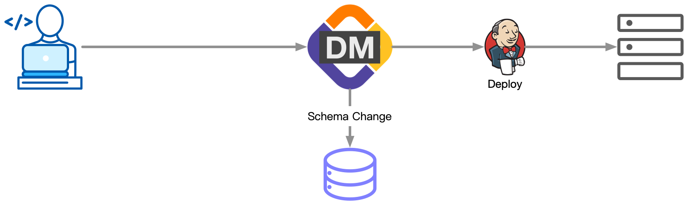

为满足不同场景的需要，CloudDM Team 中发布流的触发提供三种选择：
1. 通过 WebHook 回调。
2. 通过 URL 由远程程序或者脚本触发。
3. 在项目详情页面的发布流卡片上，通过 **触发** 按钮手动触发。

:::info
一条发布流只能有一个正在进行中的 CI/CD 发布任务，无论使用何种方式触发都会有此限制。因此在发生新的代码变更时：
- 如果变更已经开始执行 SQL，那么触发操作会以错误形式生成一个新的变更记录并记录错误原因。
- 如果变更尚未启动 SQL 执行，那么触发（主动或被动）将会导致正在执行的变更回到流程最开始重新执行。
:::

## WebHook 回调 {#webhook}

触发机制和使用场景如下：

1. 在 Git 服务提供商提供的 WebHook 能力上配置回调地址。
2. 当仓库发生 Push、Pull Request 操作时，通知 CloudDM Team 进行数据库发布。
3. 当数据库发布完毕，CloudDM Team 会继续通知后续 CI/CD 工具进行程序发布（如果有）。

:::info
已支持的 Git 服务提供商和配置方式如下：
- 码云(Gitee)：[查看如何配置](provider/devops_cicd_gitee)。
:::

## 远程触发 {#trigger}

远程触发方式是通过 HTTP 协议以脚本化替代 WebHook 来触发构建，从而更方便地和用户已有 CI/CD 流程紧密结合。

触发机制：

1. 通过 curl 或 get 命令向 CloudDM Team 发起变更计划。
2. CloudDM Team 开始新的变更流程。
3. 当数据库发布完毕，CloudDM Team 会继续通知后续 CI/CD 工具进行程序发布（如果有）。

## 控制台 {#console}

触发机制：

1. 登录 CloudDM Team 控制台。
2. 点击顶部 **项目** 进入，然后在具体的项目上点击 **进入** 打开项目详情页。
3. 在项目详情页发布流卡片中点击 **触发** 按钮。
4. CloudDM Team 开始新的变更流程。
5. 当数据库发布完毕，CloudDM Team 会继续通知后续 CI/CD 工具进行程序发布（如果有）。
