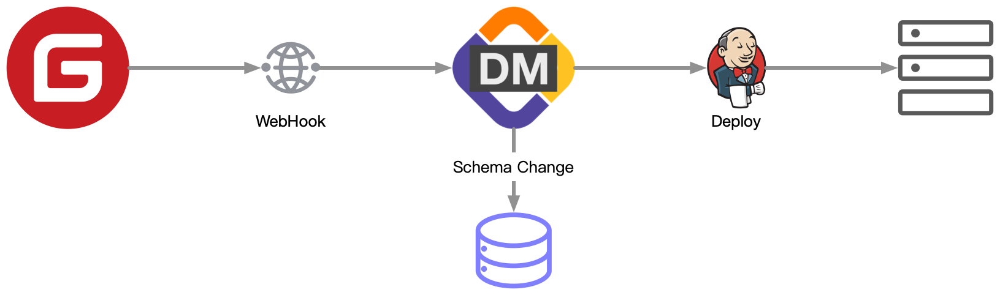
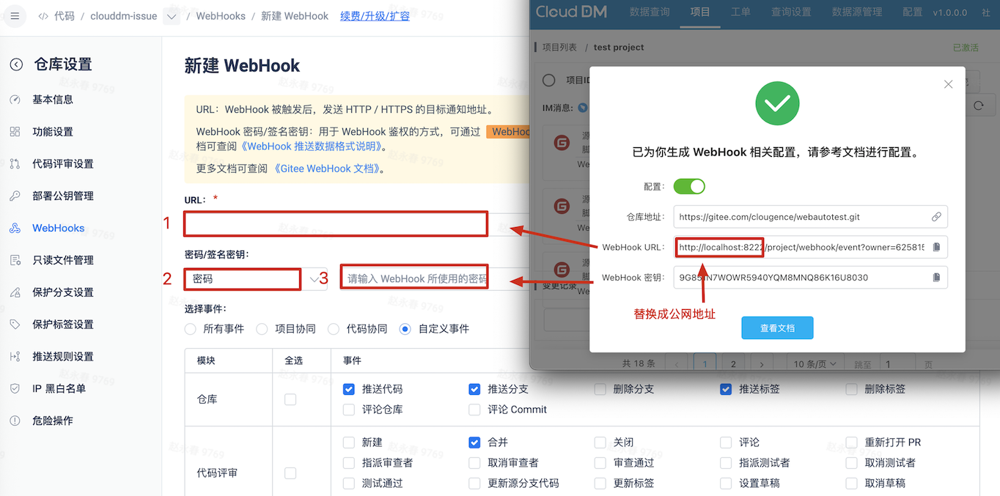

本文档主要介绍使用 **码云(Gitee)** 作为 CloudDM Team 的 CI/CD 变更源。



使用 Gitee 作为 CI/CD 变更源，可以实现包含 SQL 变更的代码在 **Push** 或 **PR 合并** 后自动触发 CloudDM Team 的变更发布。
:::tip
在使用 Gitee 作为源端时，建议创建一个新的 Git 账号用作 **发布账号**，在 Gitee 上对发布账号进行仓库权限授权。
:::

## 获取 AccessToken {#config}

1. 使用发布账号登录 [Gitee](https://gitee.com/profile/account_information)。
2. 在右上角 **头像** 弹出框中选择 **设置**
3. 进入 **私人令牌** 页面，点击右上角生成新的令牌，所需令牌权限如下：
  ```text
  user_info：访问你的个人信息、最新动态等
  projects：查看、创建、更新你的项目
  ```
4. 点击 **递交** 生成私人令牌。
5. 在 [添加 CI/CD 服务](../devops_service#add_scm) 时选择 Gitee 并使用该令牌添加。

## 配置 WebHook {#webhook}

1. 使用发布账号登录 [Gitee](https://gitee.com/)。
2. 进入需要添加 WebHook 的源码仓库页面。
3. 在仓库的 **管理** 选项卡中点击 **WebHooks** 菜单，开始配置 WebHook。
  
  
4. 将 CloudDM Team 发布流生成的配置填入 Gitee，并将 **密码/签名密钥** 方式选择为 **密码**。
  
5. WebHook 消息授权：
  ```text
  仓库（对应发布流 Push）
    推送代码
    推送分支
    推送标签
  代码评审（对应发布流 Pull Request）
    合并
  ```
6. 开启 **激活 WebHooks**，点击 **新建** 保存配置。
