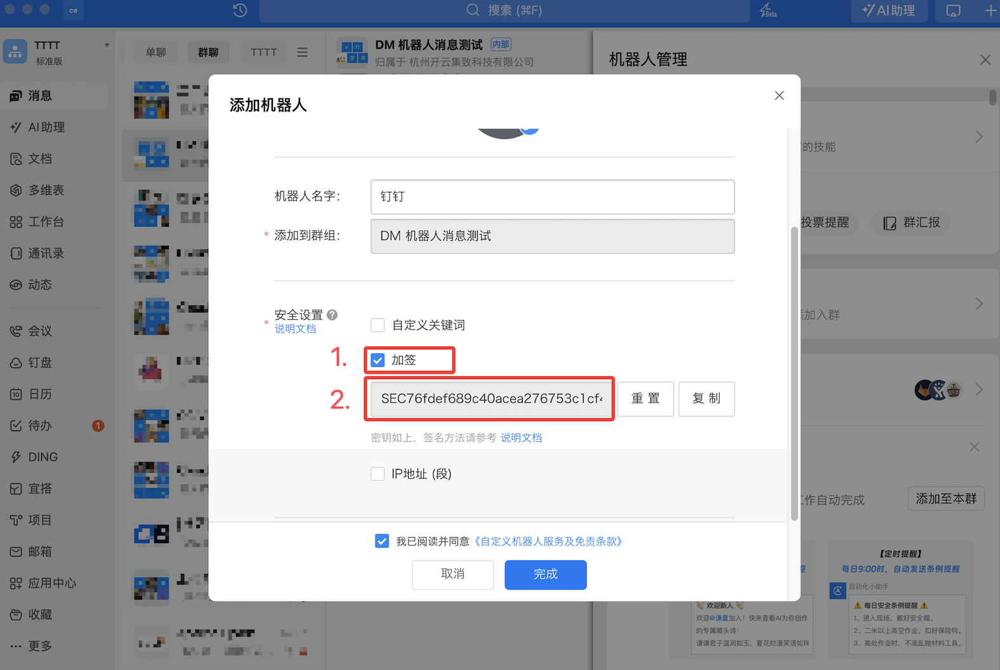
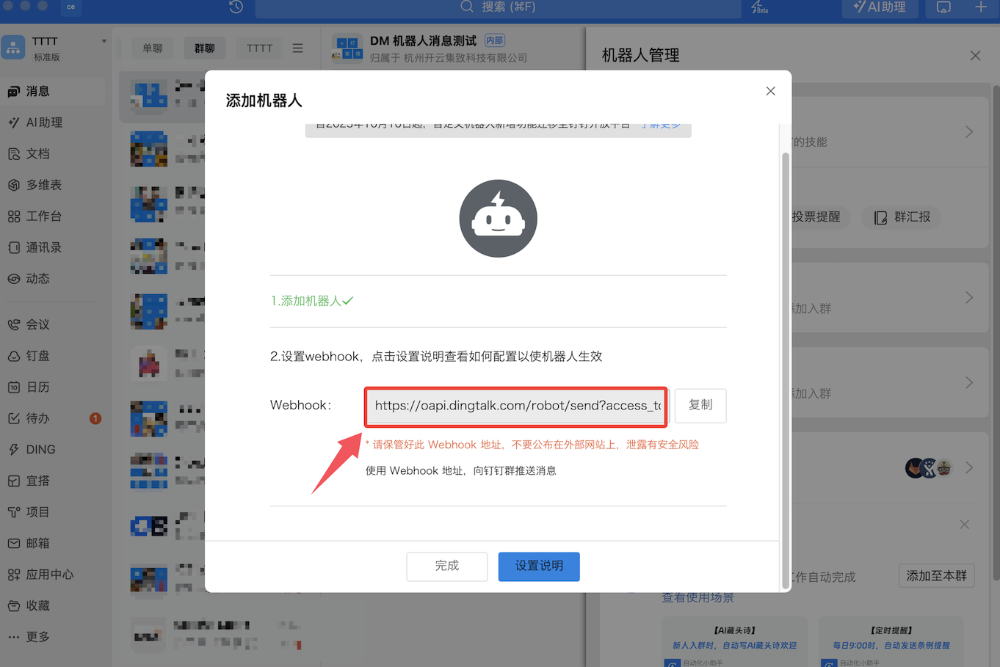

本文档主要介绍使用钉钉消息机器人作为 CloudDM Team 的 IM 消息服务。

## 创建消息机器人 {#create}

1. 参考钉钉 [**自定义机器人接入**](https://open.dingtalk.com/document/robots/custom-robot-access) 指南创建自定义机器人。
2. 在自定义机器人配置页面，进行如下配置：
  
  
3. 在 [添加 IM 服务](../devops_service#add_im) 时选择钉钉并使用上述 WebHook 地址和密钥。
