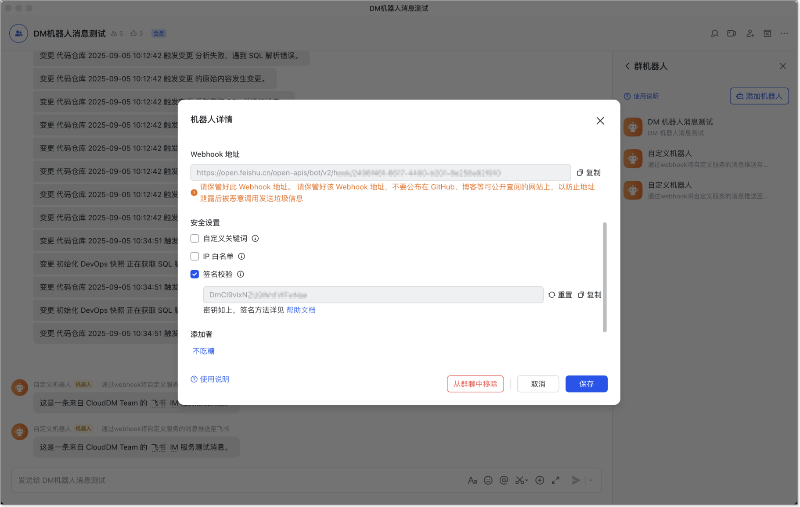

本文档主要介绍使用飞书消息机器人作为 CloudDM Team 的 IM 消息服务。

## 创建消息机器人 {#create}

1. 参考飞书 [**在群组中使用机器人**](https://www.feishu.cn/hc/zh-CN/articles/360024984973-%E5%9C%A8%E7%BE%A4%E7%BB%84%E4%B8%AD%E4%BD%BF%E7%94%A8%E6%9C%BA%E5%99%A8%E4%BA%BA) 指南创建自定义机器人。
2. 在自定义机器人配置页面，查看 WebHook地址和密钥：
   
3. 在 [添加 IM 服务](../devops_service#add_im) 时选择飞书并使用上述 WebHook 地址和密钥。