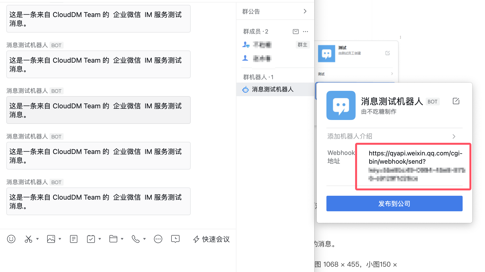

本文档主要介绍使用企业微信消息机器人作为 CloudDM Team 的 IM 消息服务。

## 创建消息机器人 {#create}

1. 参考企业微信 [**如何设置消息妥善**](https://open.work.weixin.qq.com/help2/pc/14931?person_id=1&is_tencent%3D) 指南创建自定义机器人。
2. 在群聊右侧，查看 WebHook地址：
   
3. 在 [添加 IM 服务](../devops_service#add_im) 时选择企业微信并使用上述 WebHook 地址。

