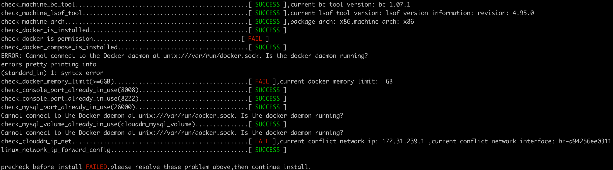
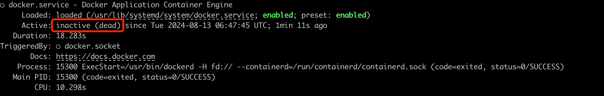
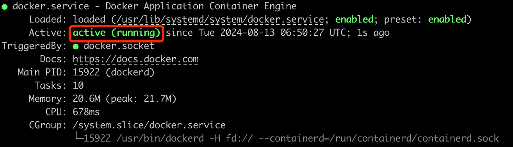

# Docker 安装检查失败

## 错误现象

在执行 “install.sh” 安装脚本执行中有 check_docker_is_permission 阶段报错，如下：


```text title='报错关键信息'
Cannot connect to the Docker daemon at unix:///var/run/docker.sock. Is the docker daemon running?
```

## 可能原因

可能原因有 2 种：
1. Docker 容器没有启动。
2. 没有 Docker 命令相关权限。

## 解决问题

### 容器没有启动

通过 sudo 查看 Docker 服务运行状态。

```text title='Ubuntu 系统'
sudo service docker status
```


- 如上所示代表 Docker 容器没有启动。
- 启动 Docker 容器
  - Ubuntu：`sudo service docker start`


- 再次查看 Docker 状态如上所示，表示成功启动。

### 没有 Docker 命令相关权限

没有权限的情况
- 使用 `sudo docker ps` 命令正常。
- 使用 `docker ps` 会有如下报错。

```text
Cannot connect to the Docker daemon at unix:///var/run/docker.sock. Is the docker daemon running?
```

解决问题

- 添加 Docker 用户组，一般已存在。
  - `sudo groupadd docker`
- 将登录用户加入到 Docker 用户组中。
  - `sudo usermod -aG docker \${USER}`
- 更新 Docker 用户组。
  - `sudo newgrp docker`
- 切换或者退出当前账户后，再重新登录。
  - `docker ps` 无报错表示正常
