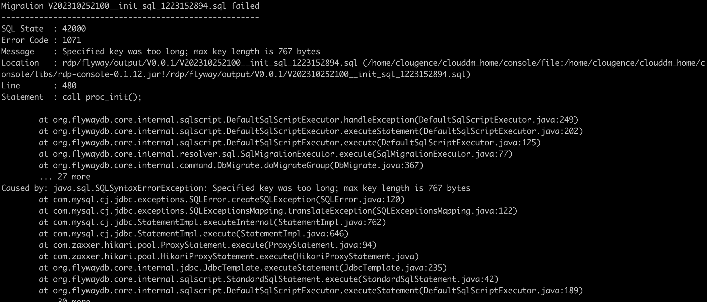

# MySQL 5.6 初始化 CloudDM 元信息数据库出现 1071 报错

## 错误现象

用 MySQL 5.6 版本作为 CloudDM 的元信息数据库时，初始化安装 CloudDM 过程中发生该问题。例如使用 tgz 版本部署 CloudDM 并指定数据库时。

当通过 **init.sh** 脚本初始化元信息数据库时，发生如下报错：



```text title='报错关键信息'
Migration V202310252100__init_sql_1223152894.sql failed
-------------------------------------------------------
SQL State  : 42000
Error Code : 1071
Message    : Specified key was too long; max key length is 767 bytes
Location   : rdp/flyway/output/V0.0.1/V202310252100__init_sql_1223152894.sql (xxxxxx/rdp-console-0.1.12.jar!/rdp/flyway/output/V0.0.1/V202310252100__init_sql_1223152894.sql)
Line       : 480
Statement  : call proc_init();
```

## 问题原因

MySQL 5.6 版本数据库，默认索引最大允许长度限制过低。

## 解决问题

- 更换使用 MySQL 8.0 版本即可。
- 如您是商业付费版本，可以联系 **CloudDM 小助手** 获取技术支持。


