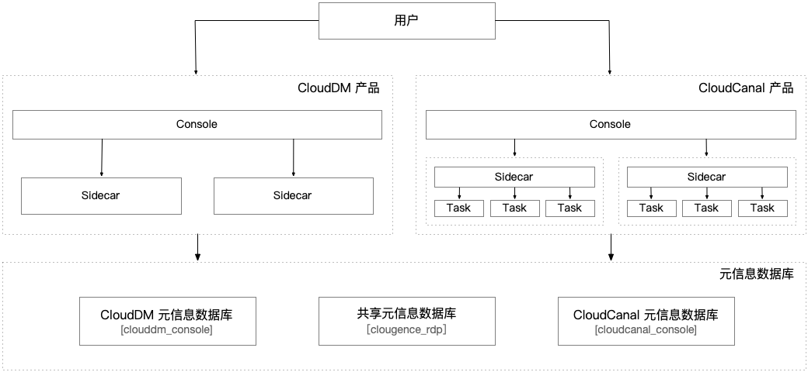

**[CloudCanal](https://www.clougence.com/cc-doc/intro/product_intro)** 是 CloudDM 同一个厂商推出的在线数据实时数据同步产品，
它是一款 **数据同步**、**迁移** 工具，帮助企业构建高质量数据管道、具备实时高效、精确互联、稳定可拓展、一站式、混合部署、复杂数据转换等优点。
CloudDM 支持产品层面的集成，集成后两个产品会在同一个控制台中出现犹如一体。

## 前置依赖
- CloudCanal 版本要求最低 **v4.3.x** 版本。
- CloudDM 版本要求最低 **v1.4.x** 版本。

## 技术架构

CloudDM 与 CloudCanal 在整合后整体产品架构如下。



## 整合方式

目前支持采用全新部署方式整合两款产品，具体是指如下场景：

1. 使用已有 CloudCanal 产品整合全新 CloudDM 产品。
   - 请另行参考文档 **[CloudCanal 官方文档](https://www.clougence.com/cc-doc/productOP/platform/extend_clouddm_team)**。
2. 使用已有 CloudDM 产品整合全新 CloudCanal 产品（**本文档**）。
   - 含：CloudCanal、CloudDM 两款产品均为全新部署。
3. 已经在使用中的 CloudCanal、CloudDM 产品整合到一起。
   - 不支持

:::danger
如有需要将使用中的 CloudCanal、CloudDM 产品整合到一起，请联系 CloudDM 或 CloudCanal 技术支持。

请注意：强行自行整合将有可能损毁已经部署的产品数据库并且在后续使用过程中可能造成更加严重的数据丢失且不可逆。
:::

## 操作步骤

### 1. 升级主账号属性
```shell
#登录 CloudDM 元数据库
mysql -h127.0.0.1 -uroot -P26000 -p123456

#进入共享库
use clougence_rdp;

#使用如下 SQL 语句确定的主账号 UID
mysql> select uid,username,maintainer from rdp_user
       where parent_id is null and email <> 'inner@clougence.com';

+------------------+----------+------------+
| uid              | username | maintainer |
+------------------+----------+------------+
| 6258151610403310 | Trial    |          0 |
+------------------+----------+------------+

#更改主账号属性
mysql> update rdp_user set maintainer = 1 where uid='6258151610403310';
```

:::info
如出现多匹配记录，请寻求 CloudDM 或 CloudCanal 技术支持。
:::

### 2. 部署 CloudCanal

- 准备一个新机器。
- 根据 **[CloudCanal 安装文档(该文档为 Docker 方式)](https://www.clougence.com/cc-doc/productOP/docker/install_linux_macos)** 进行安装。

### 3. 网络连通性

请确保 CloudDM 和 CloudCanal 处于同一个网络中，具体请联系您所在组织的网络管理员。

:::info
如果 CloudCanal、CloudDM 均为 Docker 部署，且位于同一个 Docker 服务中。<br/>
则执行以下命令将 cloudcanal-console 容器连接到 clouddm-network 网络。

`docker network connect clouddm-network cloudcanal-console`
:::

### 4. 修改配置文件

检查 CloudDM、CloudCanal 两款产品的配置文件。
1. 检查 business-output.properties 配置文件。
    ```shell
    #如果为 Docker 方式部署那么需要先进入容器
    docker exec -uclougence -it cloudcanal-console /bin/bash

    cd /home/clougence/cloudcanal/console/conf/
    vi business-output.properties
    ```
2. 检查 console.properties 配置文件。
    ```shell
    #如果为 Docker 方式部署那么需要先进入容器
    docker exec -uclougence -it clouddm-console /bin/bash

    cd /home/clougence/clouddm/console/conf/
    vi console.properties
    ```
3. 修改 CloudCanal 配置，确保下面配置项和 CloudDM 配置内容相同。
    ```test
    CloudDM                        │ CloudCanal                    │ 说明
    ───────────────────────────────┼───────────────────────────────┼──────────────────────────────────────
    spring.datasource-rdp.jdbcurl  │ spring.datasource-rdp.url     │ 共享元信息数据库连接地址
    spring.datasource-rdp.username │ spring.datasource-rdp.username│ 共享元信息数据库的访问账号
    spring.datasource-rdp.password │ spring.datasource-rdp.password│ 共享元信息数据库的访问密码
    jwt.secret                     │ jwt.secret                    │ 保证 CloudDM 和 CloudCanal 产品间单点登录
    ```

### 5. 重启服务

重启 CloudDM、CloudCanal 的 Console 服务。

```shell title='如果某个产品采用 Docker 方式部署，可以采用下面适当的语句来进行重启'
#重启 CloudDM
docker restart clouddm-console
#重启 CloudCanal
docker restart cloudcanal-console
```

### 6. 初始化产品集群

1. 访问 CloudDM、CloudCanal 任意一款产品的服务地址。
   - CloudDM 通常地址为：_**http://&lt;部署服务器IP&gt;:8222**_
   - CloudCanal 通常地址为：_**http://&lt;部署服务器IP&gt;:8111**_
   - 具体地址可以向您所在组织的 **运维人员** 或 **系统管理人员** 所要。
2. 使用在第一步中升级后的主账号登录系统，登录过程可以参考 **[使用手册](../../manual/login/login_by_main)**。
3. 添加产品集群 **配置** > **产品集群管理** > **添加产品集群**(按钮)。
   - 按照如下表格添加两个产品：

<table>
   <thead><tr>
      <th width="120">表单项</th>
      <th>CloudDM</th>
      <th>CloudCanal</th>
   </tr></thead>
   <tbody>
      <tr>
         <td>产品类型</td>
         <td>选择 CloudDM</td>
         <td>选择 CloudCanal</td>
      </tr><tr>
         <td>产品集群ID</td>
         <td>dm_cluster_1</td>
         <td>cc_cluster_1</td>
      </tr><tr>
         <td>产品集群名称</td>
         <td>CloudDM Cluster Server 1</td>
         <td>CloudCanal Cluster Server 1</td>
      </tr><tr>
         <td>版本号</td>
         <td>v1.4.0.0 (请参考实际情况)</td>
         <td>v4.3.0.0 (请参考实际情况)</td>
      </tr><tr>
         <td>API地址</td>
         <td>http://&lt;访问CloudCanal服务的IP&gt;:8111/</td>
         <td>http://&lt;访问CloudCanal服务的IP&gt;:8111/</td>
      </tr>
   </tbody>
</table>

- **产品集群ID**
  - 在初始化产品集群列表中需要具有唯一性，建议使用具有明确含义的标识ID。
- **产品集群名称**
  - 一个具有辨识度的名字。
- **版本号**
  - 在登录 CloudDM、CloudCanal 产品后右上角会有对应版本号。


### 7. 完成安装

完成上述配置后您将得到如下改变：

1. CloudDM、CloudCanal 两款产品登录后 Logo 自动变成 **ClouGence RDP**。
2. 从 CloudDM 控制台进入，可访问两个产品所有能力。
3. 从 CloudCanal 控制台进入，可访问两个产品所有能力。

## 回滚整合

:::danger
两款产品整合后不支持回退操作。

强制按照上述步骤逆向操作有可能损毁已经部署的产品数据库，在后续使用过程中可能造成更加严重的数据丢失且不可逆。
:::
