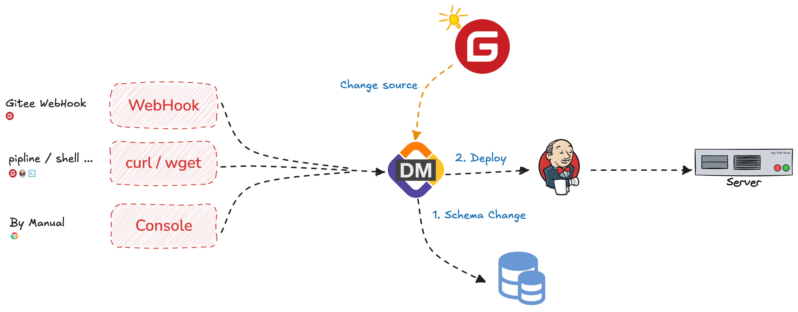
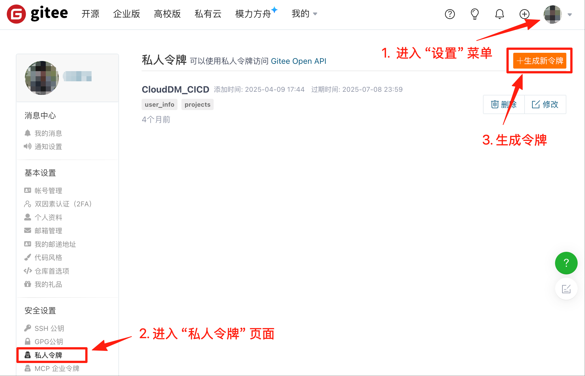
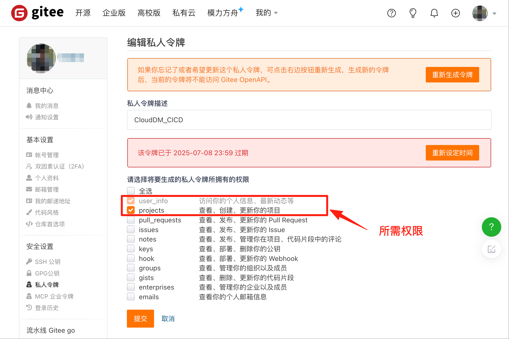
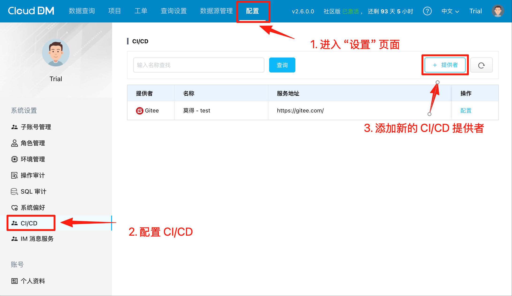
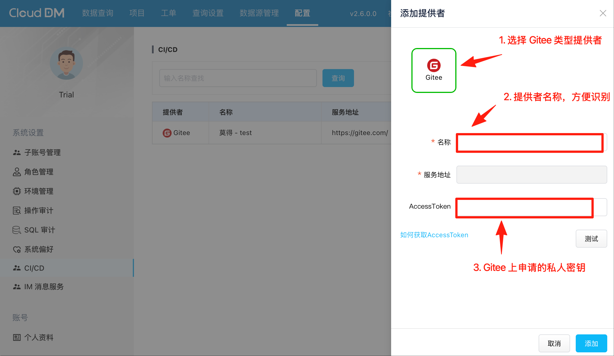
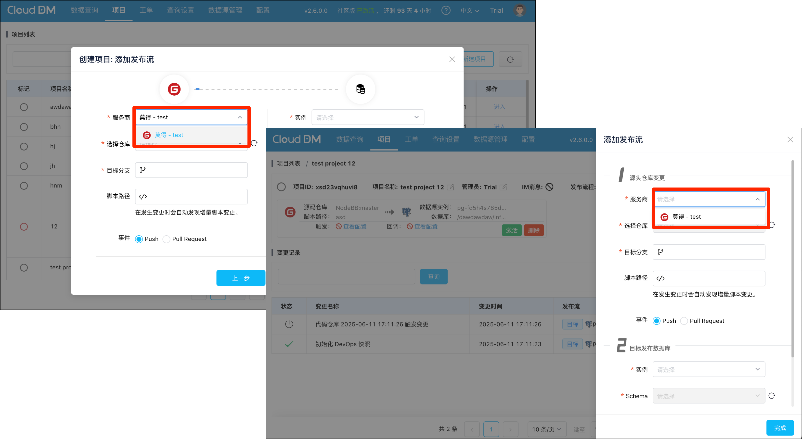
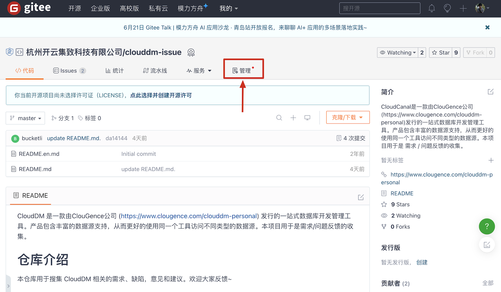
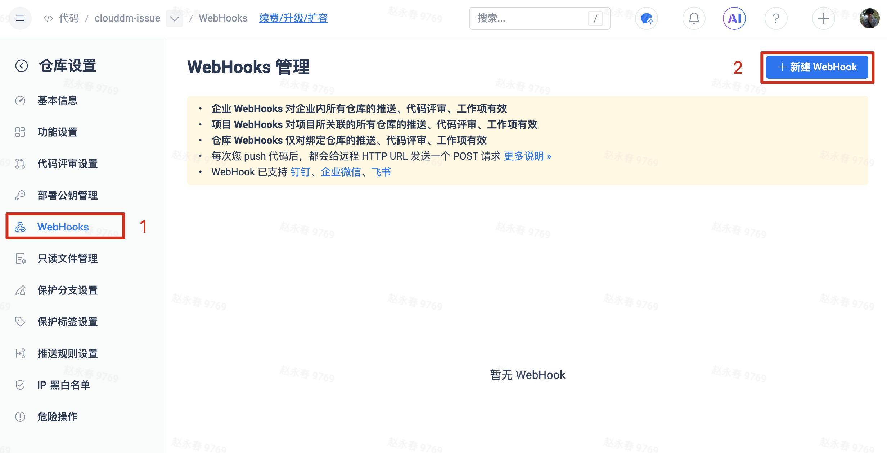

当 SQL 变更通过 **码云(Gitee)** 进行版本化管理时，CloudDM 支持将 **码云(Gitee)** 作为 CI/CD 的变更源。在这种情况下 CloudDM 提供了多种 CI/CD 系统集成的方式供选择。
在使用 Gitee 作为变更源时需要创建一个新的 Git 账号用作 **发布账号** 并在 Gitee 上对发布账号进行仓库权限授权以便获取变更内容。


## 添加变更源 {#config}

1. 使用发布账号登录 [Gitee](https://gitee.com/profile/account_information)，然后在右上角 **头像** 弹出框中选择 **设置** 页面
   
1. 在 **私人令牌** 页面中创建新的令牌，所需令牌权限如下：
    ```text
    user_info：访问你的个人信息、最新动态等
    projects ：查看、创建、更新你的项目
    ```
   
1. 在 CloudDM 的 CI/CD 提供者配置页面中新增 Gitee 类型的提供者。
  
  
1. 在使用向导新建 CI/CD 项目时或为项目添加新的发布流时，即可选择刚刚添加的 CI/CD 变更源。
  

## 配置 WebHook {#webhook}

1. 使用发布账号登录 [Gitee](https://gitee.com/)。
2. 进入需要添加 WebHook 的源码仓库页面。
3. 在仓库的 **管理** 选项卡中点击 **WebHooks** 菜单，开始配置 WebHook。
  
  
4. 将 CloudDM 发布流生成的配置填入 Gitee，并将 **密码/签名密钥** 方式选择为 **密码**。
  
5. WebHook 消息授权：
    ```text
    仓库（对应发布流 Push）
      推送代码
      推送分支
      推送标签
    代码评审（对应发布流 Pull Request）
      合并
    ```
6. 开启 **激活 WebHooks**，点击 **新建** 保存配置。
