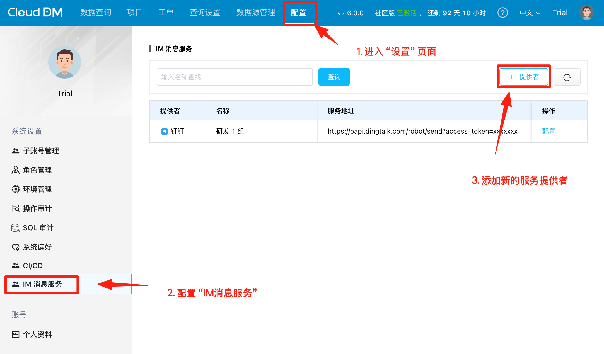
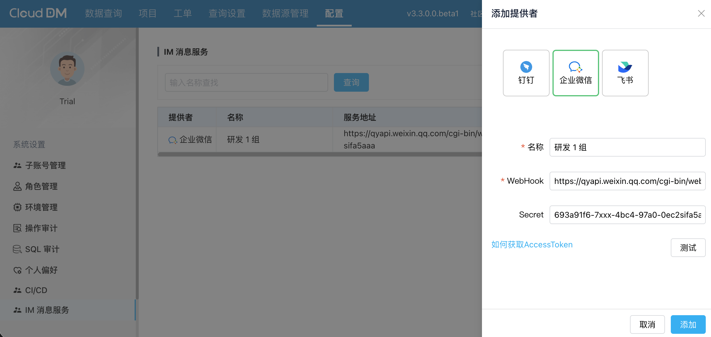
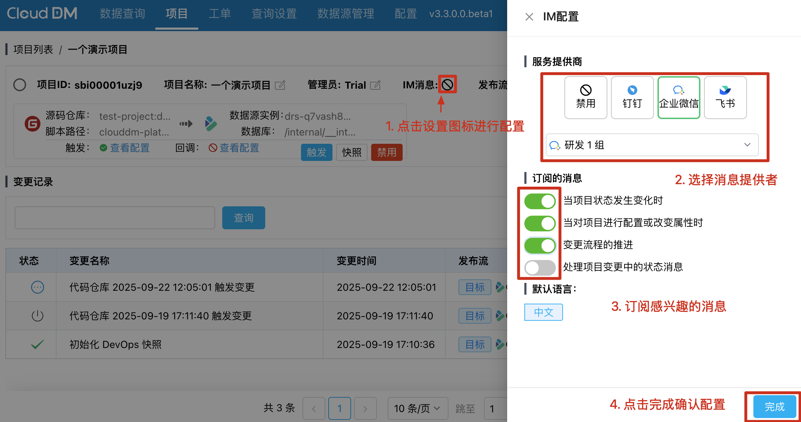

在使用数据库 CI/CD 时，CloudDM 能够对发布流、项目设置及变更进行监控，并随着这些状态的变化可以及时发送通知消息。
这使得用户能够迅速感知到项目的变动，尤其是在项目发布过程中更为重要。

使用企业微信作为消息服务需要三个步骤：
1. 创建消息机器人
2. 添加企业微信为 CloudDM 的消息服务
3. 在项目中配置消息订阅。

## 添加消息服务 {#create}

1. 参考企业微信 [**如何设置消息妥善**](https://open.work.weixin.qq.com/help2/pc/14931?person_id=1&is_tencent%3D) 指南创建自定义机器人。
   - 电脑端内部群聊 -> 右上方三个点 -> 消息推送 -> 添加
   - 手机端内部群聊->右上角三个点->消息推送->添加
2. 在自定义机器人配置页面，查看 WebHook地址和密钥：
   
3. 在 CloudDM 的 **IM消息服务提供者** 配置页面中新增 **企业微信** 类型的提供者。
   
   

## 配置消息订阅 {#config}

1. 在服务消息添加完毕后，在 CI/CD 的项目中可以通过点击 “消息配置” 图标进行配置。
   
- 消息配置图标状态解释：
  - 已配置，
  - 未配置，